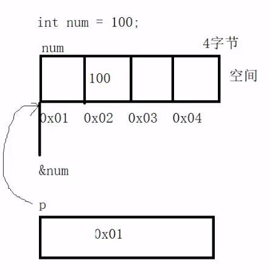

# pointer and address

`*` 的两个作用:

1. 定义一个指针变量: `int *p = &num`. 表示指针变量`p`所保存的内容为`&num`的地址.
2. 表示取p保存的地址对应的空间内容: `*p`表示为`100`, 而`p`表示为存储`100`的地址

```c
int num = 100;
// 在定义时候:  * 说明 p 是个指针变量, 而不是普通变量
int *p = NULL;
// 定义的指针变量 p 需要与 num的地址 &num 建立联系
p = &num;

// 在使用时候, * 表示该变量所指向的地址内容, 下面输出内容为 100
printf("*p = %d", *p);
```



## reference

[link](https://www.bilibili.com/video/BV1mx411d7PA?spm_id_from=333.999.0.0)