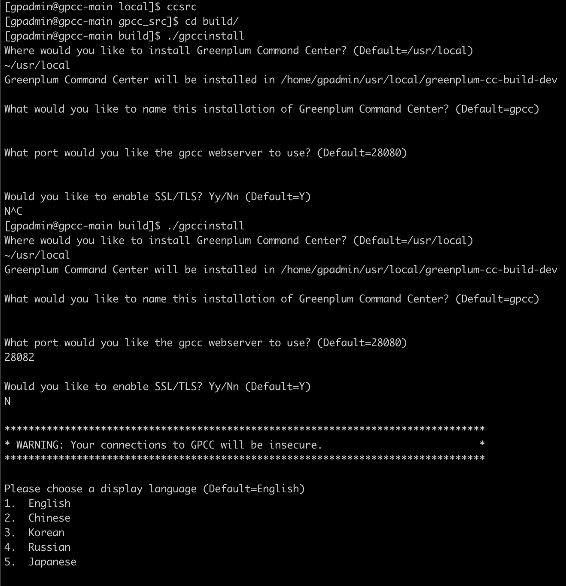

# some command

* open docker: `sudo systemctl start docker`
* enter container: `cd docker/cli` and `./hijack.sh gpcc-main`
* compile path: `ccsrc`
* if gpcc not in command: `source ~/usr/local/greenplum-cc/gpcc_path.sh`
* recompile: `gpcc stop && make dev.dockerbuild && gpcc start`
* stop gpcc: `gpcc stop`
* compile all: `make dev.dockerbuild`
* restart gpcc: `gpcc start`
* restart gpdb: `gpstop -air`
* enter gpperfmon: `psql gpperfmon`
* change schema: `set search_path to gpmetrics;`
* agent.log path: `cclog`
* `10.117.190.86`
* remote docker network: `docker network rm centos7-gpcc-gpdb_nw`
* gp_log: webserver.log
* beego_log: gpccws.log
* rerun frontend and backend: `make clean;pkill ccagent;pkill gpccws;make dev.backendrun`
* yarn mirror: `yarn config set registry https://registry.npm.taobao.org/`
* yarn mirror recover: `yarn config set registry https://registry.yarnpkg.com`
* frontend install: `cd frontend; npm config set registry https://registry.npm.taobao.org; npm install -g yarn ; yarn install; yarn upgrade file:../../pivotal-ui/dist`
* front-end test: `yarn run test:tdd-remote   xxxxx`
* install gpcc: 
* dlv path: `/workspace/gpcc_src/`
* go test with coverage: `go test -coverprofile coverage`
* run e2e on local
    `go test -mod=mod '-gcflags=all=-N -l' '-tags=GPDB5 VIP' -c -o e2e.test`
    `go test -mod=mod '-gcflags=all=-N -l' '-tags=GPDB6 VIP' -c -o e2e.test`
    `./e2e.test '-ginkgo.focus=VIP: check pg_class index bloat' -ginkgo.failFast -debug -pghost=127.0.0.1 -pgport=5432 -wshost=127.0.0.1 -wsport=28082`
* run gpdb5 docker: `GPDB_VERSION=gpdb5 ./run.sh`
new vm:

* rerun: `r`
* if modify front-end: `cleanr`
* `go test` not work: `cc`, `cd build/dev`, `export GPCC_HOME=`pwd``
* if there is a change in database `make`, then `cc`, `r`
* cd `extension/metrics_collector`, `make clean`
* pg log location: cd `$MASTER_DATA_DIRECTORY/`