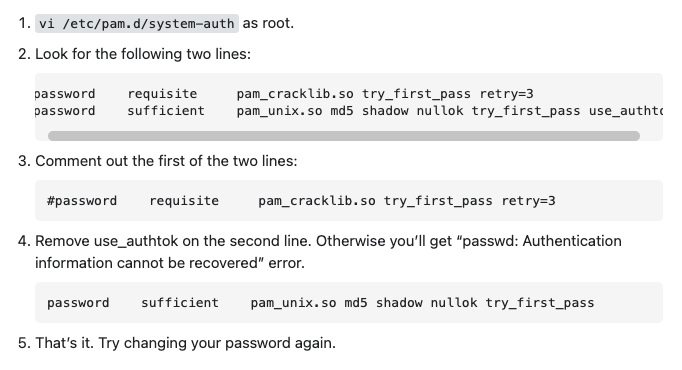

# setting zsh and plugins

* reset password

then use `passwd` to change password

* setting proxy:

    `sudo vim ~/.bashrc`

    ```bash
    export https_proxy=http://proxy.vmware.com:3128
    export http_proxy=http://proxy.vmware.com:3128
    export HTTPS_PROXY=http://proxy.vmware.com:3128
    export HTTP_PROXY=http://proxy.vmware.com:3128
    ```

    ```bash
    export https_proxy=http://proxy-sin02.net.vmware.com:3128
    export http_proxy=http:///proxy-sin02.net.vmware.com:3128
    export HTTPS_PROXY=http://proxy-sin02.net.vmware.com:3128
    export HTTP_PROXY=http://proxy-sin02.net.vmware.com:3128
    ```

* install zsh: `sudo yum install zsh`
* install oh my zsh: [link](https://ohmyz.sh/#install)
* install auto suggestion: [link](https://github.com/zsh-users/zsh-autosuggestions/blob/master/INSTALL.md#oh-my-zsh)
* install syntax highlight: [link](https://github.com/zsh-users/zsh-syntax-highlighting/blob/master/INSTALL.md)

## backend

* [install docker](https://docs.docker.com/engine/install/centos/)
* [set git ssh](https://docs.github.com/en/authentication/connecting-to-github-with-ssh)
* install go:
  * `wget https://go.dev/dl/go1.18.3.linux-amd64.tar.gz`
  * `sudo tar -C /usr/local -xzf go1.18.3.linux-amd64.tar.gz`
  * add into ~/.zshrc: `export PATH=$PATH:/usr/local/go/bin`
  * `source ~/.zshrc`

## frontend

* install nvm:
  * `wget -qO- https://raw.githubusercontent.com/nvm-sh/nvm/v0.39.1/install.sh | bash`
  * `echo 'export NVM_DIR=~/.nvm' >> ~/.zshrc`
  * `echo '[ -s "$NVM_DIR/nvm.sh" ] && . "$NVM_DIR/nvm.sh"' >> ~/.zshrc`
  * `source ~/.zshrc`
* install node `nvm install Fermium`
