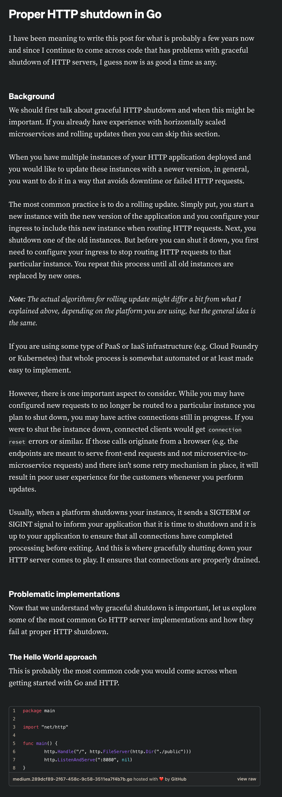
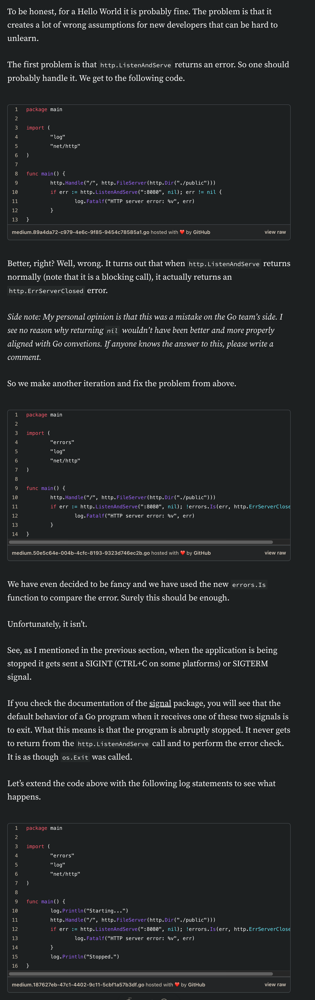
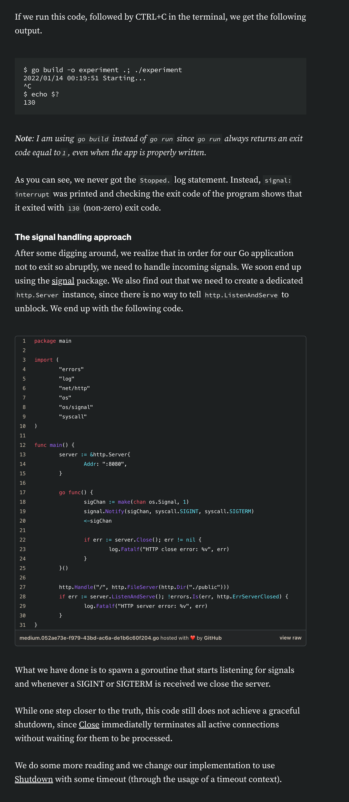
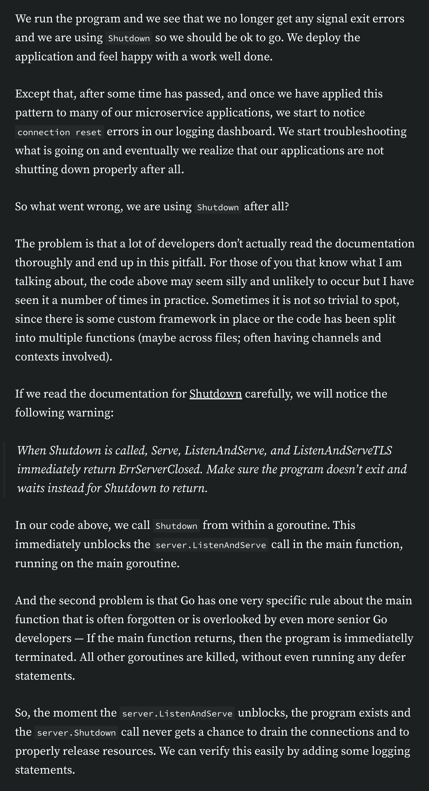
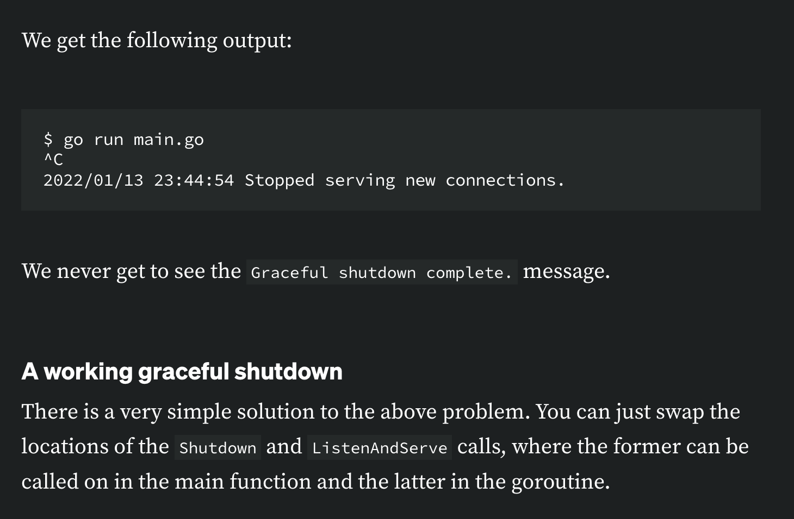
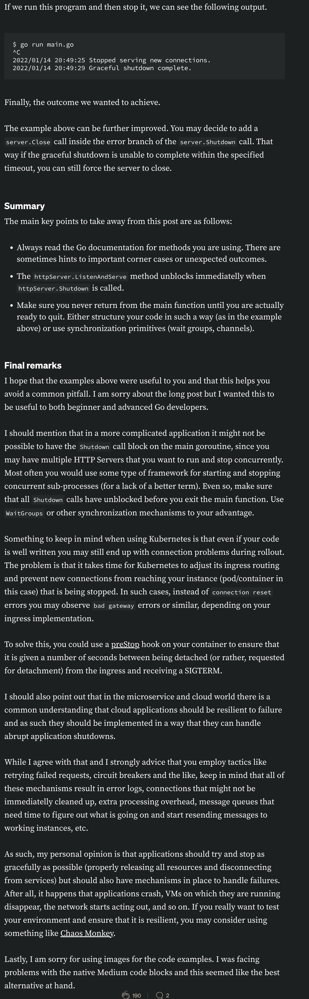

# HTTP shutdown in Go





```go
package main

import (
 "context"
 "errors"
 "log"
 "net/http"
 "os"
 "os/signal"
 "syscall"
 "time"
)

func main() {
 server := &http.Server{
  Addr: ":8080",
 }

 go func() {
  sigChan := make(chan os.Signal, 1)
  signal.Notify(sigChan, syscall.SIGINT, syscall.SIGTERM)
  <-sigChan

  shutdownCtx, shutdownRelease := context.WithTimeout(context.Background(), 10*time.Second)
  defer shutdownRelease()

  if err := server.Shutdown(shutdownCtx); err != nil {
   log.Fatalf("HTTP shutdown error: %v", err)
  }
 }()

 http.Handle("/", http.FileServer(http.Dir("./public")))
 if err := server.ListenAndServe(); !errors.Is(err, http.ErrServerClosed) {
  log.Fatalf("HTTP server error: %v", err)
 }
}
```



```go

package main

import (
 "context"
 "errors"
 "log"
 "net/http"
 "os"
 "os/signal"
 "syscall"
 "time"
)

func main() {
 server := &http.Server{
  Addr: ":8080",
 }

 go func() {
  sigChan := make(chan os.Signal, 1)
  signal.Notify(sigChan, syscall.SIGINT, syscall.SIGTERM)
  <-sigChan

  shutdownCtx, shutdownRelease := context.WithTimeout(context.Background(), 10*time.Second)
  defer shutdownRelease()

  if err := server.Shutdown(shutdownCtx); err != nil {
   log.Fatalf("HTTP shutdown error: %v", err)
  }
  log.Println("Graceful shutdown complete.")
 }()

 http.Handle("/", http.FileServer(http.Dir("./public")))
 if err := server.ListenAndServe(); !errors.Is(err, http.ErrServerClosed) {
  log.Fatalf("HTTP server error: %v", err)
 }
 log.Println("Stopped serving new connections.")
}
```



```go

package main

import (
 "context"
 "errors"
 "log"
 "net/http"
 "os"
 "os/signal"
 "syscall"
 "time"
)

func main() {
 server := &http.Server{
  Addr: ":8080",
 }

 http.Handle("/", http.FileServer(http.Dir("./public")))

 go func() {
  if err := server.ListenAndServe(); !errors.Is(err, http.ErrServerClosed) {
   log.Fatalf("HTTP server error: %v", err)
  }
  log.Println("Stopped serving new connections.")
 }()

 sigChan := make(chan os.Signal, 1)
 signal.Notify(sigChan, syscall.SIGINT, syscall.SIGTERM)
 <-sigChan

 shutdownCtx, shutdownRelease := context.WithTimeout(context.Background(), 10*time.Second)
 defer shutdownRelease()

 if err := server.Shutdown(shutdownCtx); err != nil {
  log.Fatalf("HTTP shutdown error: %v", err)
 }
 log.Println("Graceful shutdown complete.")
}
```



## reference

[blog](https://medium.com/@mokiat/proper-http-shutdown-in-go-bd3bfaade0f2)
