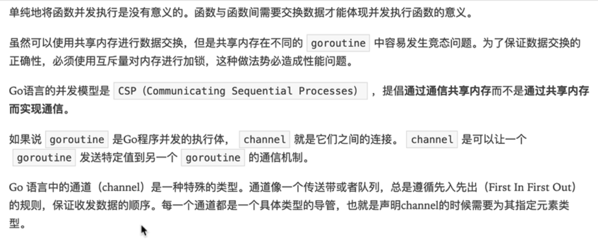
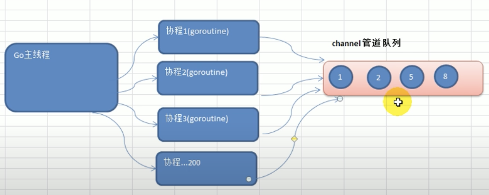
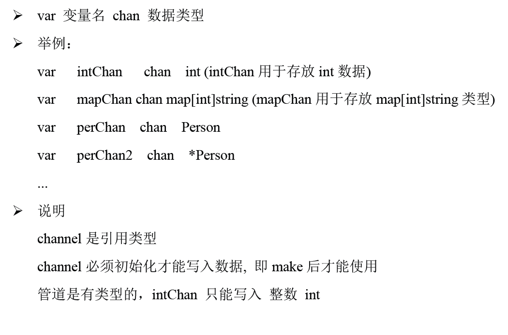
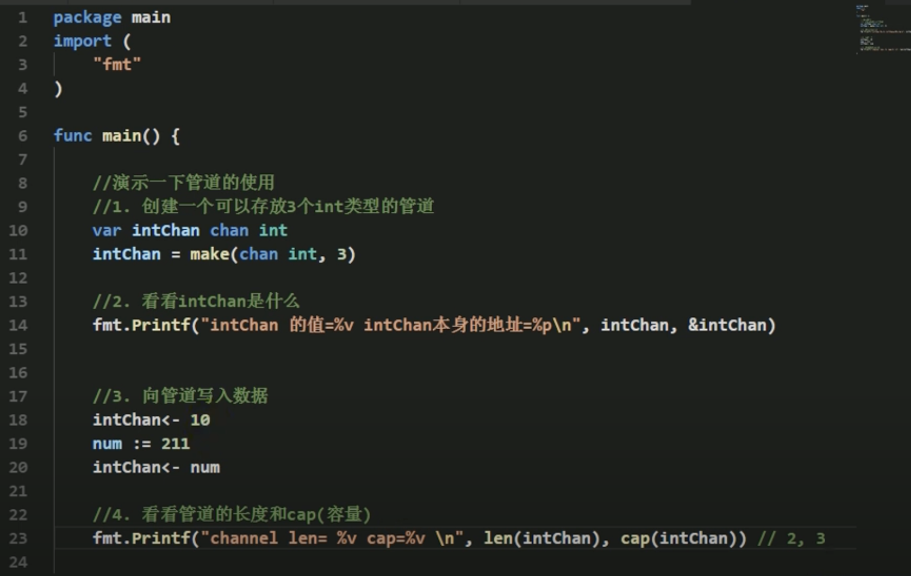
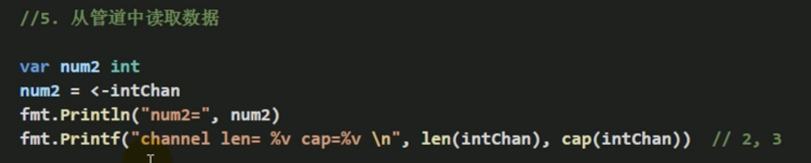
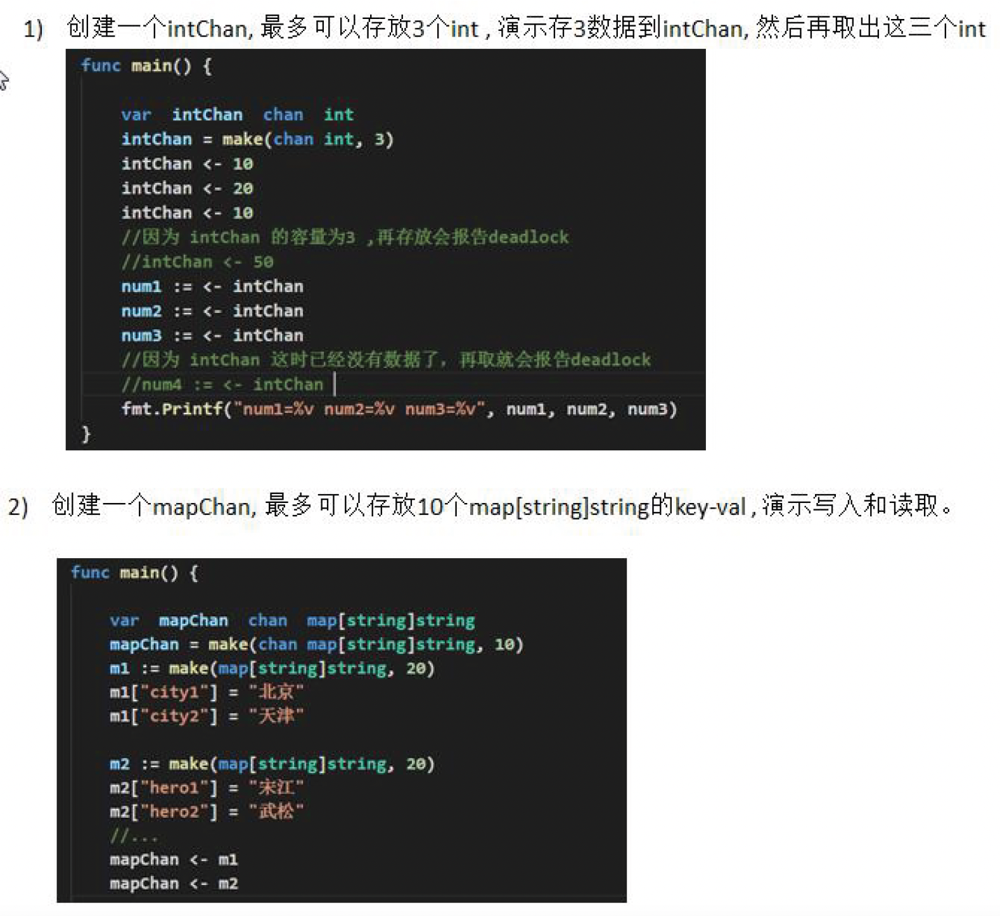
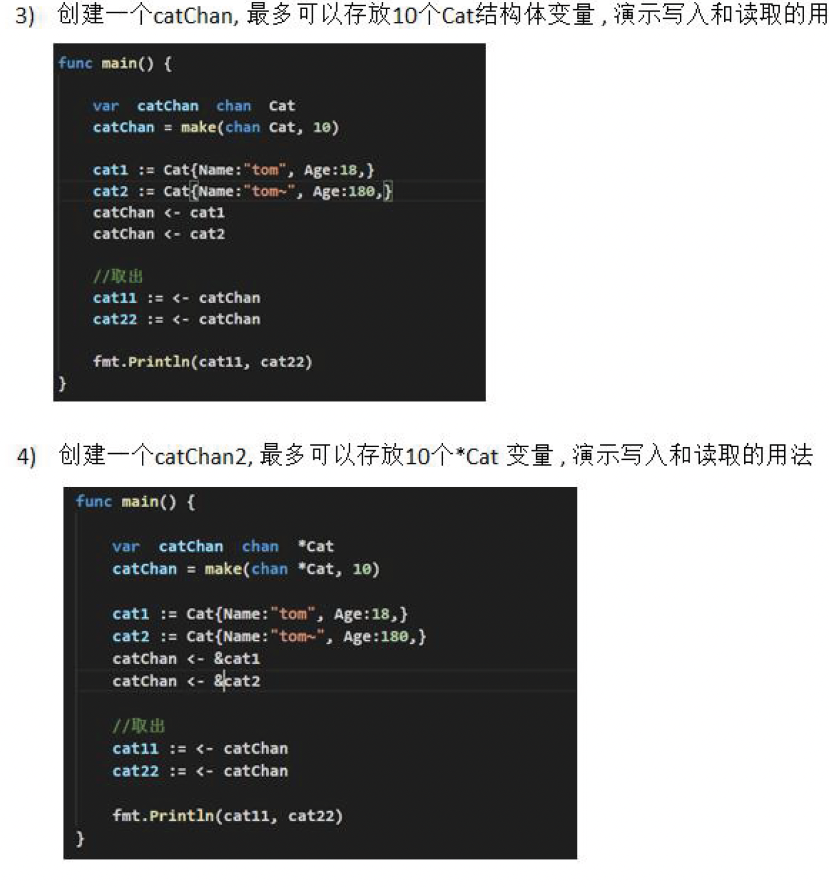
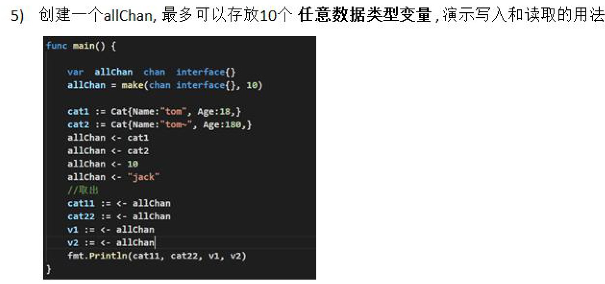
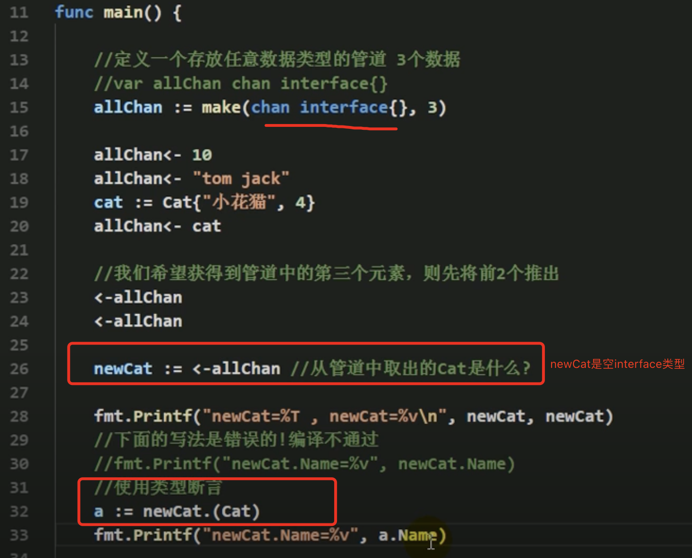

# channel

channel could think as a kind of communication.

## define

* channel is a kind of data structure: `queue`
* FIFO
* it is thread safety, 多个goroutine访问时, 无需加锁, 线程安全

## how to use

## use case

