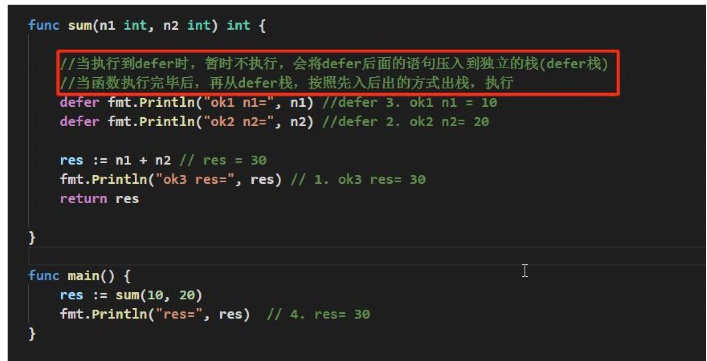
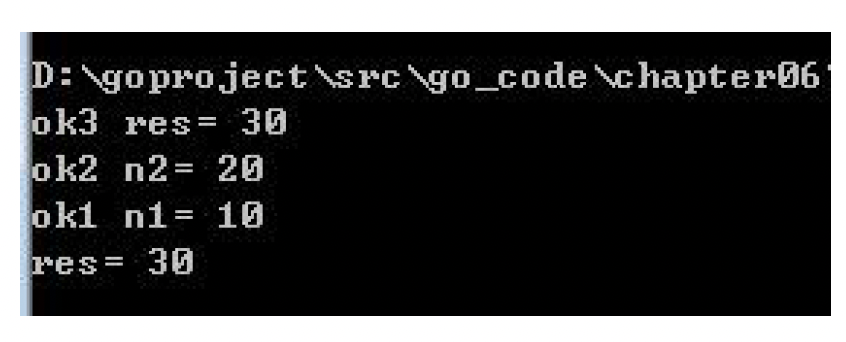

# defer

## basic logic

the result:

defer statements delay the execution of the function or method or an anonymous method until the function it belonging returns.

More details. There is a `defer stack`, when execute the defer function, it will append the function into stack. after finish all code, it will pop the stack and execute them.
