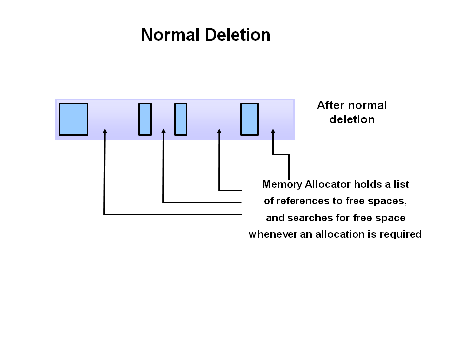
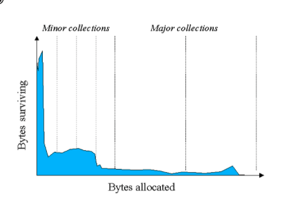

# 垃圾回收

## [Java垃圾回收机制](https://www.oracle.com/webfolder/technetwork/tutorials/obe/java/gc01/index.html)

### step 1: marking

The first step in the process is called marking. This is where the garbage collector identifies which pieces of memory are in use and which are not. Referenced objects are shown in blue. Unreferenced objects are shown in gold. All objects are scanned in the marking phase to make this determination. This can be a very time consuming process if all objects in a system must be scanned.

### step 2: Normal Deletion

Normal deletion removes unreferenced objects leaving refer
The memory allocator holds references to blocks of free space where new object can be allocated.

### step 3: deletion with compacing

To further improve performance, in addition to deleting unreferenced objects, you can also compact the remaining referenced objects. By moving referenced object together, this makes new memory allocation much easier and faster.

### JVM Generations

#### why use Generational Garbage Collection in java?

As stated earlier, having to mark and compact all the objects in a JVM is inefficient. As more and more objects are allocated, the list of objects grows and grows leading to longer and longer garbage collection time. However, empirical analysis of applications has shown that most objects are short lived.

Here is an example of such data. The Y axis shows the number of bytes allocated and the X access shows the number of bytes allocated over time.

As you can see, fewer and fewer objects remain allocated over time. In fact most objects have a very short life as shown by the higher values on the left side of the graph.

#### structure

The information learned from the object allocation behavior can be used to enhance the performance of the JVM. Therefore, the heap is broken up into smaller parts or generations. The heap parts are: Young Generation, Old or Tenured Generation, and Permanent Generation

The Young Generation is where all new objects are allocated and aged. When the young generation fills up, this causes a minor garbage collection. Minor collections can be optimized assuming a high object mortality rate. A young generation full of dead objects is collected very quickly. Some surviving objects are aged and eventually move to the old generation.

Stop the World Event - All minor garbage collections are "Stop the World" events. This means that all application threads are stopped until the operation completes. Minor garbage collections are always Stop the World events.

The Old Generation is used to store long surviving objects. Typically, a threshold is set for young generation object and when that age is met, the object gets moved to the old generation. Eventually the old generation needs to be collected. This event is called a major garbage collection.

Major garbage collection are also Stop the World events. Often a major collection is much slower because it involves all live objects. So for Responsive applications, major garbage collections should be minimized. Also note, that the length of the Stop the World event for a major garbage collection is affected by the kind of garbage collector that is used for the old generation space.

The Permanent generation contains metadata required by the JVM to describe the classes and methods used in the application. The permanent generation is populated by the JVM at runtime based on classes in use by the application. In addition, Java SE library classes and methods may be stored here.

Classes may get collected (unloaded) if the JVM finds they are no longer needed and space may be needed for other classes. The permanent generation is included in a full garbage collection.