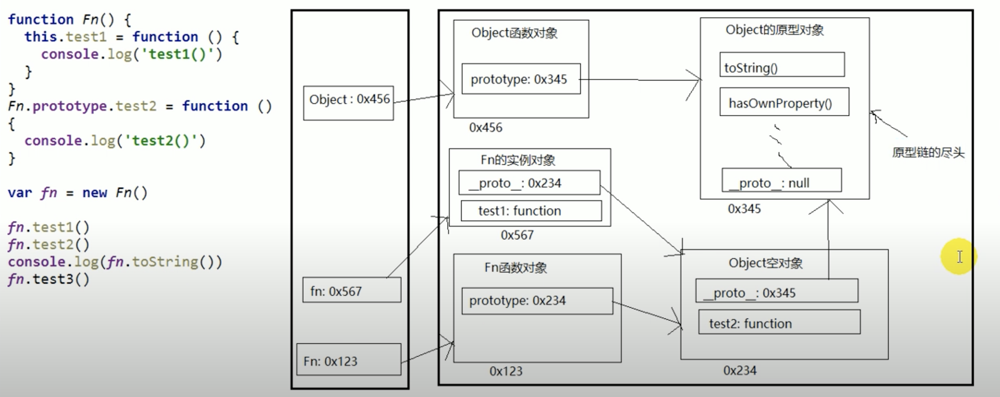
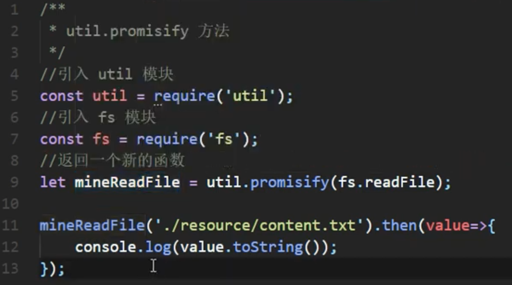
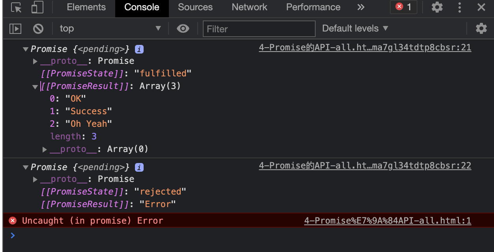

[toc]

# Basic

## protype

* Every function has a `prototype`, pointing to null object. Every instance object has a `__proto__`, also pointing to the same null object (its constructor function's `prototype`).
&nbsp; [More Details](https://www.youtube.com/watch?v=54sSn-FhTY8&list=PLmOn9nNkQxJH3g-GPoyAj2IB6bQ-qOeKl&index=16)


js has a global object, in its prototype, there are many functions. All object's `prototype` and all instance object's `__proto` points to it.



when execute `fn.test2()`, js will look for the `Fn的实例对象`, when it couldn't find `test2()`, js will continue to look for along prototype chain.

[More Details](https://www.youtube.com/watch?v=kuys6-kTkbs&list=PLmOn9nNkQxJH3g-GPoyAj2IB6bQ-qOeKl&index=17)

## indexOf vs. Match when Searching Strings

`indexOf` is better than `match`, [details](https://stackoverflow.com/questions/4757438/javascript-indexof-vs-match-when-searching-strings)

## class in js

use `super` could inherit the parent's class constructor


## [getter and setter](https://www.typescripttutorial.net/typescript-tutorial/typescript-getters-setters/)

The getters and setters allow you to control the access to the properties of a class.

```javascript
class Person {
    private _age: number;
    private _firstName: string;
    private _lastName: string;


    public get age() {
        return this._age;
    }

    public set age(theAge: number) {
        if (theAge <= 0 || theAge >= 200) {
            throw new Error('The age is invalid');
        }
        this._age = theAge;
    }

    public getFullName(): string {
        return `${this._firstName} ${this._lastName}`;
    }
}
```

access the age `setter` method as follows:

```javascript
let person = new Person();
person.age = 10;
```

Notice that the call to the setter doesn’t have parentheses like a regular method.

When you call person.age, the age setter method is invoked.

## Promise

### 1.fs读取文件

```javascript
    let p = new Promise((resolve, rejuect) => {
        fs.readFile('./content.txt', (err, data) => {
            if (err) reject(err);
            resolve(data);
        });
    });

    p.then(vaule => {
        console.log(value.toString());
    }, reason => {
        console.log(reason);
    })
```

### 2.将callback风格的函数转变为promise风格

use `util.promisify`



### 3.promise封装AJAX请求


### 4.promise state

`PromiseState` is a property of promise instance


* pending
* resolve
* rejected

只能从pending变为resolve或reject，而且不可逆

Also, `PromiseResult` is also a property of promise instance. 其内部保存着对象成功/失败的结果
只可以被`reject()`和`resolve()`函数修改

### 5.promise 基本流程


### 6.Promise API

一般的：

```
1. Promise构造函数 : Promise (excutor) {}
(1) executor函数 : 执行器 (resolve, reject) => {}
(2) resolve函数 : 内部定义成功时我们调用的函数 value => {}
(3) reject函数 : 内部定义失败时我们调用的函数 reason => {}
说明: executor会在 Promise内部立即同步调用 ,异步操作在执行器中执行

2. Promise.prototype.then方法 : (onResolved, onRejected) => {}
(1) onResolved函数 : 成功的回调函数 (value) => {}
(2) onRejected函数 : 失败的回调函数 (reason) => {}
说明: 指定用于得到成功 value的成功回调和用于得到失败 reason的失败回调
返回一个新的promise对象

3. Promise.prototype.catch方法 : (onRejected) => {}
(1) onRejected函数 : 失败的回调函数 (reason) => {}
说明: then()的语法糖 , 相当于 : then(undefined, onRejected)

```

```javascript
4. Promise.resolve()
直接Promise调用的方法，而非实例调用的。返回的为一个promise对象
作用： 快速返回一个成功或者失败的promise对象
例：
//如果传入的参数为 非Promise类型的对象, 则返回的结果为成功promise对象
let p1 = Promise.resolve(521);
console.log(p1);// 返回成功的对象

//如果传入的参数为 Promise 对象, 则参数的结果决定了 resolve 的结果
let p2 = Promise.resolve(new Promise((resolve, reject) => {
    reject('Error');
}));
p2.catch(reason => {
    console.log(reason);// 因new Promise返回的是个失败的promise对象，返回的为失败的promise
})
```

结果为


```javascript
5. Promise.reject()：只快速返回失败的promise对象
例：
    let p1 = Promise.reject(521);
    let p2 = Promise.reject('iloveyou');
    let p3 = Promise.reject(new Promise((resolve, reject) => {
        resolve('OK');
    }));

    console.log(p1);
    console.log(p2);
    console.log(p3);
```

结果为

```javascript
6. Promise.all(promises) => {}
传进来的promises: 包含 n个promise的数组， 返回一个新的 promise, 只有所有的promise都成功返回的状态才成功 , 只要有一个失败了就
直接失败
结果为所有的promise
例：
    let p1 = new Promise((resolve, reject) => {
        resolve('OK');
    })
    let p2 = Promise.resolve('Success');
    let p3 = Promise.resolve('Oh Yeah');
    let p4 = Promise.reject('Error');

    //
    const result1 = Promise.all([p1, p2, p3]);
    const result2 = Promise.all([p1, p2, p3, p4]);

    console.log(result1);
    console.log(result2);
```

结果为

### 7.改变状态的resolve和then方法指定的回调谁先执行？

```javascript
let p = new Promise((resolve, reject) => { 
    resolve('ok');
});

p.then(value => {})
```

```
(1) 都有可能 , 正常情况下是先指定回调再改变状态 , 但也可以先改状态再指定回调
(2) 如何先改状态再指定回调 ?
    ① 在执行器中直接调用 resolve()/reject()
    ② 延迟更长时间才调用 then()
(3) 什么时候才能得到数据 ?
    ① 如果先指定的回调 , 那当状态发生改变时 , 回调函数就会调用 , 得到数据
    ② 如果先改变的状态 , 那当指定回调时 , 回调函数就会调用 , 得到数据
```

[Link](https://www.youtube.com/watch?v=_kaYB0pXA-Y&list=PLmOn9nNkQxJF-I5BK-wNUnsBkuLXUumhr&index=20)

### 8.await/async

* `await` 右侧的表达式一般为promise 对象, 但也可以是其它的值
* 如果表达式是promise 对象, `await` 返回的是promise 成功的值
* 如果表达式是其它值, 直接将此值作为await 的返回值

```javascript
let p = await get(); // get为promise函数

function get() {
    return new Promise();
}
```

### 9.await/promise区别

[Link](https://mathiasbynens.be/notes/async-stack-traces)

## javascript执行机制详解

[KM文章](http://km.oa.com/articles/show/501924?kmref=discovery)

[JavaScrip可视化](http://latentflip.com/loupe/?code=JC5vbignYnV0dG9uJywgJ2NsaWNrJywgZnVuY3Rpb24gb25DbGljaygpIHsKICAgIHNldFRpbWVvdXQoZnVuY3Rpb24gdGltZXIoKSB7CiAgICAgICAgY29uc29sZS5sb2coJ1lvdSBjbGlja2VkIHRoZSBidXR0b24hJyk7ICAgIAogICAgfSwgMjAwMCk7Cn0pOwoKY29uc29sZS5sb2coIkhpISIpOwoKc2V0VGltZW91dChmdW5jdGlvbiB0aW1lb3V0KCkgewogICAgY29uc29sZS5sb2coIkNsaWNrIHRoZSBidXR0b24hIik7Cn0sIDUwMDApOwoKY29uc29sZS5sb2coIldlbGNvbWUgdG8gbG91cGUuIik7!!!PGJ1dHRvbj5DbGljayBtZSE8L2J1dHRvbj4%3D)

## js模块化

[关于__esModule](https://toyobayashi.github.io/2020/06/29/ESModule/)

## [Event Flow in JavaScript](http://www.tutorialspark.com/javascript/JavaScript_Event_Flow.php)

## History State Management (history object in js)


## "type" in TypeScript

[document in TS](https://www.typescriptlang.org/docs/handbook/2/everyday-types.html#type-aliases)

### Type VS Interface

Type aliases and interfaces are very similar, and in many cases you can choose between them freely. Almost all features of an interface are available in type, the key distinction is that a type cannot be re-opened to add new properties vs an interface which is always extendable.

## TypeScript Generic

[video](https://www.youtube.com/watch?v=lQn3zV-LFjM)

## Intersection Type in TS

[link](https://www.typescriptlang.org/docs/handbook/2/objects.html#intersection-types)

### Interfaces vs. Intersections

We just looked at two ways to combine types which are similar, but are actually subtly different. With interfaces, we could use an extends clause to extend from other types, and we were able to do something similar with intersections and name the result with a type alias. The principle difference between the two is how conflicts are handled, and that difference is typically one of the main reasons why you’d pick one over the other between an interface and a type alias of an intersection type.

[conflict is not allow in interface but in intersections](https://stackoverflow.com/questions/52681316/difference-between-extending-and-intersecting-interfaces-in-typescript)

## [Higher-Order Components](https://reactjs.org/docs/higher-order-components.html)

## type和interface区别


## then 和 await区别

```javascript
a().then(() => b());

c();

```

`a()`执行后，会马上执行`c()`只有当`a()`执行完后才会回过来继续执行`then()`

```javascript
await a();

c();
```

`a()`执行后不会马上执行`c()`而是会一直等待`a()`执行完成
