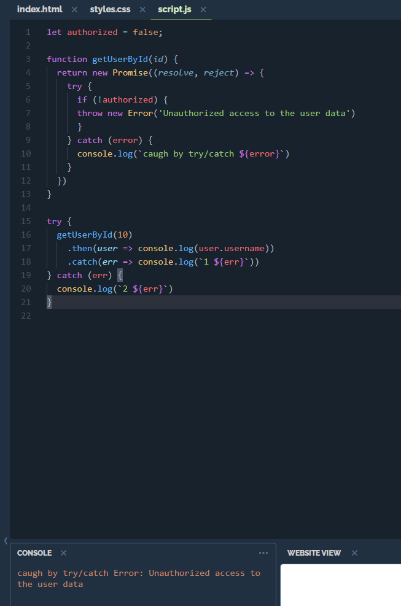

# Promise Error Handling


上图`53`产生结果为
```
caugh by .catch Error: Unauthorized access to the user data
```

## if try catch in promise



Summary:

* promise error couldn't catch by `try-catch`
* Inside the promise, the `promise.catch()` method will catch the error caused by the `throw` statement and `reject()`.
* If an error occurs and you don’t have the `promise.catch()` method, the JavaScript engine issues a runtime error and stops the program.
* `try-catch` will catch error inside a promise, and not delegated it out the promise
* 下方效果相同, 区别是`await`会阻塞等待, 但是`promise.then`不会:

```JavaScript
// 等待 b() 执行完, 才执行后续的代码
const a = await b()

// 该函数执行后, 马上执行后面的代码, 再回头异步完成执行 then() 里面的方法
b()
 .then(a => ...)
 .catch(err => ...)
```

* 如果一条链路对`return`的值有要求, 要用`await`方法去等待


## reference

[blog](https://www.javascripttutorial.net/es6/promise-error-handling/)