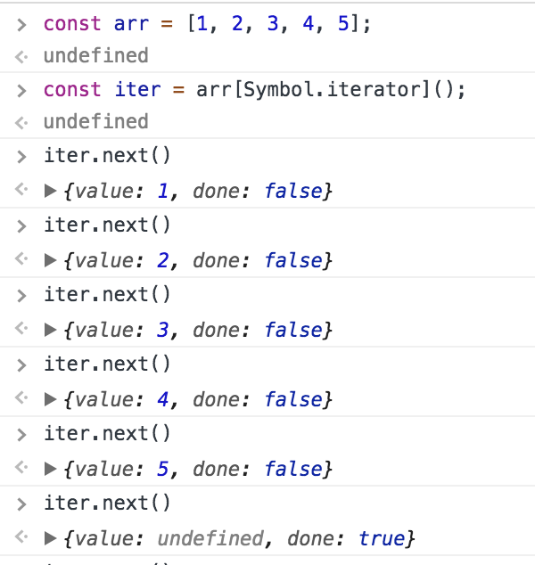

# Iterables

define: The iterable is a interface that specifies that an object can be accessible if it implements a method who is key is [symbol.iterator]
Some of the built-in data structure that use iterable are :

```java
Arrays
Strings
Maps
Sets etc.
```

## why use Iterable interface

it was added in ES6

Without iterable, it is difficult to manage the iteration on data for various types of data structures i.e iterating on an array is different from iterating on an object.
Also, ES6 has introduced new data structures like sets and maps so it will become more complicated to write logic as per data structure for iterations. This is where the iterable interface was born.

There are two things to notice here:

1. Data consumer — how the iteration takes place like using loops, spread operator, array.from method, destructuring via an array pattern, etc
2. Data source — what data structure we choose like an array, maps, string, etc to iterate on.

## Iterators

define: Object that knows how to access items from a collection one at a time, while keeping track of its current position within that sequence.

An object that is returned by the iterable interface is also an iterator object.
Iterator object have a `next()` method which returns the next item in the sequence. This method returns an object with two properties: `done` and `value` and when `next()` calls reach to the end of sequence then the done property set to `true` else remain `false` .
So the next on an iterator return :
`{value: ‘Current value of iteration’, done: ‘true/false’}`

Now, since we are clear with the theory, let's see some examples

Simple array example:


Here, we have an array `arr` with some values and then we created an iterator object on which we can call the `next()` until we have done as true

```
Note: Array already have symbol.iterator key as a function in them and in above example Symbol.iterator represents the property of iter object which when we call, construct an iterator instance for consuming that object’s values through next.
```

We can create our own iterable and iterator object lets see an example.
Custom iterators object example

```javascript

const customIterable = {
    [Symbol.iterator]() {
        let counter = 0;
        return {
            next() {
                if (counter < 5) {
                  counter++;
                  return { done: false, value: counter };
                } else {
                  return { done: true, value: undefined };
                }
            }
        }
    }
}
```

Note: To run above we will use for..of loop, you can read [here](https://developer.mozilla.org/en-US/docs/Web/JavaScript/Reference/Statements/for...of) for more details.
This is how we iterate over our customIterable object.

```javascript
for (const x of customIterable) {
    console.log(x);
}
// output 1,2,3,4,5,undefined
```

The code executes five steps, with the counter incrementing every run. First, we return the value 1, then the value 2 and so on till 5then we indicate that the end of the iteration has been reached and value undefined is returned. Each item is wrapped in an object with the properties:
value which holds the actual item and
done which is a boolean flag that indicates whether the end has been reached, yet.
Note: The last step can return a value if required, also we can manual break for..of loop if required using break keyword. The break keyword will send a signal to an iterator that the consuming code is complete and will not be pulling any more values from it, so it is being called anyway once we finished iterating, it is the one returning {done:true}, but we can call it manually as well.
Iterator with generator holds a lot of power and may change how we write code.

## reference

[blog](https://towardsdatascience.com/javascript-es6-iterables-and-iterators-de18b54f4d4)