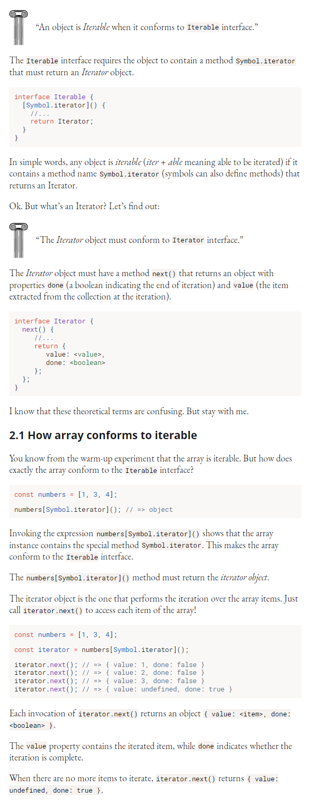

# js iterator

A collection is a data structure that contains elements. For example, a string is a collection of characters and an array is a collection of ordered items:

```javascript
const message = 'Hi!';     // consists of 'H', 'i' and '!'
const numbers = [1, 3, 4]; // consists of 1, 3 and 4
```

To easily access elements of collections of different structure, JavaScript implements a special pattern named iterator.

In this post, as a part of the iterator pattern, you’ll learn what are iterables and iterators. You’ll also learn about iterables consumers: how to iterate over a collection using for...of cycle, transform any iterable to an array using the spread operator `[...iterable]`, and more.

[toc]

## 1. Digging up the iterable

I don’t want to jump right into the dry theory of iterators. I know how confusing they are. On the contrary, let’s start with a warm-up example to dig up the concept of iterable.

Let’s reuse the `numbers` array from the introduction. Your task is to simply log to console each item of this array:

```javascript
const numbers = [1, 3, 4];
for (const item of numbers) {
  console.log(item);
}
// logs 1, 3, 4
```

As expected, the `for...of` loop logs to console each item of `numbers` array. Good.

Now let’s try another experiment. Can `for...of` enumerate each property of a plain JavaScript object?

```javascript
const person = { name: 'Eric', address: 'South Park' };
for (const prop of person) {
  console.log(prop);
}
// Throws "TypeError: person is not iterable"
```

Not this time. for...of cycle cannot iterate over the properties of person object. Why does it happen?

You can find the answer in the error message: TypeError: person is not iterable. The for...of cycle requires an iterable collection to iterate over its items.

So, the first rule of thumb whether a data structure is iterable is try to iterate it using for...of.

Having this warm-up experiment, let’s state stricter what an iterable is in the next section.

## 2. [Iterable interface](./iterable_interface.md) interfaces



## 3. Consumers of iterables


## 4. Native iterable types


## 5. summary


## reference

[blog](https://dmitripavlutin.com/javascript-iterators/)
