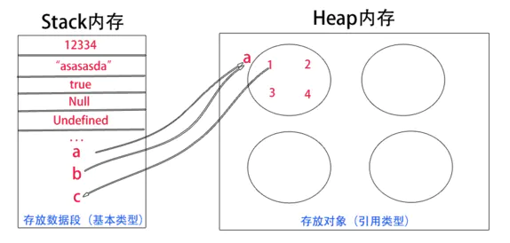

# js的堆（heap）、栈（stack）

## 堆（heap）、栈（stack）

堆是堆内存的简称，栈是栈内存的简称。说到堆栈，我们讲的就是内存的使用和分配了，没有寄存器的事，也没有硬盘的事。
各种语言在处理堆栈的原理上都大同小异。堆是动态分配内存，内存大小不一，也不会自动释放。栈是自动分配相对固定大小的内存空间，并由系统自动释放。

js的基本类型就5种，Undefined、Null、不是new出来的布尔、数字和字符串，它们都是直接按值存储在栈中的，每种类型的数据占用的内存空间的大小是确定的，并由系统自动分配和自动释放。这样带来的好处就是，内存可以及时得到回收，相对于堆来说，更加容易管理内存空间。

js中其他类型的数据被称为引用类型的数据（如对象、数组、函数等），它们是通过拷贝和new出来的，这样的数据存储于堆中。其实，说存储于堆中，也不太准确，因为，引用类型的数据的地址指针是存储于栈中的，当我们想要访问引用类型的值的时候，需要先从栈中获得对象的地址指针，然后，在通过地址指针找到堆中的所需要的数据。

说来也是形象，栈，线性结构，后进先出，便于管理。堆，一个混沌，杂乱无章，方便存储和开辟内存空间。

## 传值与传址

```javascript
var aArray = [8,8, "ass"];
var bArray = aArray ;
var cString = aArray [2];
alert(bArray);//88ass
alert(cString);//ass

b[3] = 6;
c = 7;
alert(a[3]);//6
alert(a[2]);//ass

```

上方例子得知，当我改变bArray中的数据时，aArray中数据也发生了变化，当改变cString的数据值时，aArray却没有发生改变。为什么？这就是传值与传址的区别。

因为aArray是数组，属于引用类型，所以它赋予给bArray的时候传的是栈中的地址（相当于新建了一个不同名“指针”），而不是堆内存中的对象的值。cString的到的是一个基本类型的赋值，因此，cString仅仅是从aArray堆内存中获取了一个数值，并直接保存在栈中。aArray、bArray都指向同一块堆内存，bArray修改的堆内存的时候，也就会影响到aArray，cString是直接在栈中修改，并且不能影响到aArray堆内存中的数据。



## reference


