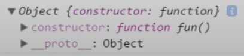
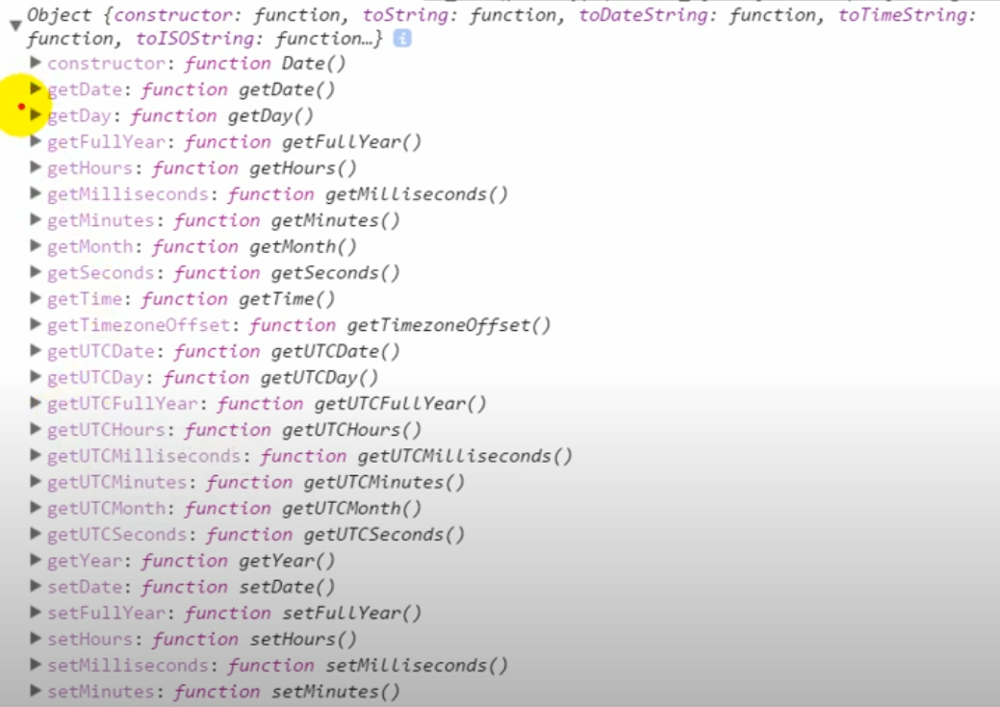
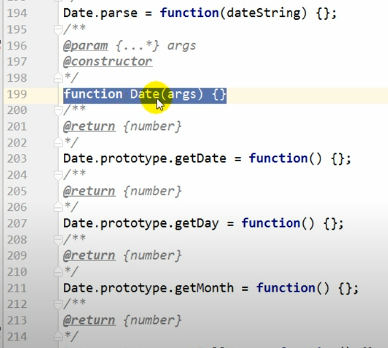

# [prototype] (https://developer.mozilla.org/en-US/docs/Learn/JavaScript/Objects/Object_prototypes)

## 定义

每个函数都有一个prototype属性, 默认情况它指向一个Object空对象(没有我们自定义的属性)

```javascript
function foo() {

}
 console.log(foo.prototype, typeof foo.prototype);
```

输出



除了`constructor`和`__proto__`, 没有任何属性, 算是一个空的object. `constructor`和`__proto__`是什么后面再说.

但是

```javascript
 console.log(Date.prototype);
```

输出:

为什么有很多方法, 这是人为添加的:


## prototype作用目的

参见[link](../一口气了解this,prototype,constructor/3.prototype.md)