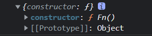

# 显示原型和隐式原型

## 每个函数function都有一个prototype，即显式原型, 指向一个空object对象

```JavaScript
function Fn() {}

console.log(Fn.prototype)
```



## 每个实例对象都有一个__proto__，可称为隐式原型

```JavaScript
var fn = new Fn()
console.log(fn.__proto__)
```

## 对象的隐式原型的值为其对应构造函数的显式原型的值

```JavaScript
console.log(Fn.prototype === fn.__proto__) // true
```

```JavaScript
当
var fn = new Fn()时候, 编译器进行了如下操作:
fn.__proto__ = Fn.prototype
```

1. 内存结构(图)
2. 总结:
  * 函数的prototype属性: 在定义函数时自动添加的, 默认值是一个空Object对象
  * 对象的__proto__属性: 创建对象时自动添加的, 默认值为构造函数的prototype属性值
  * 程序员能直接操作显式原型, 但不能直接操作隐式原型(ES6之前)
