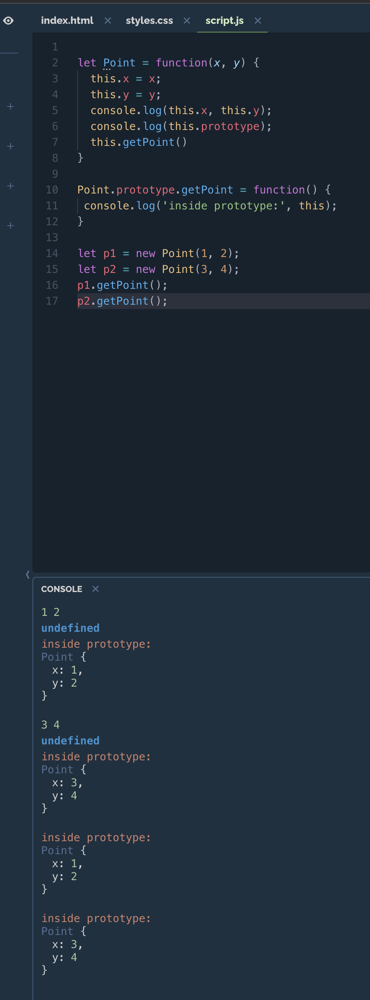

# prototype由来

[toc]

## 构造函数模式的困难

构造函数方法很好用，但是存在一个浪费内存的问题。

请看，我们现在为Cat对象添加一个不变的属性type（种类），再添加一个方法eat（吃）。那么，原型对象Cat就变成了下面这样：

```javascript
　　function Cat(name,color){

　　　　this.name = name;

　　　　this.color = color;

　　　　this.type = "猫科动物";

　　　　this.eat = function(){alert("吃老鼠");};

　　}
```

还是采用同样的方法，生成实例：

```javascript
　　var cat1 = new Cat("大毛","黄色");

　　var cat2 = new Cat ("二毛","黑色");

　　alert(cat1.type); // 猫科动物

　　cat1.eat(); // 吃老鼠
```

表面上好像没什么问题，但是实际上这样做，有一个很大的弊端。那就是对于每一个实例对象，type属性和eat()方法都是一模一样的内容，每一次生成一个实例，都必须为重复的内容，多占用一些内存。这样既不环保，也缺乏效率。

`alert(cat1.eat == cat2.eat); //false`

能不能让type属性和eat()方法在内存中只生成一次，然后所有实例都指向那个内存地址呢？回答是可以的。

## 引入prototype

Javascript规定，每一个构造函数都有一个prototype属性，指向另一个对象。这个对象的所有属性和方法，都会被构造函数的实例继承。

这意味着，我们可以把那些不变的属性和方法，直接定义在prototype对象上。

```javascript
function Cat(name,color){

　　this.name = name;

　　this.color = color;

}

Cat.prototype.type = "猫科动物";

Cat.prototype.eat = function(){alert("吃老鼠")};
```

然后，生成实例。

```javascript
　　var cat1 = new Cat("大毛","黄色");

　　var cat2 = new Cat("二毛","黑色");

　　alert(cat1.type); // 猫科动物

　　cat1.eat(); // 吃老鼠
```

这时所有实例的type属性和eat()方法，其实都是同一个内存地址，指向prototype对象，因此就提高了运行效率。

`alert(cat1.eat == cat2.eat); //true`

## prototype 和 this 关系



`14行` new 一个function, this 指向为该object:

1. 所以`function`内, 3, 4行都为本object的数值`x`, `y`;
2. `function`内也可以通过this调用`prototype`的方法
3. `prototype`内的函数的this也指向该object

