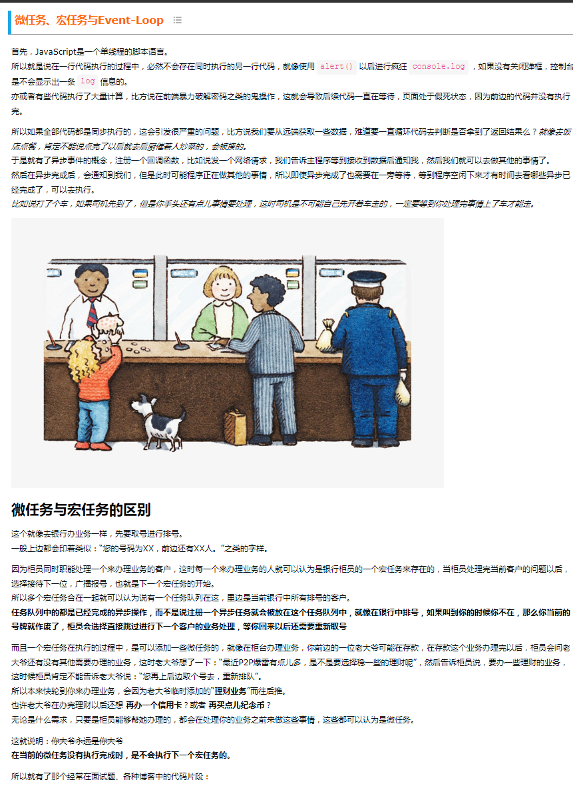
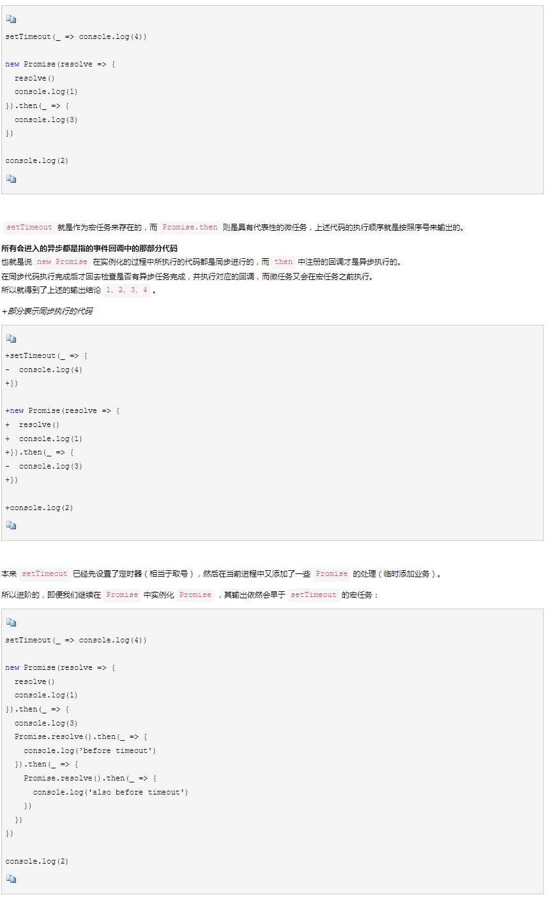
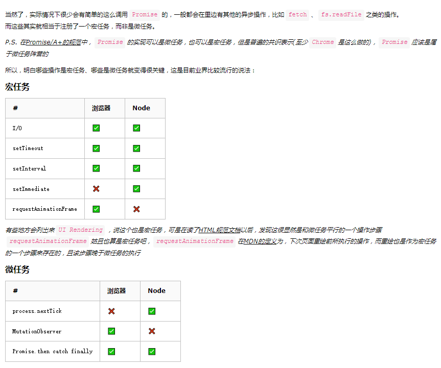
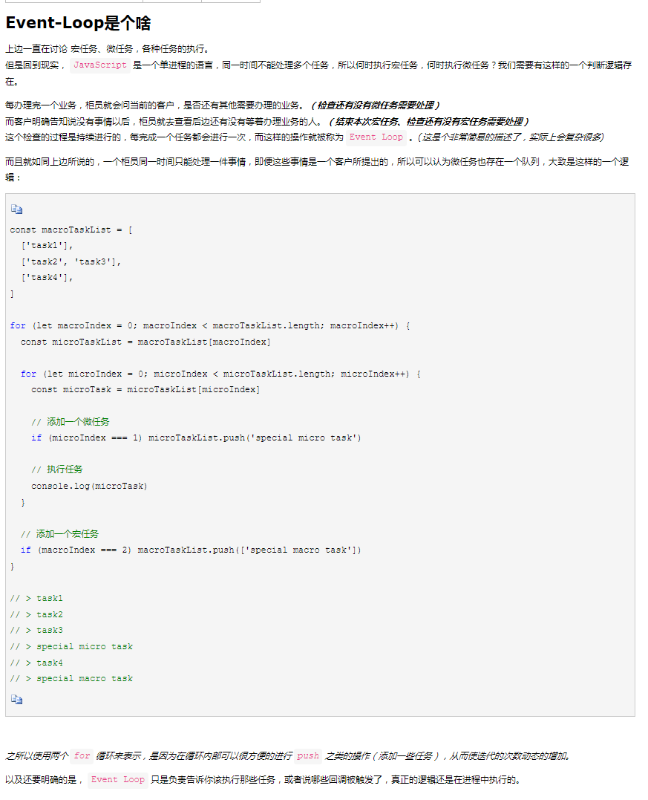
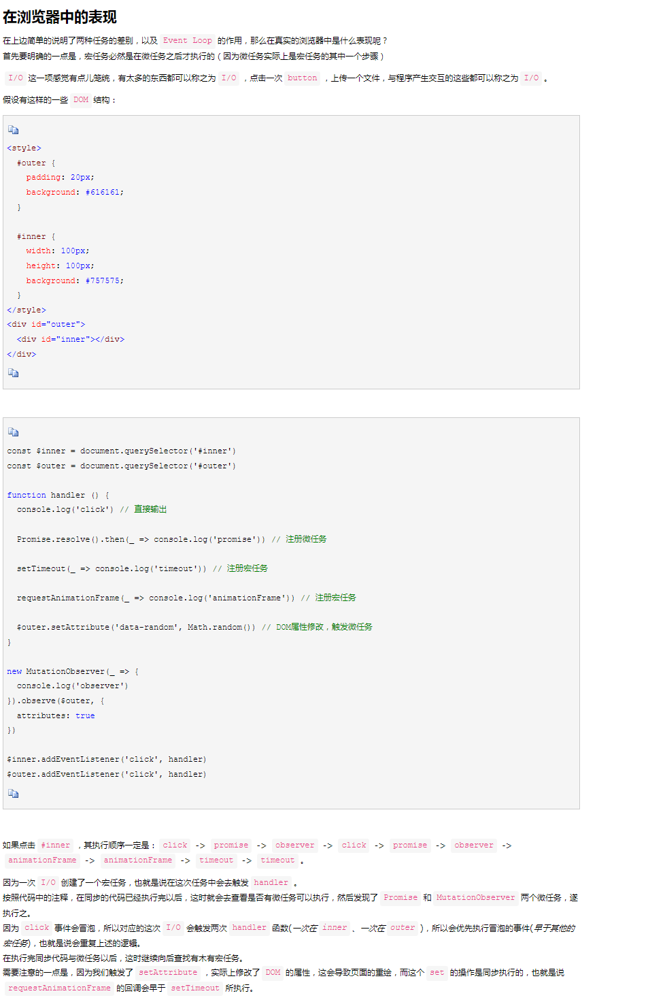
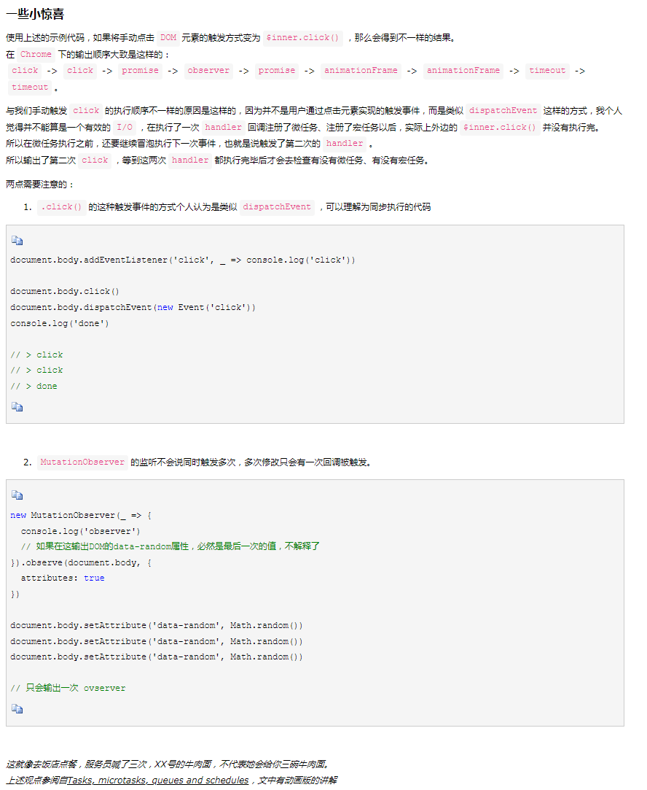
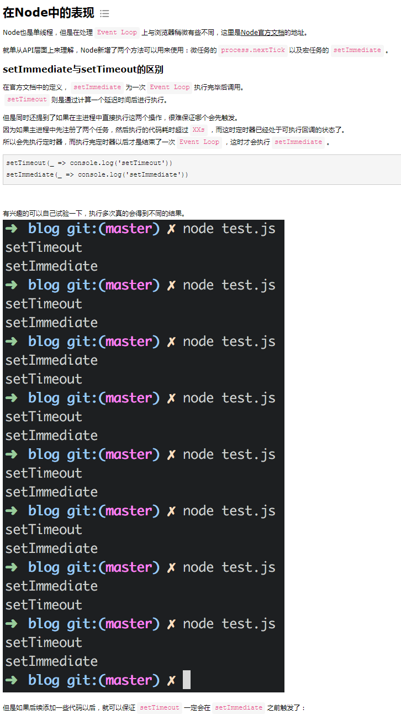
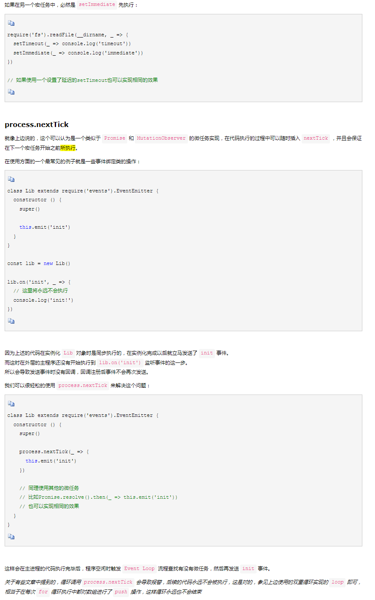
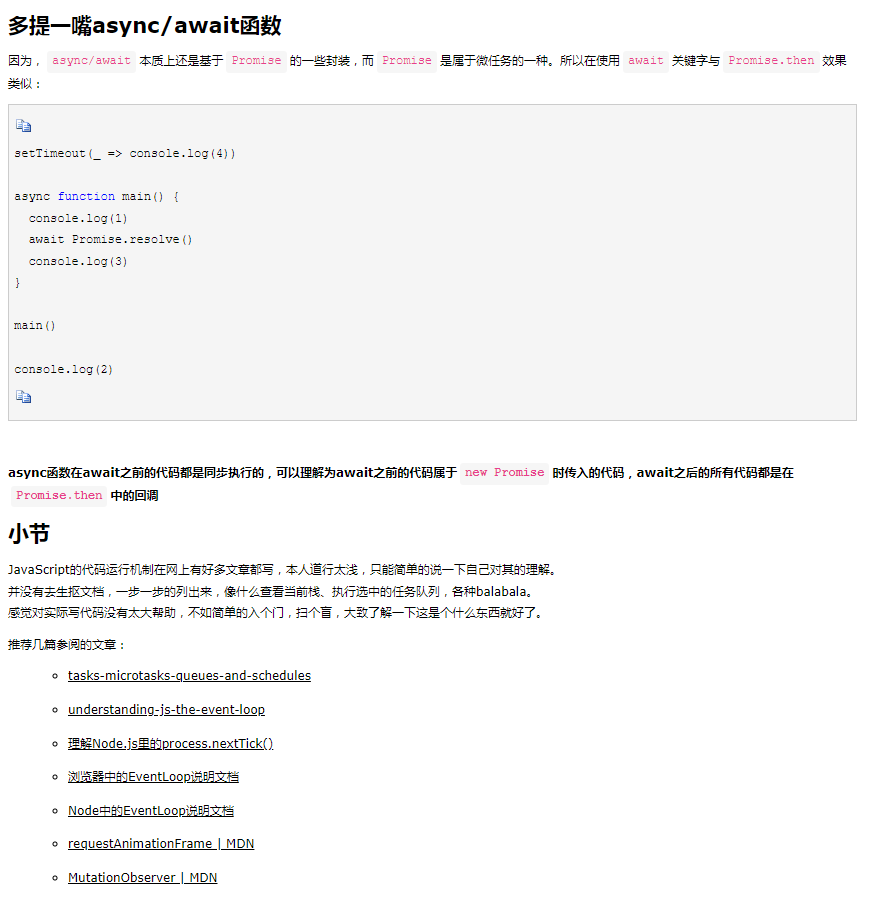

# 微任务、宏任务与Event-Loop









```javascrit
setTimeout(_ => console.log('setTimeout'))
setImmediate(_ => console.log('setImmediate'))

let countdown = 1e9

while(countdonn--) { } // 我们确保这个循环的执行速度会超过定时器的倒计时，导致这轮循环没有结束时，setTimeout已经可以执行回调了，所以会先执行`setTimeout`再结束这一轮循环，也就是说开始执行`setImmediate`
```



