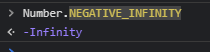

# 最大最小数

1. 最小数是`Number.NEGATIVE_INFINITY`

虽然严格意义上,它并不是一个数

2. 和Java不同, 在js里面: `0 < Number.MIN_VALUE`, 因为`Number.MIN_VALUE` 是 `5e-324`;
java最小的整数: `Integer.MIN_VALUE` 是 `-2147483648 `

3. js最大的整数`Number.MAX_VALUE`