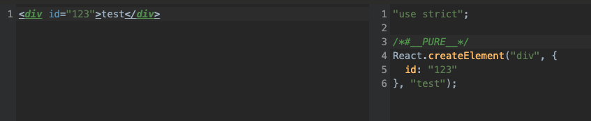
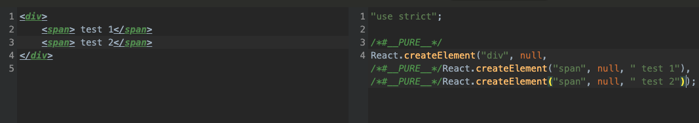
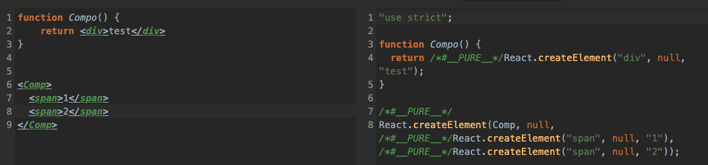
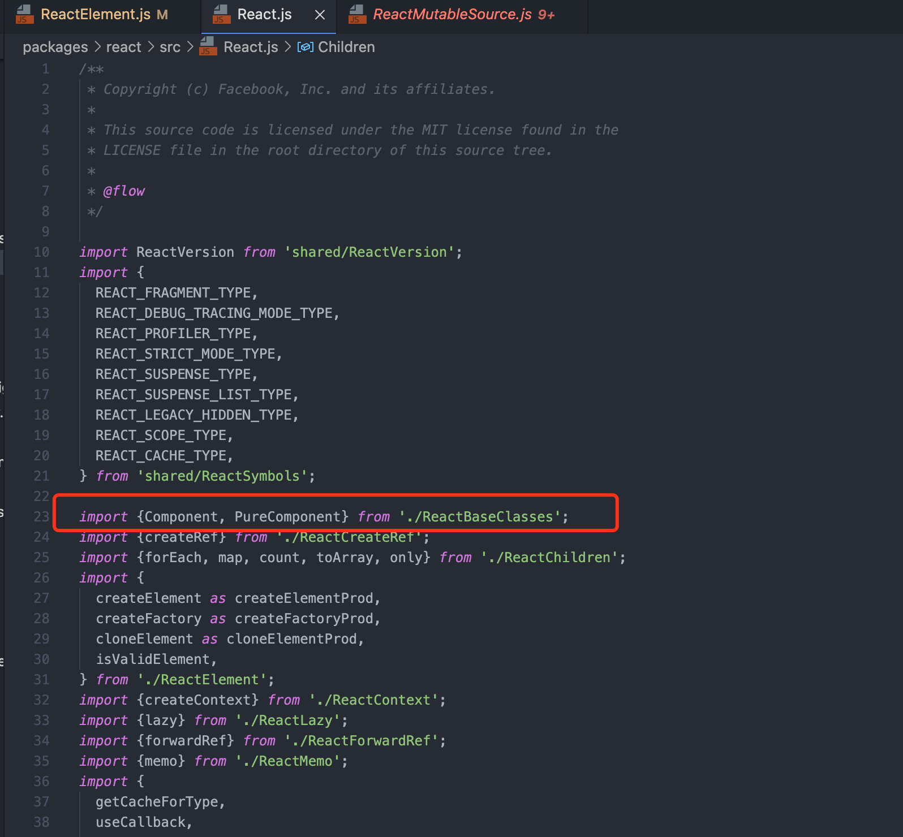

# 目录

[toc]

## 资料
[文档](https://react.jokcy.me)

[video](https://ke.segmentfault.com/course/1650000023864436#nav-section-list-title)

[github material](https://github.com/Bogdan-Lyashenko/Under-the-hood-ReactJS)

[a book](https://rn.parryqiu.com/)

[react git release version](https://github.com/facebook/react/releases?after=v0.8.0)

[react git release version tags](https://github.com/facebook/react/tags?after=v0.8.0)

[内部文章](http://km.oa.com/articles/show/496023)

## 源码阅读

### V15

我们创建一个简单的component

```typescript
class ChildCmp extends React.Component {
    render() {
        return <div> {this.props.childMessage} </div>
    }
}

class ExampleApplication extends React.Component {
    constructor(props) {
        super(props);
        this.state = {message: 'no message'};
    }

    componentWillMount() {
        //...
    }

    componentDidMount() {
        /* setTimeout(()=> {
            this.setState({ message: 'timeout state message' });
        }, 1000); */
    }

    shouldComponentUpdate(nextProps, nextState, nextContext) {
        return true;
    }

    componentDidUpdate(prevProps, prevState, prevContext) {
        //...
    }

    componentWillReceiveProps(nextProps) {
        //...
    }

    componentWillUnmount() {
        //...
    }

    onClickHandler() {
        /* this.setState({ message: 'click state message' }); */
    }

    render() {
        return <div>
            <button onClick={this.onClickHandler.bind(this)}> set state button </button>
            <ChildCmp childMessage={this.state.message} />
            And some text as well!
        </div>
    }
}

ReactDOM.render(
    <ExampleApplication hello={'world'} />,
    document.getElementById('container'),
    function() {}
);
```
以该简单代码为例，当运行`ReactDOM.render`时候，我们想要react做的就是将`JSX`代码转换为基本的html dom节点

从`JSX`到`HTML`之间要经过以下几个步骤：
                            存疑？？？？
``` 
jsx -- react element -- react internal representation -- 
```

现在进入源码内学习看下：

当运行`ReactDOM.render()`时候，react内部并没有`ReactDom.render`,而是会调用函数`ReactMount.render()`, 该函数功能如下

```javascript
  /**
   * Renders a React component into the DOM in the supplied `container`.
   *
   * If the React component was previously rendered into `container`, this will
   * perform an update on it and only mutate the DOM as necessary to reflect the
   * latest React component.
   *
   * @param {ReactElement} nextElement Component element to render.
   * @param {DOMElement} container DOM element to render into.
   * @param {?function} callback function triggered on completion
   * @return {ReactComponent} Component instance rendered in `container`.
   */
  render: function(nextElement, container, callback) {
    return ReactMount._renderSubtreeIntoContainer(null, nextElement, container, callback);
  };
```
该函数

-------------------上方为博客内容，待学完下方课程后再阅读者总结-----------------------------

### 从JSX到JavaScript转变

A `JSX` will be compiled to `JavaScript` in React by `React.createElement()`.

We all know that there are two elements types in `JSX`:

```
1) html native element like `<div>`
2) react element like `<ReactElement>`.
```

React mainly distinguish them by case of first letter.

By the way, I recommend a [web](https://babeljs.io/repl#?browsers=defaults%2C%20not%20ie%2011%2C%20not%20ie_mob%2011&build=&builtIns=false&corejs=3.6&spec=false&loose=false&code_lz=Q&debug=false&forceAllTransforms=false&shippedProposals=false&circleciRepo=&evaluate=true&fileSize=false&timeTravel=false&sourceType=module&lineWrap=true&presets=env%2Creact%2Cstage-2&prettier=false&targets=&version=7.14.2&externalPlugins=), which could transfer a `JSX` to `JavaScript` for learning.

#### If `JSX` is html element



there are 3 parameters in `createElement()`:

```JavaScript
createElement(type, config, children)
```

Children can be more than one argument, If html element has multiply elements:



React would use a new `reactElement()` as the third and forth parameter.

#### What if `JSX` is a react element



the first parameter will be a `function`

#### Three parameters in createElement()

we have glanced over the basic the basic transfer from `jsx`  to  `createElement()`.

Now, I will explain the 3 parameters:

* type:

    1) html element, the type will be a `string` type

    2) if it's a react element, the type will be a `class`,`function` component
    
    3) or other react native type like `Fragment`, `StrictMode`, `Suspense` etc.

* config:

all attribues written in `JSX` will be stored in config by key-value method, like `id` etc.

* children

store sub-tag, sub-element, text etc.

#### Details about `createElement()`

I will explain them by code comment

```JavaScript
/**
 * Create and return a new ReactElement of the given type.
 * See https://reactjs.org/docs/react-api.html#createelement
 */
export function createElement(type, config, children) {
    let propName;

    // Reserved names are extracted
    const props = {};

    let key = null;
    let ref = null;
    let self = null;
    let source = null;

    if (config != null) {
        // store config.ref and config.key into a independent variable
        if (hasValidRef(config)) {
            ref = config.ref;

            if (__DEV__) {
                warnIfStringRefCannotBeAutoConverted(config);
            }
        }
        if (hasValidKey(config)) {
            key = '' + config.key;
        }

        self = config.__self === undefined ? null : config.__self;
        source = config.__source === undefined ? null : config.__source;
        // Remaining properties are added to a new props object
        for (propName in config) {
        /*
            RESERVED_PROPS is a object:

            const RESERVED_PROPS = {
                  key: true,
                  ref: true,
                  __self: true,
                  __source: true,
            };

          object.hasOwnProperty(Object): determines whether the specified object contains the specified property
      */
            if (
                hasOwnProperty.call(config, propName) &&
                !RESERVED_PROPS.hasOwnProperty(propName)
            ) {
                // remaining properties are added to a new props object
                // when we use react, we will not see any props has key, ref and other key word. because all of them will be handle
                props[propName] = config[propName];
            }
        }
    }

    // Children can be more than one argument, and those are transferred onto
    // the newly allocated props object.
    const childrenLength = arguments.length - 2; // first two parameters is "type" and "config"
    if (childrenLength === 1) {
        props.children = children;
    } else if (childrenLength > 1) {
        // if children > 1, all of them will be added onto an array
        const childArray = Array(childrenLength);
        for (let i = 0; i < childrenLength; i++) {
            childArray[i] = arguments[i + 2];
        }
        if (__DEV__) {
            if (Object.freeze) {
                Object.freeze(childArray);
            }
        }
        props.children = childArray;
    }

    /* Resolve default props:
        * what is defalultProps: https://reactjs.org/docs/typechecking-with-proptypes.html
        *   if we write a code like this:

            class Greeting extends React.Component {
                render() {
                    return (
                        <h1>Hello, {this.props.name}</h1>
                    );
                }
            }

            Greeting.propTypes = {
                name: PropTypes.string,
                age: 18,
            };

    */
    if (type && type.defaultProps) {
        const defaultProps = type.defaultProps;
        for (propName in defaultProps) {
            // because props['age'] === undefined, so props['age'] = 18;
            // Attention! null is ignore, and not be resolved
            if (props[propName] === undefined) {
                props[propName] = defaultProps[propName];
            }
        }
    }
    if (__DEV__) {
        if (key || ref) {
            const displayName =
                typeof type === 'function'
                    ? type.displayName || type.name || 'Unknown'
                    : type;
            if (key) {
                defineKeyPropWarningGetter(props, displayName);
            }
            if (ref) {
                defineRefPropWarningGetter(props, displayName);
            }
        }
    }
    return ReactElement(
        type,
        key,
        ref,
        self,
        source,
        ReactCurrentOwner.current,
        props,
    );
}
```

createElement will return a function called ReactElement(), we could have a look what is it . We shall not be concerned about every details until future I will show.

```JavaScript
const ReactElement = function (type, key, ref, self, source, owner, props) {
    const element = {
        // This tag allows us to uniquely identify this as a React Element
        $$typeof: REACT_ELEMENT_TYPE,

        // Built-in properties that belong on the element
        type: type, // for node type
        key: key,
        ref: ref,
        props: props,

        // Record the component responsible for creating this element.
        _owner: owner,
    };

    ...

    return element;
};
```

### 1. React.Component

#### 1.1 About React.js

open `React.js` in `react/packages/react/src/React.js`. the main purpose of the file is to export functions, objects etc.



now we jump to `ReactBaseClasses.js` to explore `React.Component` and `React.PureComponent`

For convenience, I have posted the whole `ReactBaseClasses.js` file below:

```JavaScript
/**
 * Copyright (c) Facebook, Inc. and its affiliates.
 *
 * This source code is licensed under the MIT license found in the
 * LICENSE file in the root directory of this source tree.
 */

import invariant from 'shared/invariant';

import ReactNoopUpdateQueue from './ReactNoopUpdateQueue';

const emptyObject = {};
if (__DEV__) {
  Object.freeze(emptyObject);
}

/**
 * Base class helpers for the updating state of a component.
 */
function Component(props, context, updater) {
  this.props = props;
  this.context = context;
  // If a component has string refs, we will assign a different object later.
  this.refs = emptyObject;
  // We initialize the default updater but the real one gets injected by the
  // renderer.
  this.updater = updater || ReactNoopUpdateQueue;
}

Component.prototype.isReactComponent = {};

/**
 * Sets a subset of the state. Always use this to mutate
 * state. You should treat `this.state` as immutable.
 *
 * There is no guarantee that `this.state` will be immediately updated, so
 * accessing `this.state` after calling this method may return the old value.
 *
 * There is no guarantee that calls to `setState` will run synchronously,
 * as they may eventually be batched together.  You can provide an optional
 * callback that will be executed when the call to setState is actually
 * completed.
 *
 * When a function is provided to setState, it will be called at some point in
 * the future (not synchronously). It will be called with the up to date
 * component arguments (state, props, context). These values can be different
 * from this.* because your function may be called after receiveProps but before
 * shouldComponentUpdate, and this new state, props, and context will not yet be
 * assigned to this.
 *
 * @param {object|function} partialState Next partial state or function to
 *        produce next partial state to be merged with current state.
 * @param {?function} callback Called after state is updated.
 * @final
 * @protected
 */
Component.prototype.setState = function(partialState, callback) {
  invariant(
    typeof partialState === 'object' ||
      typeof partialState === 'function' ||
      partialState == null,
    'setState(...): takes an object of state variables to update or a ' +
      'function which returns an object of state variables.',
  );
  this.updater.enqueueSetState(this, partialState, callback, 'setState');
};

/**
 * Forces an update. This should only be invoked when it is known with
 * certainty that we are **not** in a DOM transaction.
 *
 * You may want to call this when you know that some deeper aspect of the
 * component's state has changed but `setState` was not called.
 *
 * This will not invoke `shouldComponentUpdate`, but it will invoke
 * `componentWillUpdate` and `componentDidUpdate`.
 *
 * @param {?function} callback Called after update is complete.
 * @final
 * @protected
 */
Component.prototype.forceUpdate = function(callback) {
  this.updater.enqueueForceUpdate(this, callback, 'forceUpdate');
};

/**
 * Deprecated APIs. These APIs used to exist on classic React classes but since
 * we would like to deprecate them, we're not going to move them over to this
 * modern base class. Instead, we define a getter that warns if it's accessed.
 */
if (__DEV__) {
  const deprecatedAPIs = {
    isMounted: [
      'isMounted',
      'Instead, make sure to clean up subscriptions and pending requests in ' +
        'componentWillUnmount to prevent memory leaks.',
    ],
    replaceState: [
      'replaceState',
      'Refactor your code to use setState instead (see ' +
        'https://github.com/facebook/react/issues/3236).',
    ],
  };
  const defineDeprecationWarning = function(methodName, info) {
    Object.defineProperty(Component.prototype, methodName, {
      get: function() {
        console.warn(
          '%s(...) is deprecated in plain JavaScript React classes. %s',
          info[0],
          info[1],
        );
        return undefined;
      },
    });
  };
  for (const fnName in deprecatedAPIs) {
    if (deprecatedAPIs.hasOwnProperty(fnName)) {
      defineDeprecationWarning(fnName, deprecatedAPIs[fnName]);
    }
  }
}

function ComponentDummy() {}
ComponentDummy.prototype = Component.prototype;

/**
 * pureCompoent is almost the same to component.
 */
function PureComponent(props, context, updater) {
  this.props = props;
  this.context = context;
  // If a component has string refs, we will assign a different object later.
  this.refs = emptyObject;
  this.updater = updater || ReactNoopUpdateQueue;
}

const pureComponentPrototype = (PureComponent.prototype = new ComponentDummy());
pureComponentPrototype.constructor = PureComponent;
// Avoid an extra prototype jump for these methods.
Object.assign(pureComponentPrototype, Component.prototype);
pureComponentPrototype.isPureReactComponent = true; // identifer the react dom will use to judege if a component need to be updated
export {Component, PureComponent};
```

#### 1.2 Details About React.Component

We often use `React.Component` like this:

```JavaScript
class fileInfo extends React.Component {


    render() {
        return (
            <div style={{ width: '208px' }}>
                <span>test</span>
            </div>
        );
    };
}
```

Before learning the `React.Component`, you maybe think it's a heavy function or class which carries many functions and effect.
But it's wrong!! the `React.Component` function just less than ten lines. The whole `ReactBaseClasses.js` just have less than 150 lines.

Let's see what information in `React.Component`:

```JavaScript

const emptyObject = {};
/**
 * Base class helpers for the updating state of a component.
 */
function Component(props, context, updater) {
    this.props = props;
    this.context = context;
    // If a component has string refs, we will assign a different object later.
    this.refs = emptyObject;
    // We initialize the default updater but the real one gets injected by the
    // renderer.
    this.updater = updater || ReactNoopUpdateQueue;
}
```

The above is all, supprise!

`Component` is a function which will receive 3 parameters: `props`, `context`, `updater`.

We all know `props` and `context`, `Component` will store `props` and `context` into `this`.

At `this.refs = emptyObject`, `this.refs` will be an empty object in the beginning, but if a component has string refs, we will assign a different object later. If you don't understand this, don' worry, I will explain `ref` next chapter.

we always use `setState`, I still use code comments to explain:

```JavaScript
/**
 * Sets a subset of the state. Always use this to mutate
 * state. You should treat `this.state` as immutable.
 *
 * There is no guarantee that `this.state` will be immediately updated, so
 * accessing `this.state` after calling this method may return the old value.
 *
 * There is no guarantee that calls to `setState` will run synchronously,
 * as they may eventually be batched together.  You can provide an optional
 * callback that will be executed when the call to setState is actually
 * completed.
 *
 * When a function is provided to setState, it will be called at some point in
 * the future (not synchronously). It will be called with the up to date
 * component arguments (state, props, context). These values can be different
 * from this.* because your function may be called after receiveProps but before
 * shouldComponentUpdate, and this new state, props, and context will not yet be
 * assigned to this.
 *
 * @param {object|function} partialState Next partial state or function to
 *        produce next partial state to be merged with current state.
 * @param {?function} callback Called after state is updated.
 * @final
 * @protected
 */
Component.prototype.setState = function(partialState, callback) {
    // examine the partialState type, if it is not object, function or null, will prompt an error
    invariant(
        typeof partialState === 'object' ||
            typeof partialState === 'function' ||
            partialState == null,
    'setState(...): takes an object of state variables to update or a ' +
        'function which returns an object of state variables.',
    );
    this.updater.enqueueSetState(this, partialState, callback, 'setState');
};
```

#### 1.3 createRef & ref

#### intro to ref

`ref` is use to get specific Subcomponent instance Conveniently.
