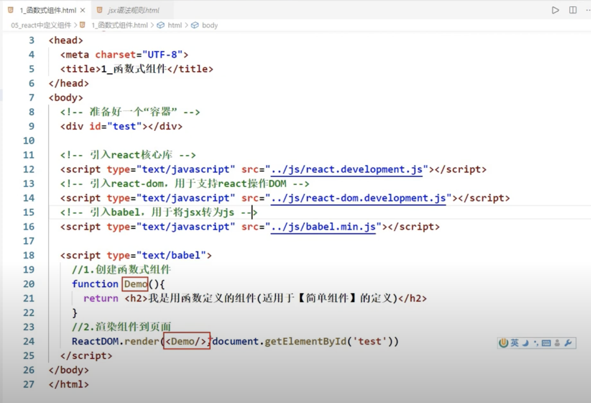
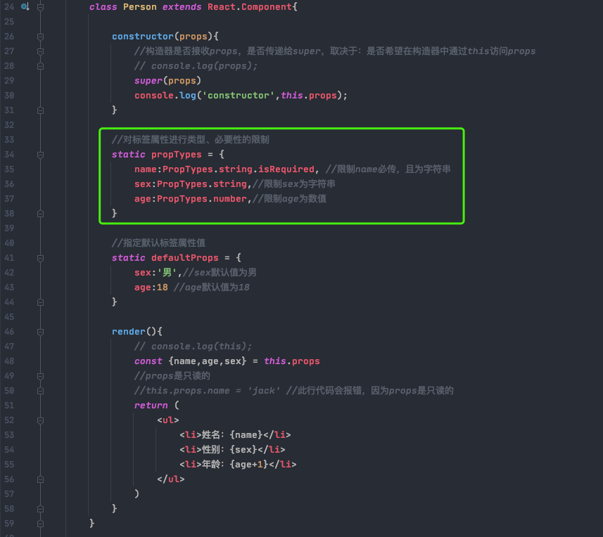
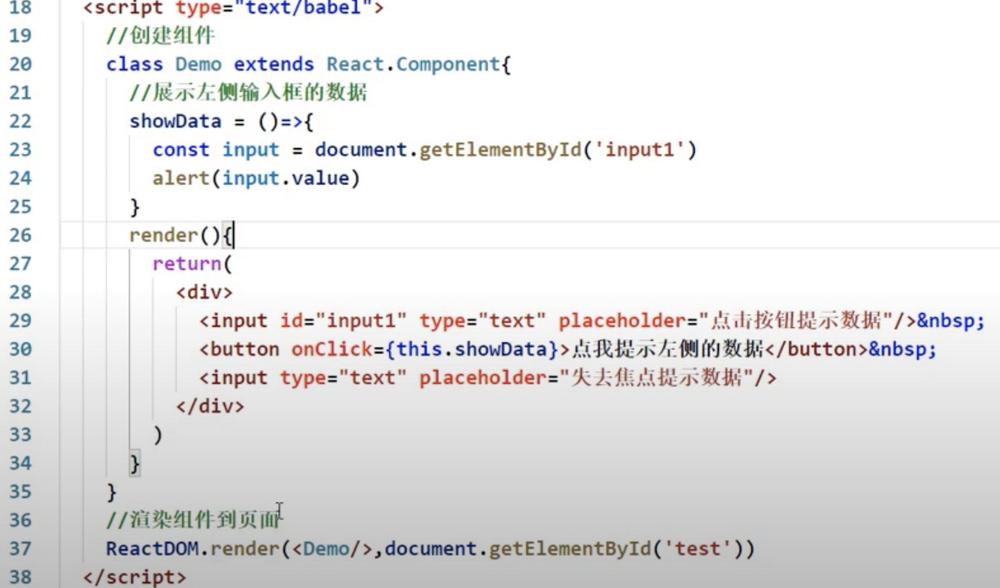
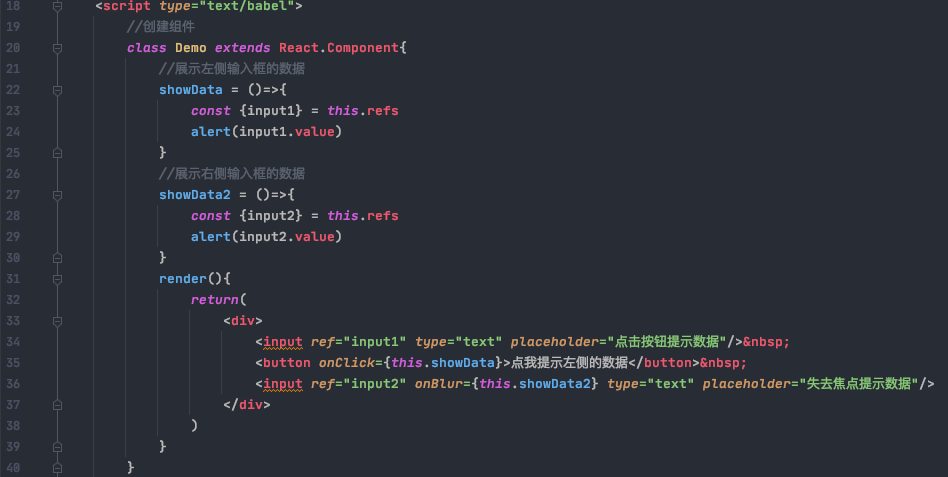
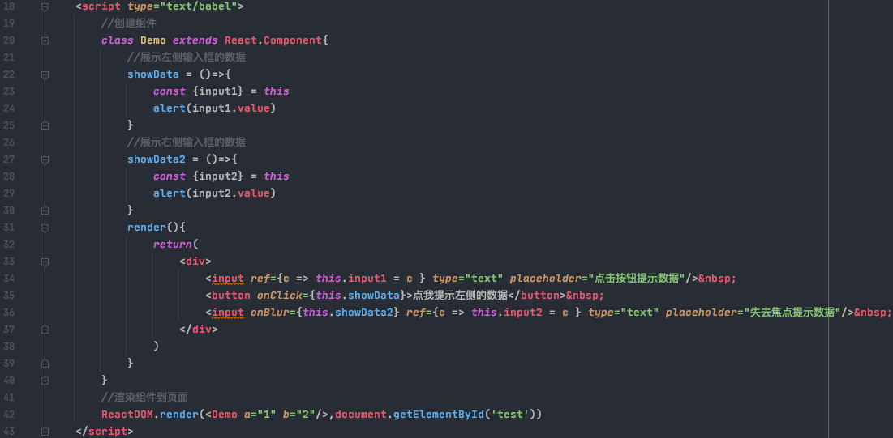
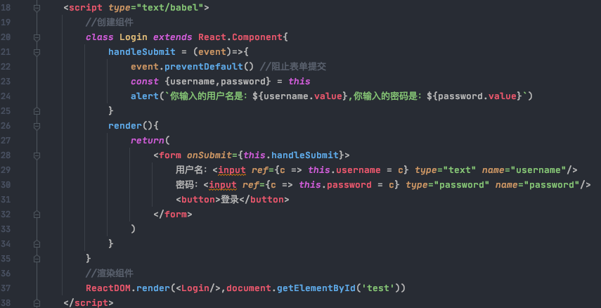

# 目录

[toc]

## 一些基本知识

### create a react project: `npx create-react-app my-app`

### launch a react and design it by heat update: `npm start`

### JSX

1. 定义虚拟DOM时候不用写引号
2. 标签中混入JS表达式时需要加`{}`, 何为表达式：`a`, `a+b`, `a(1)`, `a.map()`, `定义个函数`
3. 样式的类名用className

```javascript
  const myID = "abc";
  const VDOM = (
  <h2 id = {myID}>
  hello
  </h2>
```

#### 内联样式，用style = {{key:'value'}}形式


#### tag内，如果为小写，则认为是html的tag。如果首字母是大写，则为定义react component

## react components

Component：用来实现局部功能效果的代码和资源的集合（HTML/CSS/JS/Image等等）
component 分为两类： 1. Function Component 2.class Component:

### Function Component

特点：简单组件，无状态, no state



函数首字母大写，渲染时候用`<Demo/>因为之前说过`tag内，如果为小写，则认为是html的tag。如果首字母是大写，则为定义react component`

### Class Component

特点： 复杂组件，有状态

因为只有类才包含实例this.state， 所以只有class component 含有状态


## Three Core Attributes

Three Core Attributes of Components:

### state

* just exist in an instance of class， 为`this.state`, because function doesn't have property
* 初始state 为null

#### 复习：three methods to Bound event in native js


bound event in react


我们会发现，class component内部的自定义function都有一个特点，其function基本都是作为时间的回调函数.
如上图，如果我`const w1 = new Weather()`, 我不可能直接`w1.changeWeather()`， 由此发现this的重要性。

引出class components简写方式：

在class components内部不用写constructor，直接写赋值语句，就可以直接给实例对象赋值属性.


#### 总结


上图2中，箭头函数的this指向object本身。但是类的非箭头函数位于类的prototype内，存放类型为普通函数，this为未定义
上图3中，this.state是没办法直接赋值的，要借用setState(上上图）

### props

#### 基本用法


`...p`是语法糖，要保证25行和39行对应

展开运算符`...`：

1.展开一个数组：

```javascript
    // 展开一个数组：
    let arr1 = [1,2,3]
    console.log(...arr1); //输出位 1， 2， 3
```

2.连接两个数组`[...arr1, arr2]

3.复制一个对象

```javascript
    let obj1 = { name: 'abc', age: 18}
    let obj2 = {...obj1} //花括号 + ...
```

#### 对props进行限制


#### props进行限制的简写



#### props 和 constructor

1.构造器是否接收props，是否传递给super，取决于：是否希望在构造器中通过this访问props,
[视频](https://www.youtube.com/watch?v=6XOgFOGmmdQ&list=PLmOn9nNkQxJFJXLvkNsGsoCUxJLqyLGxu&index=24)
[link](https://reactjs.org/docs/react-component.html#constructor)
上图中中constructor要打印`this.props`，所以就要传`props`进去

2.只有props可以用于function component

3.component内的constructor不能随便用：

```
Typically, in React constructors are only used for two purposes:
    1. Initializing local state by assigning an object to this.state.
    2. Binding event handler methods to an instance.
```

但其实上述两种目的都可以通过其他方法解决：如下图所示


### refs

不用refs时:


用refs时:

作用是替代html的`id`

#### 分类

1. 字符串形式refs, 如上图。（官方建议弃用）

2. 回调refs:


## 4. 收集表单数据

### 非受控组件：

现用现取，点提交才上传


### 受控组件：

随着输入，就能自动维护到dom里面


## 5. 生命周期

react生命周期(旧)：

.png)

react生命周期(新)：

.png)

## 6. react源码

[源码笔记](../2_React_源码.md)

## 7. 不同component之间如何传输数据

[Link](https://www.pluralsight.com/guides/how-to-pass-data-between-react-components)

### pubsubJS

[youtube](https://www.youtube.com/watch?v=zwAxgBFK0NM&list=PLmOn9nNkQxJFJXLvkNsGsoCUxJLqyLGxu&index=71)

[github](https://github.com/mroderick/PubSubJS)

Basic example

```javascript

import PubSub from 'pubsub-js'

// or when using CommonJS
const PubSub = require('pubsub-js');

// create a function to subscribe to topics
var mySubscriber = function (msg, data) {
    console.log( msg, data );
};

// add the function to the list of subscribers for a particular topic
// we're keeping the returned token, in order to be able to unsubscribe
// from the topic later on
var token = PubSub.subscribe('MY TOPIC', mySubscriber);

// publish a topic asynchronously
PubSub.publish('MY TOPIC', 'hello world!');

// publish a topic synchronously, which is faster in some environments,
// but will get confusing when one topic triggers new topics in the
// same execution chain
// USE WITH CAUTION, HERE BE DRAGONS!!!
PubSub.publishSync('MY TOPIC', 'hello world!');
```
---

## 8. react路由

### 概念

引入了SPA - single page application的概念

只页面局部更新， 数据通过AJAX获取并前端异步展示


```

路由的基本使用
    1.明确好界面中的导航区、展示区
    2.导航区的a标签改为Link标签
                <Link to="/xxxxx">Demo</Link>
    3.展示区写Route标签进行路径的匹配
                <Route path='/xxxx' component={Demo}/>
    4.<App>的最外侧包裹了一个<BrowserRouter>或<HashRouter>
```

### react路由组件和react一般组件区别

1.写法不同：
    一般组件：<Demo/>
    路由组件：<Route path="/demo" component={Demo}/>
2.存放位置不同：
    一般组件：components
    路由组件：pages
3.接收到的props不同：
    一般组件：写组件标签时传递了什么，就能收到什么
    路由组件：接收到三个固定的属性
        history:
                    go: ƒ go(n)
                    goBack: ƒ goBack()
                    goForward: ƒ goForward()
                    push: ƒ push(path, state)
                    replace: ƒ replace(path, state)
        location:
                    pathname: "/about"
                    search: ""
                    state: undefined
        match:
                    params: {}
                    path: "/about"
                    url: "/about"

## 9. portals

## 10. constructor

构造函数作用:

   1. 通过给this.state赋值来初始化state
   2. 为事件处理绑定实例 (bind(this))
但是上述两个作用都可以通过其他方法解决：
   1.在class components内部不用写constructor，直接写赋值语句，就可以直接给实例对象赋值属性
   2.用箭头函数

tips:
    Constructor is the only place where you should assign this.state directly.
    In all other methods, you need to use this.setState() instead.

## 11. hooks

### state hooks

Declaring state variables as a pair of [something, setSomething] is also handy because it lets us give different names to different state variables if we want to use more than one:

```javascript
  // Declare multiple state variables!
  const [age, setAge] = useState(42);
  const [fruit, setFruit] = useState('banana');
  const [todos, setTodos] = useState([{ text: 'Learn Hooks' }]);
```

You don’t have to use many state variables. State variables can hold objects and arrays just fine, so you can still group related data together. However, unlike this.setState in a class, updating a state variable always replaces it instead of merging it.

### effect hooks

```javascript
useEffect(() => {
    // Similar to componentDidMount
    ChatAPI.subscribeToFriendStatus(props.friend.id, handleStatusChange);
    // Similar to componentWillUnmount:
    return () => {
        ChatAPI.unsubscribeFromFriendStatus(props.friend.id, handleStatusChange);
};
});
```
