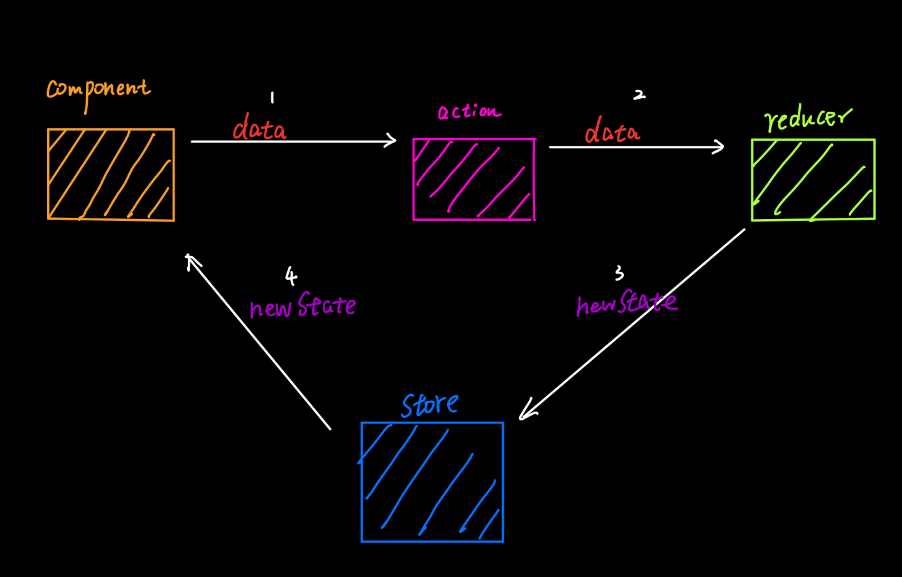

# react-redux

just show sync function, async function see [more details](./redux.md) plz.

## store

If there is a component, it need to do some operators(`action`) such as `add` or `minus`, and store the results(`state`) so as other component to access globally. So, we need a object called `store` to store all state so as to access globally.

```javascript
/*
store:

如果没有异步action
该文件专门用于暴露一个store对象，整个应用只有一个store对象
*/

import {createStore} from 'redux'
//引入为Count组件服务的reducer
import countReducer from './count_reducer'
//暴露store
export default createStore(countReducer) // 把reducer放进store
```

## container component

we know that, we get a data`(initialState)` from component and after computing such as `add` or `minus`, need to return result`(state)` to store.

so we need a function to link computing`(action)` and `store`. This function is `dispatch(action(num))`. it will compute the `num` through `action(num)`, then return the result`(state)` to `store`;

```javascript
import CountUI from '../../components/Count'
import {
    createIncrementAction,
    createDecrementAction,
    createIncrementAsyncAction
} from '../../redux/count_action'
import {connect} from 'react-redux'

function mapStateToProps(state){ // store已经把状态传过来，只需要接收下。 图中绿色左指向的箭头
    return { count:state } // 图中红色左指向的箭头
}

function mapDispatchToProps(dispatch){
    return {
        // 通知redux执行加法
        // 下面是常规方法
        // jia: {
        //     store.dispatch({type: 'increment', data: number})
        // },
        // 但是可以用react-redux方法
        // 通过action creator定义的函数action，dispathch
        jia: number => store.dispatch(createIncrementAction(number)),
        jian: number => dispatch(createDecrementAction(number)),
        jiaAsync:(number,time) => dispatch(createIncrementAsyncAction(number,time)),
    }
}

export default connect(mapStateToProps,mapDispatchToProps)(CountUI)
```

### UI component

container component is to communicate. UI component is to show UI. the data`(state)` need to show at UI component. so, we use `mapStateToProps(state)` to communicate `state` between UI component and container component. we use `mapDispatchToProps(dispatch)` to communicate `action` between UI component and container component.

```javascript
import React, { Component } from 'react'

export default class Count extends Component {

    state = {carName:'奔驰c63'}

    //加法
    increment = ()=>{
        const {value} = this.selectNumber
        // 父亲容器组件定义的 mapDispatchToProps 传递的函数。通过props传递过来
        this.props.jia(value*1) // 不做具体的函数实现，交给props.jia, 下同
    }
    //减法
    decrement = ()=>{
        const {value} = this.selectNumber
        this.props.jian(value*1)
    }
    //奇数再加
    incrementIfOdd = ()=>{
        const {value} = this.selectNumber
        // 父亲容器组件定义的 mapStateToProps 传递的函数。通过props传递过来
        if(this.props.count % 2 !== 0){
            this.props.jia(value*1)
        }
    }
    //异步加
    incrementAsync = ()=>{
        const {value} = this.selectNumber
        this.props.jiaAsync(value*1,500)
    }

    render() {
        //console.log('UI组件接收到的props是',this.props);
        return (
            <div>
                <h1>当前求和为：{this.props.count}</h1>
                <select ref={c => this.selectNumber = c}>
                    <option value="1">1</option>
                    <option value="2">2</option>
                    <option value="3">3</option>
                </select>&nbsp;
                <button onClick={this.increment}>+</button>&nbsp;
                <button onClick={this.decrement}>-</button>&nbsp;
                <button onClick={this.incrementIfOdd}>当前求和为奇数再加</button>&nbsp;
                <button onClick={this.incrementAsync}>异步加</button>&nbsp;
            </div>
        )
    }
}
```

### 容器组件的上层组件

store必须通过props方式传递给容器组件，才能建立组件component和redux之间连接

```javascript
import React, { Component } from 'react'
import Count from './containers/Count'
import store from './redux/store' // store不用自己创建，整个redux只维护一个store

export default class App extends Component {
    render() {
        return (
            <div>
                {/* 给容器组件传递store */}
                <Count store={store} />
            </div>
        )
    }
}
```


## action

so we use:

1. `store`: to store `action` and `state`
2. component: to give `store` a `state`, get a new `state` from `store` after computing`(action)`

so we need to define different `actions` to act or compute different `states`

```javascript
export const createIncrementAction = data => prevData + data
export const createDecrementAction = data => prevData - data
```

but if there are many `actions`, we need to add `action` into `store` like this:

```javascript
store.add(createIncrementAction)
store.add(createDecrementAction)
...
...other actions
```

why not use just one function? so we need `reducer`. so as to just add `reducer` into `store`: `export default createStore(countReducer)`

## reducer

```javascript
/*
countReducer:
1.该文件是用于创建一个为Count组件服务的reducer，reducer的本质就是一个函数
2.reducer函数会接到两个参数，分别为：之前的状态(preState)，动作对象(action)
*/

const initState = 0 //初始化状态
export default function countReducer(preState=initState, action){
    // console.log(preState);
    //从action对象中获取：type、data
    const { type,data } = action // 拿到action creator想要执行的type和data
    //根据type决定如何加工数据
    switch (type) {
        case 'increment': //如果是加
            return preState + data
        case 'decrement': //若果是减
            return preState - data
        default:
            return preState
    }
}
```

then `actions` could be:

```javascript
/*
action:

该文件专门为Count组件生成action对象
*/

//同步action，就是指action的值为Object类型的一般对象
export const createIncrementAction = data => ({ type: 'increment', data })
export const createDecrementAction = data => ({ type: 'decrement', data })
```

then, using `dispatch(action(num))` in component, we let `component` know which `action` and `state` need to use.

## summary

we use:

1. `store`: to store `action` and `state`
2. component: to give `store` a data(`state`), get a new data(`state`) from `store` after computing`(action)`
3. we need to define many `actions` and `states` into `store`. so we use `reducer` + `actions`. `reducer` is specific executor,  `action` is to distribute who to handler `prevState`.

