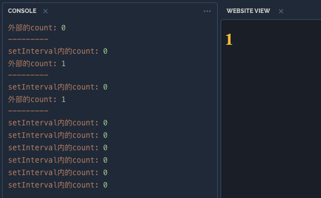
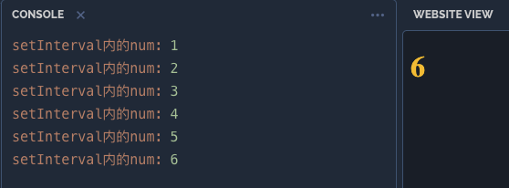
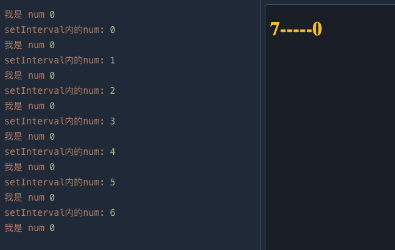
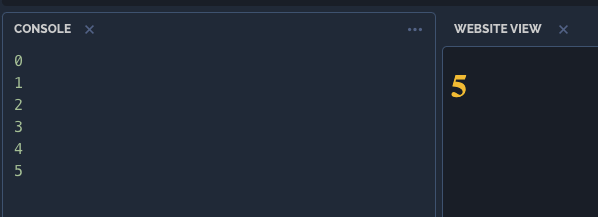

# react hooks实现原理一

## 深入 React hooks  — useState

## 前言

React Hooks的基本用法，[官方文档](https://react.docschina.org/docs/hooks-intro.html) 已经非常详细。本文的目的，是想通过一个简单的例子详细分析一些令人疑惑的问题及其背后的原因。这是系列的第一篇，主要讲解 useState。

## 思考

> 一起来看看这个栗子。

``` javascript
function Counter() {
    const [count, setCount] = useState(0);
    useEffect(() => {
        const id = setInterval(() => {
            setCount(count + 1);
        }, 1000);
    }, []);

    return <h1>{count}</h1>;
}
```

我们期望，useEffect 只执行一次，且后续每隔 1s，count 自动 + 1。然而， 实际上 count 从 0 到 1 后，再没有变化，一直都是 1。难道是 setInterval 没执行？于是我们很疑惑的加上了打印:

```javascript
function Counter() {
    const [count, setCount] = useState(0);

    useEffect(() => {
        const id = setInterval(() => {
            console.log('setInterval内的count:', count);
            setCount(count + 1);
        }, 1000);
    }, []);

    console.log('我是 count', count);

    return <h1>{count}</h1>;
}
```




事实是，setInterval 每次执行的时候，拿到的 count 都是 0。而函数组件在count变为1后，便不再被触发。

很自然的我们会想到闭包。我们稍加修改再看下这个例子：

``` javascript
function Counter() {
    const [count, setCount] = useState(0);
    let num = 0;
    useEffect(() => {
        const id = setInterval(() => {
            // 通过 num 来给 count 提供值
            console.log("setInterval内的num:", num);
            setCount(num++);
        }, 1000);
    }, []);

    return <h1>{count}</h1>;
}
}
```



我们可以看到，借助 num 这个中间变量，我们可以得到想要的结果。但是，同样是闭包，为什么 num 就能记住之前的值而count每次都为0呢？其实问题出在 count 上，继续往下看：

```javascript
function Counter() {
    const [count, setCount] = useState(0);
    let num = 0;

    useEffect(() => {
        const id = setInterval(() => {
            // 通过 num 来给 count 提供值
            console.log('setInterval内的num:', num);
            setCount(num += 1);
        }, 1000);
    }, []);

    console.log('我是 num', num);

    return <h1>{count}-----{num}</h1>;
}
```



渲染的 num 一直为0， 而定时器中的 num 却一直在增加，为什么呢？

## 每次都是重新执行

到这里我想说的到底是什么呢？我们可以清晰看见渲染出的 num 和 setInterval 中的 num，是不同的。这是因为在 React 中，对于函数式组件来讲，每次更新都会重新执行一遍函数。也就是说，每次更新都会在当前作用域重新声明一个 `let num = 0`，所以，定时器中闭包引用的那个 num，和每次更新时渲染的 num，根本不是同一个。当然，我们可以很轻易的把它们变成同一个。

``` javascript
let num = 0; // 将声明放到渲染组件外面
function Counter() {
    // ...
    return <h1>{count}-----{num}</h1>;
}
```

嗯，说了这么多，跟 count 有什么关系呢？同理，正因为函数组件每次都会整体重新执行，那么 Hooks 当然也是这样。

``` javascript
function Counter() {
    const [count, setCount] = useState(0);
    // ...
}
```

**useState 应该理解为和普通的 javascript 函数一样，而不是 React 的什么黑魔法**。函数组件更新的时候，useState 会重新执行，对应的，也会重新声明 `[count, setCount]` 这一组常量。只不过 React 对这个函数做了一些特殊处理：首次执行时，会将 useState 的参数初始化给 count，而以后再次执行时，则会直接取上次 setCount (如果有调用) 赋过的值（React 通过某种方式保存起来的）。

有了这个概念，就不难知道，定时器里的`setCount(count + 1)` ，这个 count 和每次更新重新声明的 count，也是完全不同的两个常量，只不过它们的值，可能会相等。

比如，我们尝试把之前的 num，直接用 count 替代。

``` javascript
function Counter() {
    // 注意这里变成 let
    let [count, setCount] = useState(0);
    useEffect(() => {
        const id = setInterval(() => {
            // 这种写法是不好的
            setCount(++count);
        }, 1000);
    }, []);
    console.log(count);
    return <h1>{count}</h1>;
}
```



这时候不论是打印还是页面表现都和你期望的一样，**但是这违背了 React 的原则，而且也让程序变得更让人迷惑**。也就导致你并不能清楚地知道：此时渲染的 count 和 setInterval 中的 count 已经不是同一个了。尽管他们的值是相等的。


当然，这种场景下 React 也提供了可行的方法，能够每次拿到 count 的最新值，就是给 setCount 传递一个回调函数。

``` javascript
function Counter() {
    const [count, setCount] = useState(0);
    useEffect(() => {
        const id = setInterval(() => {
            // 注意：这里变成回调了
            setCount(count => count + 1);
        }, 1000);
    }, []);

    return <h1>{count}</h1>;
}
```

## 执行图解

回过头再看看开始的例子：

``` javascript
function Counter() {
    const [count, setCount] = useState(0);
    useEffect(() => {
        const id = setInterval(() => {
            setCount(count + 1);
        }, 1000);
    }, []);

    return <h1>{count}</h1>;
}
```


## 小结

count 每次都被重新声明了，setInterval 因为 useEffect 设置了只执行一次的缘故，在第一次更新时闭包引用的 count 始终是 0，后续更新的 count 和它没关系。


## reference

[useState](https://zhuanlan.zhihu.com/p/82589347)
[useState](https://juejin.cn/post/6846687599625519111#heading-2)

[useEffect](https://zhuanlan.zhihu.com/p/85192975)
[hooks原理](https://zhuanlan.zhihu.com/p/88734130)
