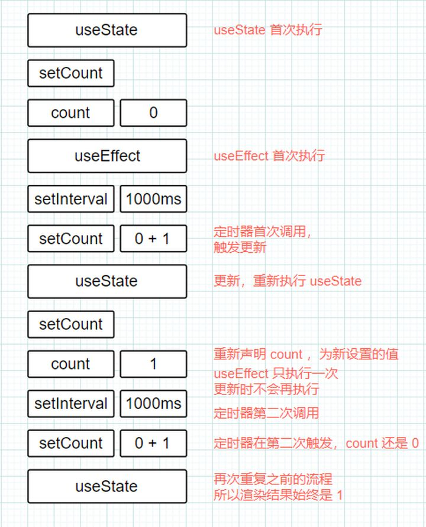

# react hooks实现原理一

## 深入 React hooks  — useState

## 前言

React Hooks的基本用法，[官方文档](https://react.docschina.org/docs/hooks-intro.html) 已经非常详细。本文的目的，是想通过一个简单的例子详细分析一些令人疑惑的问题及其背后的原因。这是系列的第一篇，主要讲解 useState。

## 一个栗子引发的思考

``` javascript
function Counter() {
    const [count, setCount] = useState(0);
    useEffect(() => {
        const id = setInterval(() => {
            setCount(count + 1);
        }, 1000);
    }, []);

    return <h1>{count}</h1>;
}
```

我们期望，useEffect 只执行一次，且后续每隔 1s，count 自动 + 1。然而， 实际上 count 从 0 到 1 后，再没有变化，一直都是 1。难道是 setInterval 没执行？于是我们很疑惑的加上了打印:

```javascript
function Counter() {
    const [count, setCount] = useState(0);

    useEffect(() => {
        const id = setInterval(() => {
            console.log('setInterval内的count:', count);
            setCount(count + 1);
        }, 1000);
    }, []);

    console.log('外部的count:', count);
    console.log('---------');

    return <h1>{count}</h1>;
}
```


事实是，setInterval 每次执行的时候，拿到的 count 都是 0。而函数组件在count变为1后，便不再被触发。

## 为什么

### 闭包

很自然的我们会想到闭包，由于闭包的存在，在函数真正被运行时才可以获取到外部的变量（count）。 比如：

```javascript
function a() {
  let count = 0;

  setInterval(() => {
    console.log(count + 1);
  }, 1000);
}

a();
```

函数`setInterval()`每次被调用时候，才能拿到的外部的变量`count`， 即`0`


再比如


```javascript
function a() {
  let count = 0;

  setInterval(() => {
    console.log(count += 1);
  }, 1000);
}

a();
```


以上是闭包的特点，在此不多详细讲解，详情请看[闭包](./../1_javascript/闭包.md)

### 验证

根据闭包的特点，这里进行验证

```javascript
function Counter() {
  const [count, setCount] = useState(0);

  useEffect(() => {
      const id = setInterval(() => {

        setCount(count + 1);
        console.log("setInterval内的count:", count);
      }, 1000);
  }, []);

  return <h1>{count}</h1>;
}
```


由于我们给 `useEffect`，传递了第二个参数 `[]`，表示这个 effect 没有任何外部依赖，只需要在第一次 render 时运行，无论这个组件被重新 render 多少次，`setInterval` 只会被注册一次。


## WHY? 每次都是重新执行

到这里我想说的到底是什么呢？

1. 在 React 中，对于函数式组件来讲，每次更新都会重新执行一遍函数。也就是说，每次更新都会在当前作用域重新声明一个 `let num = 0`。
2. **useState 应该理解为和普通的 javascript 函数一样，而不是 React 的什么黑魔法**。函数组件更新的时候，useState 会重新执行，对应的，也会重新声明 `[count, setCount]` 这一组常量。只不过 React 对这个函数做了一些特殊处理：首次执行时，会将 useState 的参数初始化给 count，而以后再次执行时，则会直接取上次 setCount (如果有调用) 赋过的值（React 通过某种方式保存起来的）。
Function Component 每次 render 都是重新执行 Function (产生新的局部变量，闭包)，第一次创建的闭包和第二次创建的闭包没有任何关系。所以，当程序运行起来是，`setInterval` 内的闭包引用到的一直是最初的 count，而 useState 得到的是最新的 count。这是两处代码打印出来结果不一致的根本原因。

### 每次都是重新渲染，为什么 useState 可以读到最新的 value


## 解决上述问题

### 利用闭包

我们稍加修改，利用变量`num`，解决上述问题：

``` javascript
function Counter() {
  const [count, setCount] = useState(0);
  let num = 0;

  useEffect(() => {
      const id = setInterval(() => {
          // 通过 num 来给 count 提供值
          setCount(num += 1);
          console.log("setInterval内的num:", num);
      }, 1000);
  }, []);

  return <h1>{count}</h1>;
}
```


### 利用全局变量

将声明放到渲染组件外面

``` javascript
let num = 0; // 将声明放到渲染组件外面
function Counter() {
    // ...
    return <h1>{count}-----{num}</h1>;
}
```

### 利用setState机理

给 setCount 传递一个回调函数。

``` javascript
function Counter() {
    const [count, setCount] = useState(0);
    useEffect(() => {
        const id = setInterval(() => {
            // 注意：这里变成回调了
            setCount(count => count + 1);
        }, 1000);
    }, []);

    return <h1>{count}</h1>;
}
```

## 执行图解

回过头再看看开始的例子：

``` javascript
function Counter() {
    const [count, setCount] = useState(0);
    useEffect(() => {
        const id = setInterval(() => {
            setCount(count + 1);
        }, 1000);
    }, []);

    return <h1>{count}</h1>;
}
```



## 小结

count 每次都被重新声明了，setInterval 因为 useEffect 设置了只执行一次的缘故，在第一次更新时闭包引用的 count 始终是 0，后续更新的 count 和它没关系。

## reference

[useState](https://zhuanlan.zhihu.com/p/82589347)
[useState](https://juejin.cn/post/6846687599625519111#heading-2)

[useEffect](https://zhuanlan.zhihu.com/p/85192975)
[hooks原理](https://zhuanlan.zhihu.com/p/88734130)
