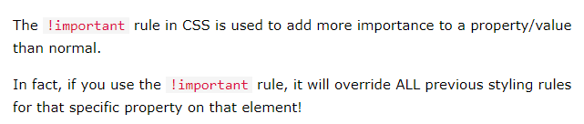
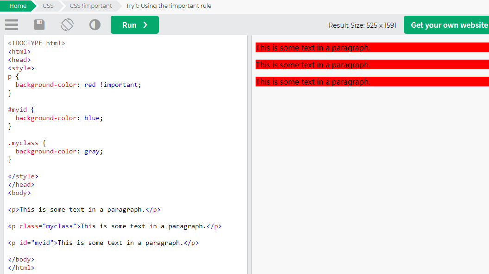

# CSS选择器

## type selectors/element selector

```CSS
p {
    color: black;
}
```

## Descendant selectors (space)

代表div下所有的p

```HTML
<div>
    <p>1</p>
    <h1>
        <p>2</p>
    </h1>
</div>
```

```css
div p {
    color: black;
}
```

## id selector (#)

```css
#id {

}
```

## class selector (.)

```CSS
.className {

}


```

## child selector (>)

a descendant selector will select all the descendants of an
element, a child selector only targets the element’s immediate descendants, or children.


```css
#nav > li {
 background: url(folder.png) no-repeat left top;
 padding-left: 20px;
}
```

```HTML
<ul id="nav">
 <li><a href="/home/">Home</a></li>
 <li><a href="/services/">Services</a>
 <ul>
 <li><a href="/services/design/">Design</a></li>
 <li><a href="/services/development/">Development</a></li>
 <li><a href="/services/consultancy/">Consultancy</a></li>
 </ul>
 </li>
 <li><a href="/contact/">Contact Us</a></li>
</ul>
```

## adjacent sibling selector (+)

 allows you to target an element that is preceded by another element that shares the same
parent.


## General Sibling Selector (~)

```css
h2 ~ p {
 font-size: 1.4em;
 font-weight: bold;
 color: #777;
}
```

## Attribute Selectors

```HTML
<p>
    Theterm
    <abbr title="self-contained underwater breath ing apparatus">
        SCUBA
    </abbr>
    isan acronymratherthananabbreviationasitispronouncedasaword.
</p>
```

```css
abbr[title] {
 border-bottom: 1px dotted #999;
}
```

## The Cascade

### important





## cascade order

样式的冲突
    当我们通过不同的选择器，选中相同的元素，并且为相同的样式设置不同的值时，此时就发生了样式的冲突。
    发生样式冲突时，应用哪个样式由选择器的权重（优先级）决定

选择器的权重

```css
    内联样式        1,0,0,0
    id选择器        0,1,0,0
    类和伪类选择器   0,0,1,0
    元素选择器       0,0,0,1
    通配选择器       0,0,0,0
    继承的样式       没有优先级
```

1. 比较优先级时，需要将所有的选择器的优先级进行相加计算，最后优先级越高，则越优先显示（分组选择器是单独计算的）;
2. 选择器的累加不会超过其最大的数量级，类选择器再高也不会超过id选择器
3. 如果优先级计算后相同，此时则优先使用靠下的样式
4. 可以在某一个样式的后边添加 !important ，则此时该样式会获取到最高的优先级，甚至超过内联样式，注意：在开发中这个玩意一定要慎用！

例子:

```css
#box1{
    background-color: orange;
}

div#box1{
    background-color: yellow;
}

第一个为id选择器, 第二个为元素选择器 + id选择器, 所以 101 > 100 第二个的权重大
```

```css
div, span, p {
    color: yellow;
}

逗号是分组, 所以上面三个元素是分开计算的, 而不是放在一起
```

```css
h1 h2 h3 h4 ... {
    color: yellow;
}

即使类型选择器叠加超过10个, 他的值也不会大于100的id选择器
```

```css
*{
    font-size: 50px;
}

div{
    font-size: 20px;
}

<div id="box1" class="red d1 d2 d3 d4" style="background-color: chocolate;">我是一个div <span>我是div中的span</span></div>
div内有一个 span,  span有两个属性设置, 一个是继承div的front-size: 20px, 一个是通配50px, 这时候听通配的
```