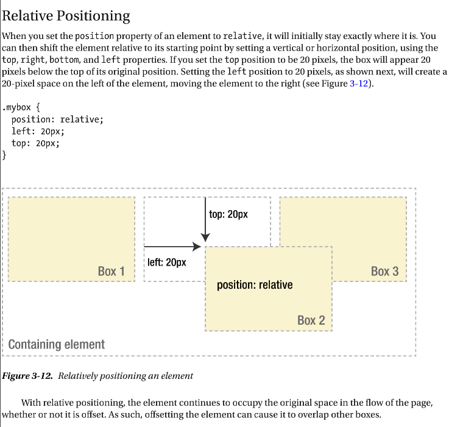

# [CSS position](https://developer.mozilla.org/en-US/docs/Learn/CSS/CSS_layout/Positioning)

## static

Static positioning is the default that every element gets. It just means "put the element into its normal position in the document flow — nothing special to see here."

## relative

