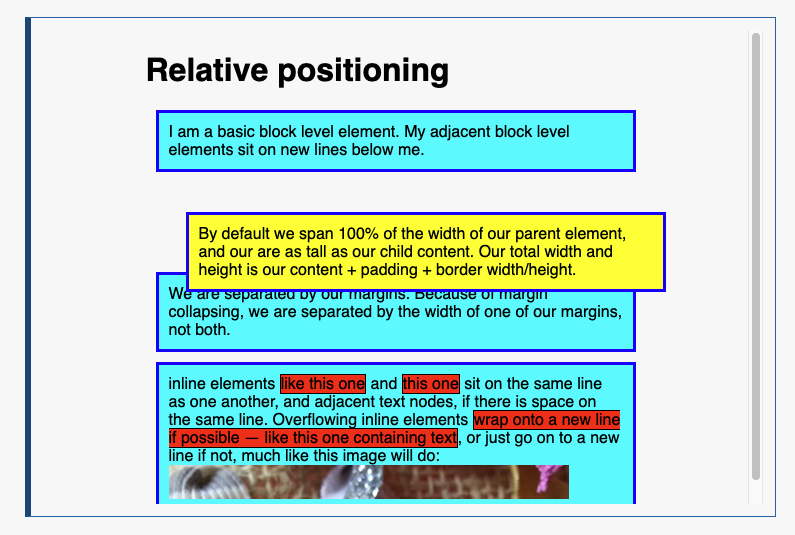
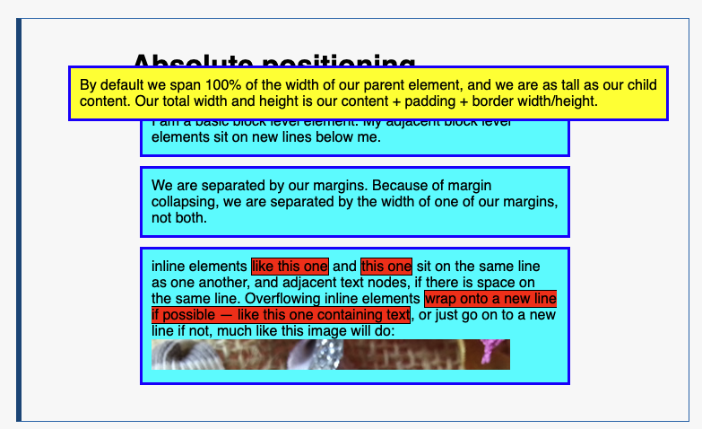
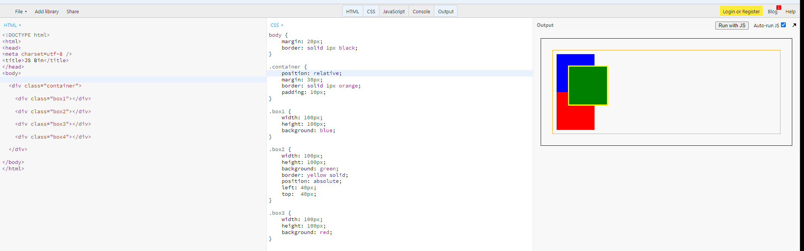
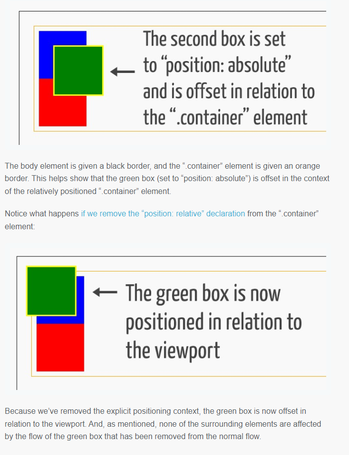

# [CSS position](https://developer.mozilla.org/en-US/docs/Learn/CSS/CSS_layout/Positioning)

## static

Static positioning is the default that every element gets. It just means "put the element into its normal position in the document flow — nothing special to see here."

## relative

他跟`static`很相似, 占据在正常的文档流中, 跟static唯一的区别就是它可以和其他元素`重叠`, 并且可以通过`top bottom left right`去设置dom的位置.

例如图片中黄色组件, 通过设置`top: 30px; left: 30px`, 将会让这个元素相对于static向下和向右移动`30px`

## absolute

脱离了正常的文档流, 可以看到蓝色的dom挤在了一起, 黄色元素像不复存在一样. 该黄色dom位于独立的一层, 这个时候设置`top bottom left right` 已经不是relative相对位置, 而是相对于页面的位置. 例如图中通过设置`top: 30px; left: 30px`, 元素会相对于页面向下和向右移动`30px`

## positioning contexts (位置上下文环境)

relative是相对于原始static位置进行offset, absolute脱离通常的文档流, 相对于`<body>`位置进行offset. 但是如果给一个祖先元素设置relative, 某个子元素设置absolute. 则子元素的环境上下文改变, 它不是相对于`<body>`进行offset, 而是将设置了`relative`的祖先元素视为上下文环境, 进行偏移

## reference

[blog](https://blog.teamtreehouse.com/css-positioning)
[mdn](https://developer.mozilla.org/en-US/docs/Learn/CSS/CSS_layout/Positioning#positioning_contexts)