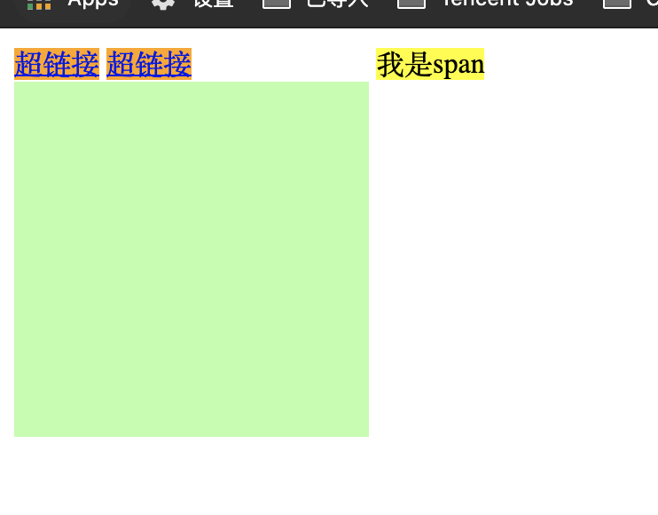

# 行内元素

* 定义： a, br, b, span等元素， 元素分为行内元素和块元素，盒子模型为块元素，独占一行， 行内元素不独占一行
* 行内元素会在一条直线上排列，在同一行从左至右水平排列。直到一行排不下，才会换行
* 行内元素设置宽、高、margin上下、padding上下无效（竖直不会影响布局）(不太懂啥意思)
* 行内元素设置line-height、margin左右、padding左右有效（水平有效）
* 行内元素不支持设置宽度和高度, height 和 width无效， 行内元素的宽高随标签里的内容而变化
例如下图，给a超链接设置长宽无用
* 要想设置宽高只能把行内元素变为块元素，用到`display`
* `display`:
    inline 将元素设置为行内元素
    block 将元素设置为块元素
    inline-block 将元素设置为行内块元素。行内块元素：既可以设置宽度和高度又不会独占一行
    table 将元素设置为一个表格
    none 元素不在页面中显示
* `visibility`:
    用来设置元素的显示状态
    可选值：
    visible 默认值，元素在页面中正常显示
    hidden 元素在页面中隐藏 不显示，和`display` = none的区别为：
    hidden隐藏，但是依然占据位置， none是不占显示时候的位置

## span和div

div默认为block，每一个单独占一行； span的默认样式为inline

