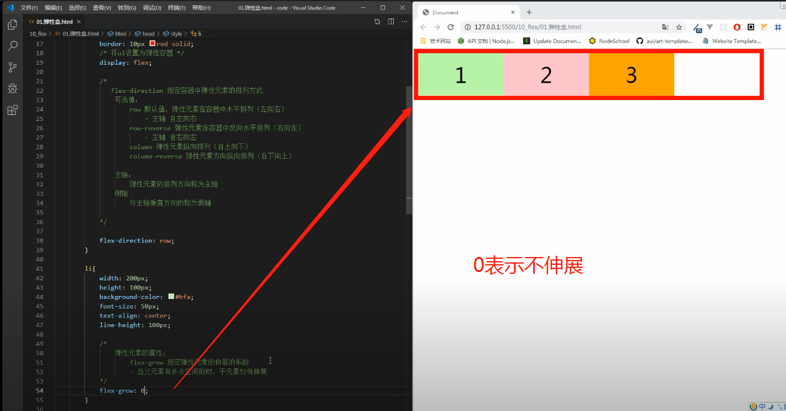
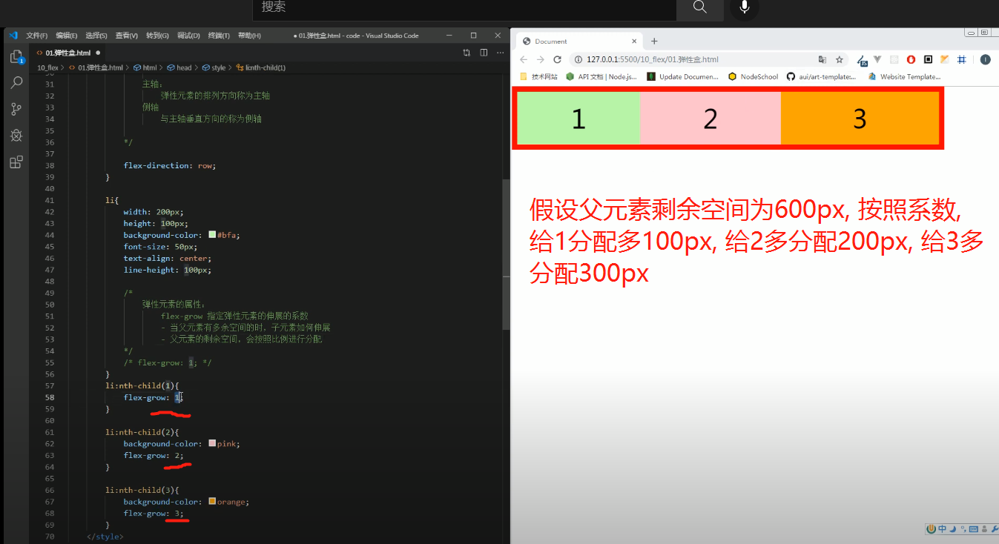

# flex一些属性

## flex-direction(弹性容器属性)

flex-direction 指定容器中弹性元素的排列方式
可选值：
```
    row 默认值，弹性元素在容器中水平排列（左向右）
        - 主轴 自左向右
    row-reverse 弹性元素在容器中反向水平排列（右向左）
        - 主轴 自右向左
    column 弹性元素纵向排列（自上向下）
    column-reverse 弹性元素方向纵向排列（自下向上）
```

两个概念:
**主轴：** 弹性元素的排列方向称为主轴
**侧轴：** 与主轴垂直方向的称为侧轴

## flex-grow(弹性元素属性)

设置指定弹性元素的伸展的系数.
当父元素有多余空间的时，子元素如何伸展: 父元素的剩余空间，会按照比例进行分配




## flex-shrink(弹性元素属性)

指定弹性元素的收缩系数, 当父元素中的空间不足以容纳所有的子元素时，如果对子元素进行收缩. 默认为1, 不收缩
