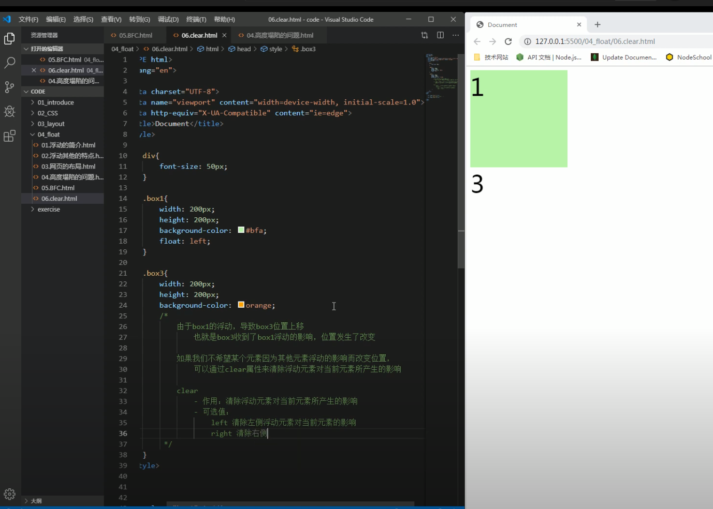
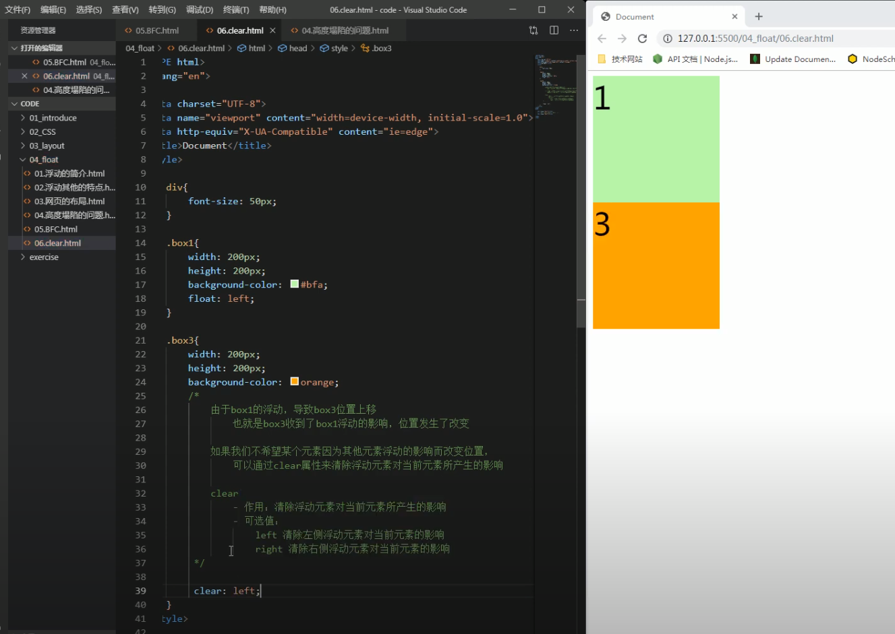

# clear

由于box1设置了浮动, box3就会覆盖上去, 也就是box3收到了box1浮动的影响，位置发生了改变

如果我们不希望某个元素因为其他元素浮动的影响而改变位置，可以通过clear属性来清除浮动元素对当前元素所产生的影响

- clear作用：清除浮动元素对当前元素所产生的影响
- 可选值：
    left 清除左侧浮动元素对当前元素的影响
    right 清除右侧浮动元素对当前元素的影响
    both 清除两侧中最大影响的那侧

原理：
    设置清除浮动以后，浏览器会自动为元素添加一个上外边距，
        以使其位置不受其他元素的影响

## reference

[video](https://www.youtube.com/watch?v=cKH-SnzGAfg&list=PLmOn9nNkQxJFs5KfK5ihVgb8nNccfkgxn&index=66)