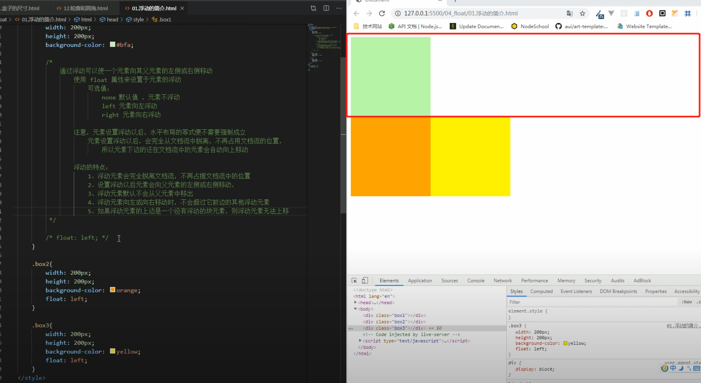
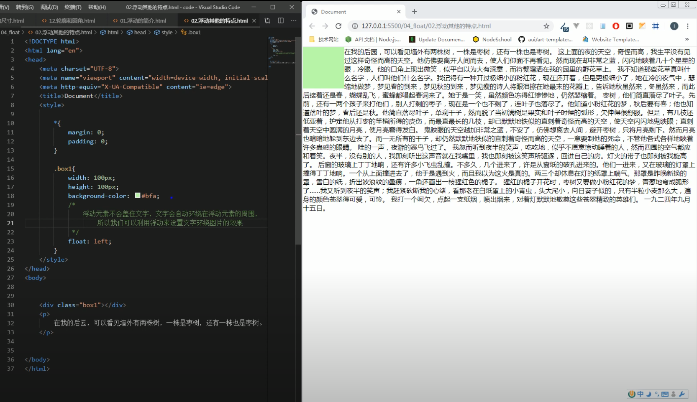
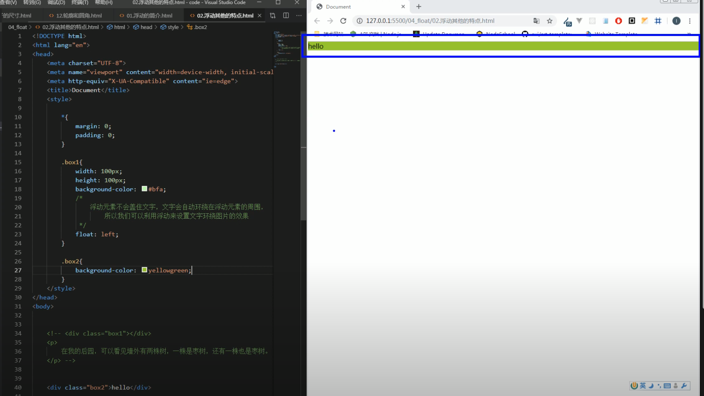
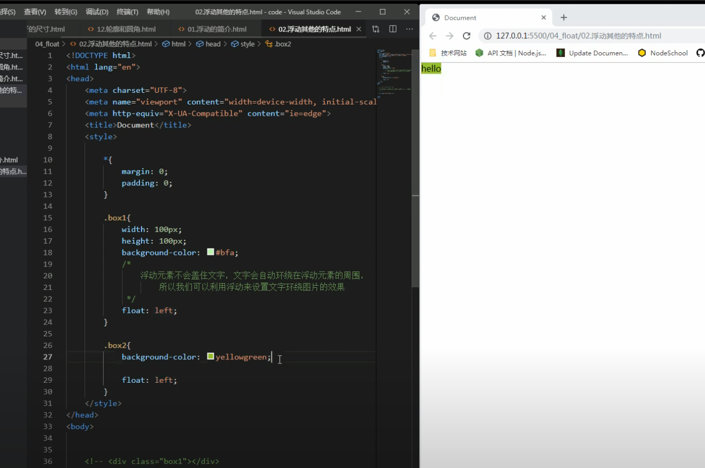
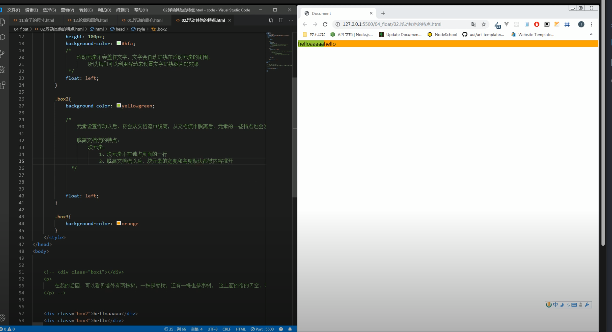
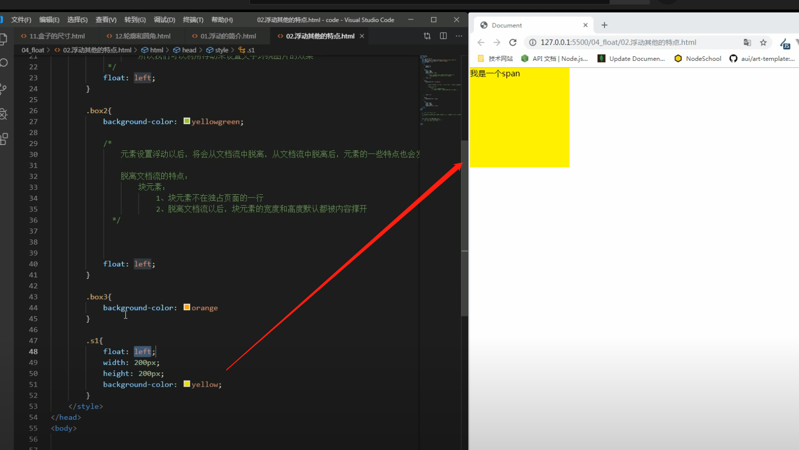

# float

通过浮动可以使一个元素向其父元素的左侧或右侧移动

可选值：
    none 默认值 ，元素不浮动
    left 元素向左浮动
    right 元素向右浮动

注意，元素设置浮动以后，水平布局的等式(块元素独占一行，外边距等自动填充)便不再生效
元素设置浮动以后，会完全从文档流中脱离，不再占用文档流的位置，所以元素下边的还在文档流中的元素会自动向上移动

浮动的特点：
  1、浮动元素会完全脱离文档流，不再占据文档流中的位置
  2、设置浮动以后元素会向父元素的左侧或右侧移动，
  3、浮动元素默认不会从父元素中移出
  4、浮动元素向左或向右移动时，不会超过它前边的其他浮动元素
  5、如果浮动元素的上边是一个没有浮动的块元素，则浮动元素无法上移
  6、浮动元素不会超过它上边的浮动的兄弟元素，最多最多就是和它一样高

简单总结：浮动目前来讲它的主要作用就是让页面中的元素可以水平排列，通过浮动可以制作一些水平方向的布局

特点4:

特点5:

特点6:

[视频 21:00](https://www.youtube.com/watch?v=c_AX0mblTks&list=PLmOn9nNkQxJFs5KfK5ihVgb8nNccfkgxn&index=60)

## float的其他特点

1. 浮动元素不会盖住文字，文字会自动环绕在浮动元素的周围，所以我们可以利用浮动来设置文字环绕图片的效果

2. 元素设置浮动以后，将会从文档流中脱离，从文档流中脱离后，元素的一些特点也会发生变化

脱离文档流的特点：
块元素(图示)：
    1、块元素不在独占页面的一行
    2、脱离文档流以后，块元素的宽度和高度默认都被内容撑开

行内元素：
行内元素脱离文档流以后会变成块元素，特点和块元素一样, 可以设置宽高

