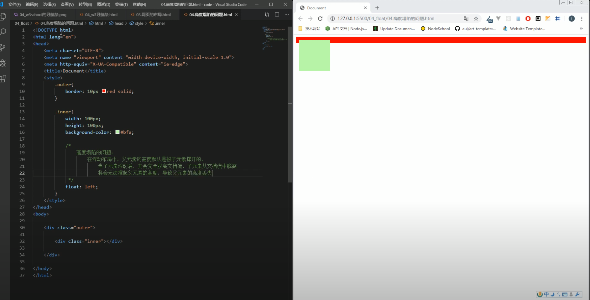

# [float的高度塌陷问题](https://www.youtube.com/watch?v=Pc-RhCPCcD4&list=PLmOn9nNkQxJFs5KfK5ihVgb8nNccfkgxn&index=64)

一般在html结构中, 父元素不设置高度, 而是由子元素的高度撑起来父元素.
但是如果将子元素设置了float, 它便脱离了父元素, 无法将未设置高度的父元素撑开.

如何解决这个问题?
开启BFC. BFC(Block Formatting Context) 块级格式化环境.
[开启BFC的特点(视频16:15)处](https://www.youtube.com/watch?v=Pc-RhCPCcD4&list=PLmOn9nNkQxJFs5KfK5ihVgb8nNccfkgxn&index=64):
1.开启BFC的元素不会被浮动元素所覆盖
2.给子元素设置margin, 父元素和子元素的margin都会受影响. 给父元素开启BFC, 则父元素的margin不受影响
3.开启BFC的元素可以包含浮动的子元素, 就不会出现高度塌陷

## 可以通过一些特殊方式来开启元素的BFC

1、设置元素的浮动（不推荐）: 不能设置宽高
2、将元素设置为行内块元素（不推荐）: 不能设置宽高
3、将元素的overflow设置为一个非visible的值
    - 常用的方式 为元素设置 overflow:hidden 开启其BFC 以使其可以包含浮动元素

## [演示](https://www.youtube.com/watch?v=yygdkbsTKZI&list=PLmOn9nNkQxJFs5KfK5ihVgb8nNccfkgxn&index=65)