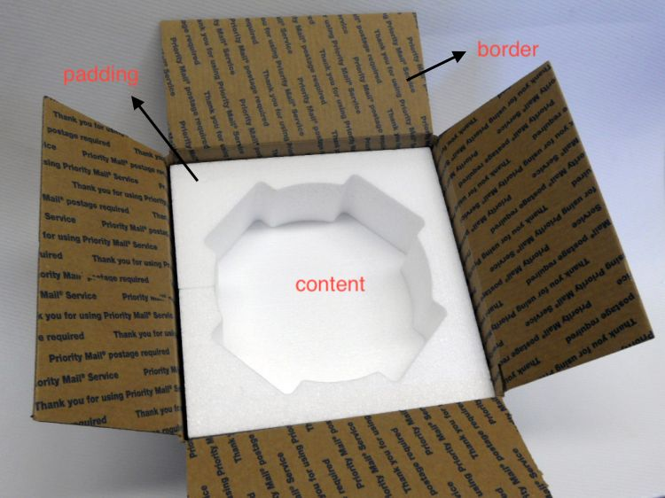
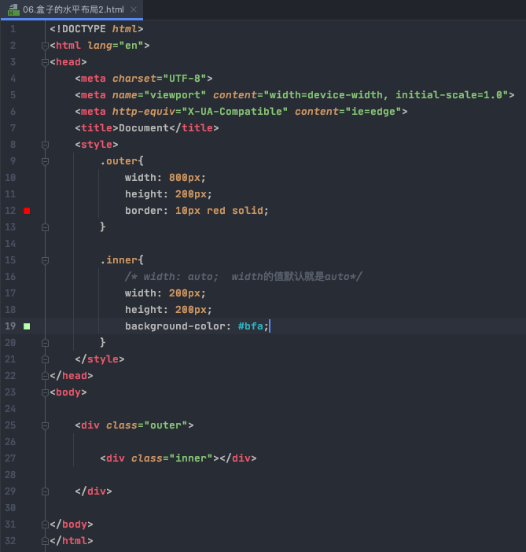

#

## Box Model (盒子模型) -- 块元素

摆放一个元素的位置，放在上面下面或者中间，此时得知道该元素的大小形状。CSS将页面内所有元素都设置为一个矩形的盒子

盒子(电视包装盒)组成：

* content（电视）
* border 盒子边界（纸盒子板子）
* padding 内边距 （泡沫）
* margin 外边距 （盒子外部，盒子与盒子之间的泡沫）， 定义两个不同盒子之间的距离



### box默认

* 默认高度： 100%
* 默认宽度： 被`content`撑开
* 内容区范围： 该元素所有的子元素和文本内容
* width和height设置的不是整个盒子大小，而是内容区大小
* 盒子的可见框大小是由 content大小 + board大小 + pading大小 共同决定的
* 元素分为行内元素和块元素，盒子模型为块元素，独占一行

### border

* 边框里面属于盒子内部，边框外面属于盒子外部
* 设置边框，至少三个样式：
  * border-width
  * border-color
  * boder-style

* 默认宽度不一定，有的3px，最好指定
* border-width: 0 1px 2px 3px:
    四个值：上右下左
    三个值：上左右下
    两个值： 上下， 左右
    一个值： 上下左右
* 边框大小影响盒子大小

```css
.box {
    height: 200px;
    width: 200px;
    border-width: 10px;
    border-color: red;
    border-style: solid;
}
内容区宽200， 左边框10px，右边框10px，所以box宽220px
```

### padding内边距

* 定义： content 到 border之间的距离
* 内边距的设置也会影响盒子大小
* 会继承盒子的背景颜色

### margin 外边距

* 影响盒子的位置，而不是盒子的大小
* 可以理解为该盒子大小为 可见框大小 + margin（不可见框）大小， 所以该盒子大小可以理解为可见框大小或加上不可见框大小（图中红色细线内大小）
* 元素在页面中是按照自左向右的顺序排列的，所以默认情况下如果我们设置左和上边距则会移动该元素自身，但是如果设置下和右边距则会移动其他元素
* 一共有四个方向的外边距：
    margin-top - 上外边距，设置一个正值，元素会向下移动
    margin-right - 默认情况下设置margin-right不会产生任何效果（只影响水平布局）
    margin-bottom - 下外边距，设置一个正值，其下边的元素会向下移动
    margin-left - 左外边距，设置一个正值，元素会向右移动


### 水平布局




```text
元素的水平方向的布局：
    元素在其父元素中水平方向的位置由以下几个属性共同决定“
        margin-left 默认为 0
        border-left
        padding-left
        width 默认为 auto
        padding-right
        border-right
        margin-right 默认为 0

    一个元素在其父元素中，水平布局必须要满足以下的等式：（等号左边全为子元素的属性）

margin-left + border-left + padding-left + width + padding-right + border-right + margin-right = 其父元素内容区的宽度 （必须满足）

因为上图中，子元素inner的所有属性相加必须 = 父元素outer的宽度800px
没写默认就是0， 所以上图公式为 0 + 0 + 0 + 200 + 0 + 0 + 0 = 800px， 等式不成立，所以其为过度约束，等式会自动调整

如何自动调整：
    * 如果这七个值中没有为 auto 的情况，则浏览器会自动调整margin-right值以使等式满足
        * 所以上图公式为 0 + 0 + 0 + 200 + 0 + 0 + 600 = 800px
    * 如果有auto， 这7个值有3个可以设置为auto：
        * margin-left
        * margin-right
        * width
    * 如果某个值为auto，则会自动调整为auto的那个值以使等式成立, 图 shuipingbuju3 的代码设置width为auto，所以
        0 + 0 + 0 + auto + 0 + 0 + 0 = 800, 所以自动width为800p
    * 如果将width和margin-left或者margin-right其中一个外边距设置为auto，则width会自动为最大，margin-right或left外边距为0, 如图shuipingbuju5和6
    * 如果将width， margin-left和margin-right都设置为auto，则witdh最大，定为800，margin-left和margin-right为0
    * 如果将两个外边距设置为auto，宽度固定值，则会将外边距设置为相同的值。例： width为200， margin-left和margin-right为auto，则margin-left和margin-right为300
        所以我们经常利用这个特点来使一个元素在其父元素中水平居中
        示例：
            width:xxxpx;
            margin:0 auto;
```


——————————————


### 垂直布局

* 默认情况下父元素的高度不写，是由子元素决定的，由子元素撑开
* 子元素大小超过父元素，会从父元素中溢出。可以通过使用overflow属性来设置父元素如何处理溢出的子元素：
  visible：默认值，子元素可以溢出
  hidden： 溢出部分被剪裁不能显示
  scroll: 生成左右或者上下滚动条
  auto: 根据需要生成滚动条
* 折叠现象：
  * 视频： [link](https://www.youtube.com/watch?v=SkFQz0NuINk&list=PLmOn9nNkQxJFs5KfK5ihVgb8nNccfkgxn&index=51)
  * 两个相邻元素处于垂直方向（相邻，垂直），他们的外边距会重叠。例如一个设置margin-bottom = 100px，一个设置margin-top = 100px他们会重叠为100px
  * 兄弟元素之间的相邻垂直外边距会取两者之间的较大值（都是正值）。如果都是负值，取绝对值较大的
  * 父子元素
    * 父子元素间相邻外边距，子元素的会传递给父元素（上外边距）
    * 父子外边距的折叠会影响到页面的布局，必须要进行处理

## 行内元素

* 定义： a, br, b, span等元素， 元素分为行内元素和块元素，盒子模型为块元素，独占一行， 行内元素不独占一行
* 行内元素会在一条直线上排列，在同一行从左至右水平排列。直到一行排不下，才会换行
* 行内元素设置宽、高、margin上下、padding上下无效（竖直无效）
* 行内元素设置line-height，margin左右、padding左右有效（水平有效）
* 行内元素不支持设置宽度和高度, height 和 width无效， 行内元素的宽高随标签里的内容而变化
例如下图，给a超链接设置长款无用
* 要想设置宽高只能把行内元素变为块元素，用到`display`
    inline 将元素设置为行内元素
    block 将元素设置为块元素
    inline-block 将元素设置为行内块元素。行内块元素：既可以设置宽度和高度又不会独占一行
    table 将元素设置为一个表格
    none 元素不在页面中显示
  visibility 用来设置元素的显示状态
    可选值：
    visible 默认值，元素在页面中正常显示
    hidden 元素在页面中隐藏 不显示，和display = none的区别为：hidden隐藏，但是依然占据位置， none是不占显示时候的位置


## 默认样式

* 通常情况，浏览器都会为元素设置一些默认样式
* 默认样式的存在会影响到页面的布局，通常情况下编写网页时必须要去除浏览器的默认样式（PC端的页面）
* 通常去除默认的margin, padding:
* {
    padding: 0;
    margin: 0;
}

## span和div

div默认为block，每一个单独占一行； span的默认样式为inline


## [CSS居中的几种方式](https://segmentfault.com/a/1190000013966650)

## float

通过浮动可以使一个元素向其父元素的左侧或右侧移动

可选值：
    none 默认值 ，元素不浮动
    left 元素向左浮动
    right 元素向右浮动

注意，元素设置浮动以后，水平布局的等式(块元素独占一行，外边距等自动填充)便不再生效
元素设置浮动以后，会完全从文档流中脱离，不再占用文档流的位置，所以元素下边的还在文档流中的元素会自动向上移动

浮动的特点：
  1、浮动元素会完全脱离文档流，不再占据文档流中的位置
  2、设置浮动以后元素会向父元素的左侧或右侧移动，
  3、浮动元素默认不会从父元素中移出
  4、浮动元素向左或向右移动时，不会超过它前边的其他浮动元素
  5、如果浮动元素的上边是一个没有浮动的块元素，则浮动元素无法上移
  6、浮动元素不会超过它上边的浮动的兄弟元素，最多最多就是和它一样高

简单总结：浮动目前来讲它的主要作用就是让页面中的元素可以水平排列，通过浮动可以制作一些水平方向的布局
