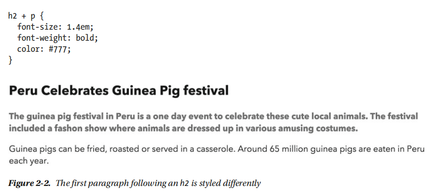

# CSS选择器

## type selectors

```CSS
p {
    color: black;
}
```

## Descendant selectors: 代表div下所有的p

```HTML
<div>
    <p>1</p>
    <h1>
        <p>2</p>
    </h1>
</div>
```

```css
div p {
    color: black;
}
```

## id selector

```css
#id {

}
```

## class selector

```CSS
.className {

}


```

## child selector (>)

a descendant selector will select all the descendants of an
element, a child selector only targets the element’s immediate descendants, or children.


```css
#nav > li {
 background: url(folder.png) no-repeat left top;
 padding-left: 20px;
}
```

```HTML
<ul id="nav">
 <li><a href="/home/">Home</a></li>
 <li><a href="/services/">Services</a>
 <ul>
 <li><a href="/services/design/">Design</a></li>
 <li><a href="/services/development/">Development</a></li>
 <li><a href="/services/consultancy/">Consultancy</a></li>
 </ul>
 </li>
 <li><a href="/contact/">Contact Us</a></li>
</ul>
```

## adjacent sibling selector (+)

 allows you to target an element that is preceded by another element that shares the same
parent.



## General Sibling Selector (~)

```css
h2 ~ p {
 font-size: 1.4em;
 font-weight: bold;
 color: #777;
}
```

## Attribute Selectors

```HTML
<p>
    Theterm
    <abbr title="self-contained underwater breath ing apparatus">
        SCUBA
    </abbr>
    isan acronymratherthananabbreviationasitispronouncedasaword.
</p>
```

```css
abbr[title] {
 border-bottom: 1px dotted #999;
}
```

## The Cascade

### important


