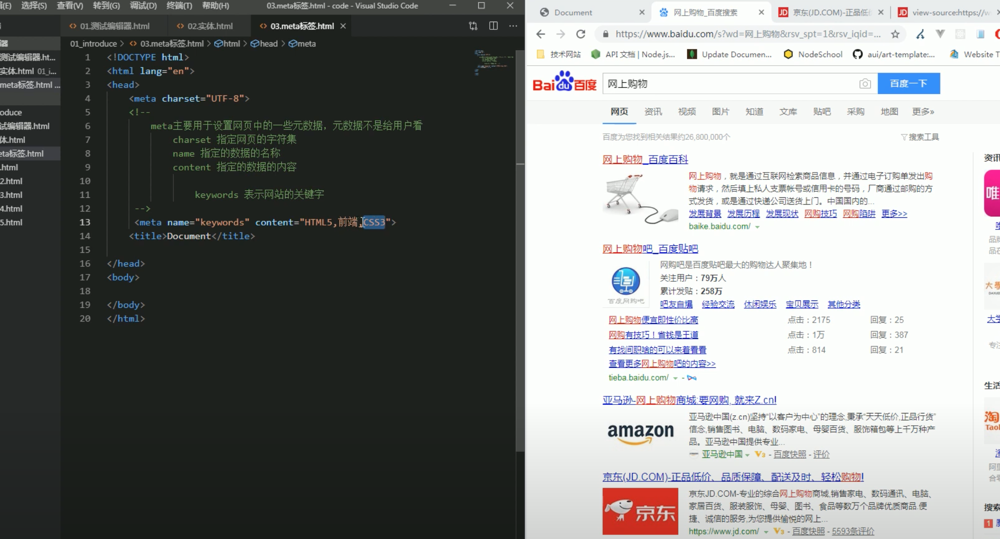

# meta

## define

The `<meta>` HTML element represents metadata that cannot be represented by other HTML meta-related elements, like `<base>, <link>, <script>, <style> or <title>`

meta是给浏览器使用的，不是给用户看的

## 属性

设置`name`为`keyword`， `content`设置一些关键词，可以给搜索引擎搜索关键字用

