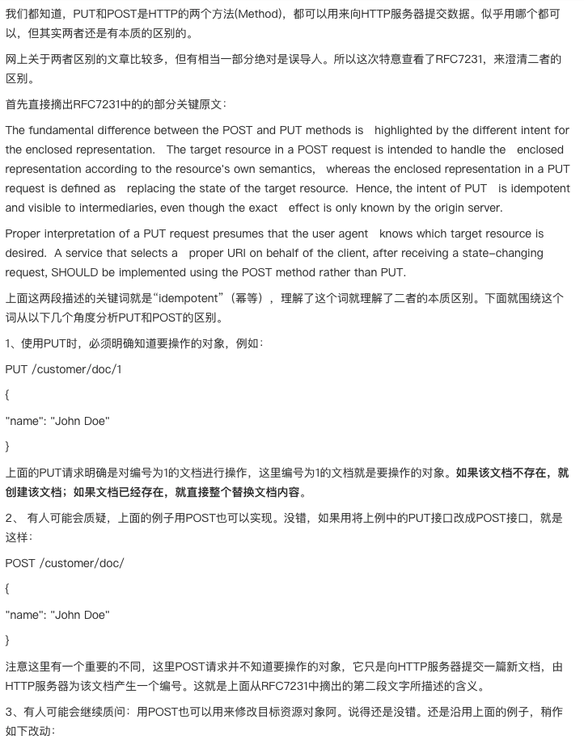
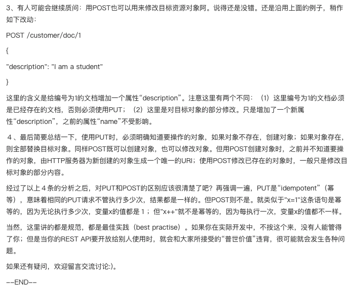

## 应用场景： 
* 保证页面在不刷新的情况下发送请求给后端，实现懒加载

## XML VS JSON：
* 定义： 可拓展标记语言， 被设计用来传输和存储数据。早期服务器传回的数据就是XML语言，现在改为JSON语言。现在利用AJAX从服务器返回的数据为JSON格式

## AJAX缺点
*   不能跨域
*   没有浏览历史，不能回退
*   无法爬虫，HTML内很难展现

## HTTP协议
* 定义：超文本传输协议
* 请求报文格式：
```
行： GET/POST /s?ie=utf-8 HTTP/1.1
头   Host: atguigu.com
    Cookie: name=guigu
    User-Agent: chrome
空行
体   如果为POST，则该部分不为空：
        username=admin&password=admin
```
* 浏览器会将请求报文拼接成url格式传输

## 响应报文
```
行      HTTP/1.1  200  OK
头      Content-Type: text/html;charset=utf-8
        Content-length: 2048
        Content-encoding: gzip
空行    
体      <html>
            <head>
            </head>
            <body>
                <h1>尚硅谷</h1>
            </body>
        </html>
```

## express框架
* 后端框架，用js封装`http`请求和解析`http response`的框架
* 是用来接收前端ajax的框架

```javascript
//1. 引入express
const express = require('express');

//2. 创建应用对象
const app = express();

//3. 创建路由规则
// request 是对请求报文的封装
// response 是对响应报文的封装
app.get('/', (request, response)=>{
    //设置响应
    response.send('HELLO EXPRESS');
});

//4. 监听端口启动服务
app.listen(8000, ()=>{
    console.log("服务已经启动, 8000 端口监听中....");
});
``` 

* PUT和POST的区别

[link](https://cloud.tencent.com/developer/news/39873)




## xhr

不管是jQuery还是axios都是对xhr进行的封装
但是fetch是window原生的