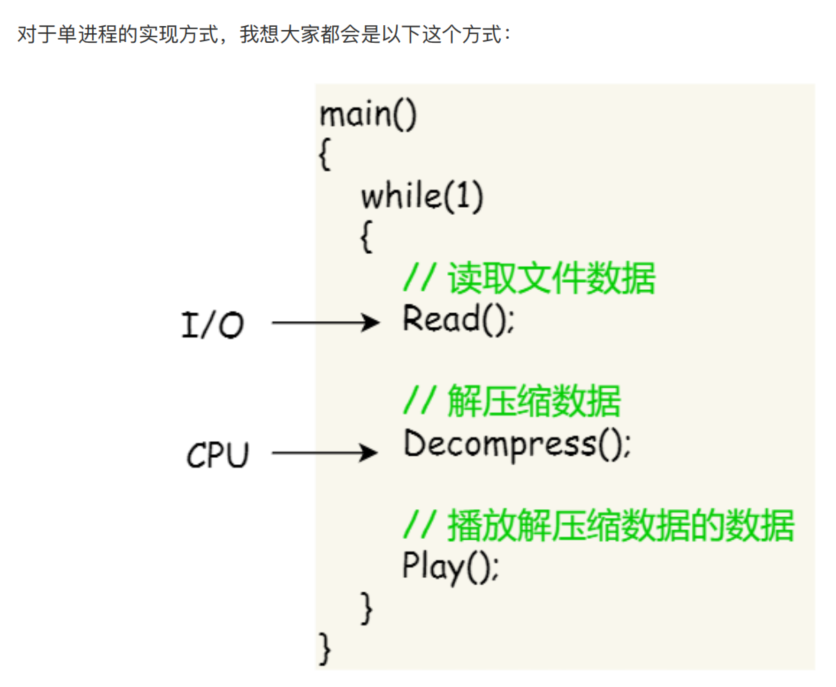
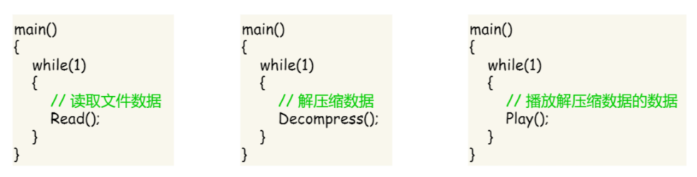

# tread

## [define](https://www.zhihu.com/question/25532384/answer/81152571)

进程和线程, 两个名词不过是对应的CPU时间段的描述，名词就是这样的功能。

进程在CPU轮流的方法: 先加载进程A的上下文，然后开始执行A，保存进程A的上下文，调入下一个要执行的进程B的进程上下文，然后开始执行B,保存进程B的上下文。 进程就是上下文切换之间的程序执行的部分。是运行中的程序的描述，也是对应于该段CPU执行时间的描述。

线程是什么呢？进程的颗粒度太大，每次的执行都要进行进程上下文的切换。如果我们把进程比喻为一个运行在电脑上的软件，那么一个软件的执行不可能是一条逻辑执行的，必定有多个分支和多个程序段，就好比要实现程序A，实际分成 a，b，c等多个块组合而成。那么这里具体的执行就可能变成：程序A得到CPU =》CPU加载上下文，开始执行程序A的a小段，然后执行A的b小段，然后再执行A的c小段，最后CPU保存A的上下文。这里a，b，c的执行是共享了A进程的上下文，CPU在执行的时候仅仅切换线程的上下文，而没有进行进程上下文切换的。进程的上下文切换的时间开销是远远大于线程上下文时间的开销。这样就让CPU的有效使用率得到提高。这里的a，b，c就是线程，也就是说线程是共享了进程的上下文环境，的更为细小的CPU时间段。线程主要共享的是进程的地址空间。

## why use thread

假设你要编写⼀个视频播放器软件，那么该软件功能的核⼼模块有三个：

* 从视频⽂件当中读取数据
* 对读取的数据进⾏解压缩
* 把解压缩后的视频数据播放出来

对于单进程的这种⽅式，存在以下问题： 播放出来的画⾯和声⾳会不连贯，因为当 CPU 能⼒不够强的时候， Read 的时候可能进程就等在这了，这样就会导致等半天才进⾏数据解压和播放；各个函数之间不是并发执⾏，影响资源的使⽤效率

对于多进程的这种⽅式，依然会存在问题：进程之间如何通信，共享数据？ 维护进程的系统开销较⼤，如创建进程时，分配资源、建⽴ PCB；终⽌进程时，回收资源、撤销PCB；进程切换时，保存当前进程的状态信息；

那到底如何解决呢？需要有⼀种新的实体，满⾜以下特性：

* 实体之间可以并发运⾏；
* 实体之间共享相同的地址空间；

这个新的实体，就是线程( Thread )，线程之间可以并发运⾏且共享相同的地址空间. 什么是线程? 线程是进程当中的⼀条执⾏流程
, 可以把一个进程拆分几个不同的执行流程

