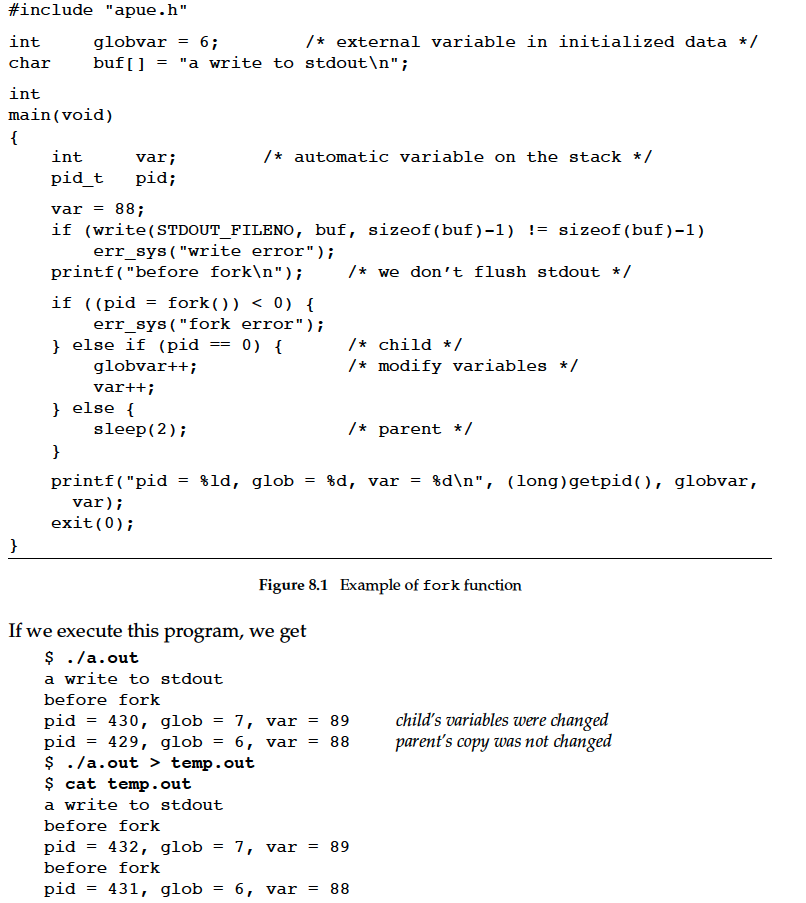
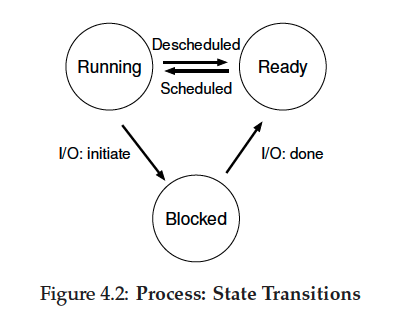

# OS

[toc]

## process and program/thread

process在APUE（P13）的定义:

A program is an executable file residing on disk in a directory. A program is read into memory and is executed by the kernel as a result of one of the seven exec functions.
An executing instance of a program is called a process, a term used on almost every page of this text. Some operating systems use the term task to refer to a program that is being executed

举个例子， 将下方代码加载进内存时候，就是一个instance of program/process

```c
#include "apue.h"
#include <sys/wait.h>
int
main(void)
{
    char buf[MAXLINE]; /* from apue.h */
    pid_t pid;
    int status;
    printf("%% "); /* print prompt (printf requires %% to print %) */
    while (fgets(buf, MAXLINE, stdin) != NULL) {
        if (buf[strlen(buf) - 1] == ’\n’)
        buf[strlen(buf) - 1] = 0; /* replace newline with null */
        if ((pid = fork()) < 0) {
            err_sys("fork error");
        } else if (pid == 0) { /* child */
            execlp(buf, buf, (char *)0);
            err_ret("couldn’t execute: %s", buf);
            exit(127);
        }
    /* parent */
    if ((pid = waitpid(pid, &status, 0)) < 0)
        err_sys("waitpid error");
        printf("%% ");
    }
    exit(0);
}
```

<!-- 上述代码中，fork() 会复制一个线程thread，如果当前线程为parent，则fork后的为child。
因为在某一时刻，代码仅能由一个thread执行，所以可以理解为process只能有一个thread控制。 -->

note: All **threads** within a process share the same address space, file descriptors, stacks,and process-related attributes. Each thread executes on *its own stack*, although any thread can access the stacks of other threads in the same process. Because they can access the same memory, the threads need to synchronize access to shared data among themselves to avoid inconsistencies.(APUE P14)

the child process gets a copy of the parent’s data space, heap, and stack by `fork()`. Note that this is a copy for the child; the parent and the child do not share these portions of memory. The parent and the child do share the text segment, however(APUE P229)

## ID

Every process has a unique process ID, a non-negative integer. Although unique, process IDs are reused. As processes terminate, their IDs become candidates for reuse. The init process never dies. It is a normal user process, not a system process within the kernel, like the swapper, although it does run with superuser privileges.

## init

Process ID 1 is usually the init process and is invoked by the kernel at the end of the bootstrap procedure

## fork()



`fork`后的parent process 和 child process变量互不影响

我们控制不了parent和child哪一个先执行，他们是由kernel的scheduling algorithm决定的。
如果想让the child and parent synchronize their actions, some form of interprocess communication is required. 例如use signals to synchronize a parent and a child after a fork.

## The Abstraction: A Process

To understand what constitutes a process, we thus have to understand its machine state:

1. One obvious component of machine state that comprises a process is its memory. Instructions lie in memory; the data that the running program reads and writes sits in memory as well. Thus the memory that the process can address (called its address space) is part of the process.
2. Note that there are some particularly special registers that form part of thismachine state. For example, the programcounter (PC) (sometimes called the instruction pointer or IP) tells us which instruction of the programis currently being executed;
3. similarly a stack pointer and associated frame pointer are used tomanage the stack for function parameters, local variables, and return addresses.
4. Finally, programs often access persistent storage devices too. Such I/O information might include a list of the files the process currently has open.

### how programs are transformed into processes

1. **load**: The first thing that the OS must do to run a program is to load its code and any static data (e.g., initialized variables) into memory, into the address space of the process. In early (or simple) operating systems, the loading process is done eagerly, i.e., all at once before running the program; modern OSes perform the process lazily, i.e., by loading pieces of code or data only as they are needed during programexecution. To truly understand how lazy loading of pieces of code and data works, you’ll have to understand more about the machinery of paging and swapping
2. **stack**: Once the code and static data are loaded into memory, there are a few other things the OS needs to do before running the process. Some memory must be allocated for the program’s **run-time stack** (or just stack). C programs use the stack for local variables, function parameters, and return addresses;
3. **heap**: In C programs, the heap is used for explicitly requested dynamically-allocated
data; programs request such space by calling malloc() and free it explicitly by calling free(). The heap is needed for data structures such as linked lists, hash tables, trees, and other interesting data structures
4. **I/O**

the OS has now (finally) set the stage for program execution. It thus has one last task: to start the program running at the entry point, namely `main(）`

### Process States

1. **Running**: In the running state, a process is running on a processor. This means it is executing instructions.
2. **Ready**: In the ready state, a process is ready to run but for some reason the OS has chosen not to run it at this given moment.
3. **Blocked**: In the blocked state, a process has performed some kind
of operation that makes it not ready to run until some other event takes place. A common example: when a process initiates an I/O request to a disk, it becomes blocked and thus some other process
can use the processor.
4. Sometimes a systemwill have an **initial** state that the process is in when it is being created.
5. Also, a process could be placed in a **final** state where it has exited buthas not yet been cleaned up. This final state can be useful as it allows other processes(usually theparentthat created the process) to examine the return codeof the process and see if the just-finished process executed successfully



a process can be moved between the ready and running states.
Being moved from ready to running means the process has been **scheduled**;
being moved from running to ready means the process has been **descheduled**.
Once a process has become blocked (e.g., by initiating anI/O operation), the OS will keep it as such until some event occurs(e.g.,I/O completion); at that point, the process moves to the ready state again(and potentially immediately to running again, if the OS so decides)

These types of decisions are made by the OS **scheduler**, a topic we will discuss a few chapters in the future

### process list

OS maintains a **process list** to track information about every process.

## API

### fork(), wait()

APUE(P37)

