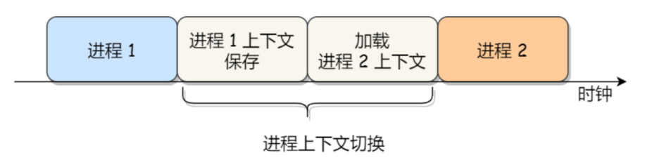
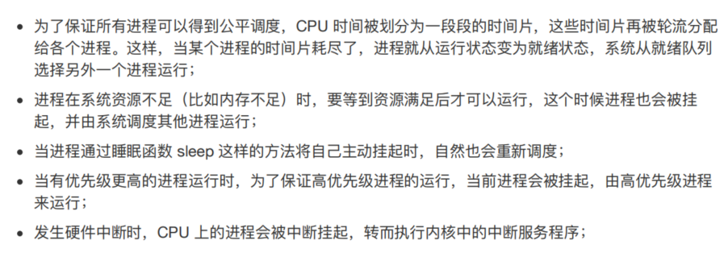

# Mechanism

## Limited Direct Execution

 the operating system needs to somehowshare the physical CPU among many jobs running seemingly at the same time. The basic idea is simple: run one process for a little while, then run another one, and so forth. By time sharingthe CPU in this manner,virtualization is achieved.

## Direct Execution Protoco

 runs in. In this mode, code that runs can do what it likes, in-cluding privileged operations such as issuing I/O requests and executingall types of restricted instruction: what should a user process do when it wishes to perform some kind of privileged operation,such as reading from disk? To enable this, virtually all modernhard-ware provides the ability for user programs to perform a **system call**

### system call

define: allow the kernel to carefully expose certain key pieces of functionality touser programs

To execute a system call, a program must execute a special **trap** instruction. This instruction simultaneously jumps into the kernel and raises the privilege level to kernel mode; once in the kernel, the system can now perform whatever privileged operations are needed (if allowed), and thus dothe required work for the calling process. When finished, the OS calls a special **return-from-trap** instruction, which, as you might expect, returns into the calling user program while simultaneously reducing the privi-lege level back to user mode.

how does thetrap know which code to run inside the OS?

## Problem #2: Switching Between Processes

if a process is running on the CPU, this by definition means the OS is not running on the CPU. If the OS is not running, how can it do anything at all? How can the operating systemregain control of the CPU so that it can switch between processes?

### cooperative approach

old system, the OS trusts the processes of the system to behave reasonably. Processes that run for too long are assumed to periodically give up the CPU so that the OS can decide to run some other task.

一个进程如何放弃CPU?　 the answer is: by making **system calls**, for example, to open a file and subsequently read it, or to send a message to another machine, or to create a new process. Systems like this often include an explicit yield system call, which does nothing except to transfer control to the OS so it can run other processes. Applications also transfer control to the OS when they do something illegal. For example, if an application divides by zero, or tries to access memory that it shouldn’t be able to access, it will generate a trap to the OS. The OS will then have control of the CPU again (and likely terminate
the offending process).

### A Non-Cooperative Approach: The OS Takes Control

How can the OS gain control of the CPU even if processes refuse to cooperative? **timer interrupt**

一个timer device被编写成隔个几毫秒就会打断cpu一次, cpu便会暂停执行当前的process, 去执行提前配置好的OS的 **interrupt handler**. 这个时候OS重新获取CPU, 它再去停止当前的process然后开始另一个process.

The timer interrupt gives the OS the ability to run again on a CPU even if processes act in a non-cooperative fashion.

Now that the OS has regained control, 一个决定随之需要解决: whether to continue running the currently-running process, or switch to a different one. This decision is made by a part of the operating system known as the **scheduler**; scheduler有很多的policy, 以后再讨论.

If the decision is made to switch, the OS then executes a low-level piece of code which we refer to as a **context switch**.

## context switch

### define

⼀个进程切换到另⼀个进程运⾏，称为进程的上下⽂切换。

操作系统所要做的就是为当前正在执行的进程保存一些寄存器值(register valus)（例如到其内核堆栈上），并为即将执行的进程（从其内核堆栈中）恢复一些寄存器值。 通过这样做，操作系统因此确保当最终执行 return-from-trap 指令时，系统不会返回到正在运行的进程，而是恢复另一个进程的执行。

### CPU registers and program counter　(CPU 寄存器和程序计数器)

在每个任务运⾏前，CPU 需要知道任务从哪⾥加载，⼜从哪⾥开始运⾏。 所以，操作系统需要事先帮 CPU 设置好 CPU 寄存器和程序计数器。 CPU 寄存器是 CPU 内部⼀个容量⼩，但是速度极快的内存（缓存）。我举个例⼦，寄存器像是你的⼝袋，内存像你的书包，硬盘则是你家⾥的柜⼦，如果你的东⻄存放到⼝袋，那肯定是⽐你从书包或家⾥柜 ⼦取出来要快的多。 再来，程序计数器则是⽤来存储 CPU 正在执⾏的指令位置、或者即将执⾏的下⼀条指令位置。 所以说，CPU 寄存器和程序计数是 CPU 在运⾏任何任务前，所必须依赖的环境，这些环境就叫做 CPU context;

CPU 上下⽂切换就是先把前⼀个任务的 CPU 上下⽂（CPU 寄存器和程序计数器）保存起来，然后加载新 任务的上下⽂到这些寄存器和程序计数器，最后再跳转到程序计数器所指的新位置，运⾏新任务。这里的任务, 主要是进程/线程/中断. 所以，可以根据任务的不同，把 CPU 上下⽂切换分成：**进程上下⽂切换、线程上下⽂切换和中断上下⽂切换**

### 进程context switch切换的是什么

进程是由内核管理和调度的，所以进程的切换只能发⽣在内核态。 所以，进程的上下⽂切换不仅包含了虚拟内存、栈、全局变量等⽤户空间的资源，还包括了内核堆栈、寄存器等内核空间的资源

### 发⽣进程上下⽂切换有哪些场景？

### context switch时候,有两种寄存器被保存/恢复(user and kernel)

#### 1. User and Kernel Stacks

In the user space, we can find the user stack that grows downward to lower addresses, whereas dynamic allocations (heap) grow upwards to higher addresses. The user stack is only used while the process is running in user mode.

The kernel stack is part of the kernel space. Hence, it is not directly accessible from a user process. Whenever a user process uses a syscall, the CPU mode switches to kernel mode. During the syscall, the kernel stack of the running process is used.

The size of the kernel stack is configured during compilation and remains fixed. This is usually two pages (8KB) for each thread. Moreover, additional per-CPU interrupt stacks are used to process external interrupts. While the process runs in user mode, these special stacks don’t have any useful data.

Unlike the kernel stack, we can change the user stack.

#### 2. system call --- CPU context switch

从用户态到内核态的转变，需要通过系统调用来完成。比如，当我们查看文件内容时，就需要多次系统调用来完成：首先调用 open() 打开文件，然后调用 read() 读取文件内容，并调用 write() 将内容写到标准输出，最后再调用 close() 关闭文件。

在这个过程中就发生了 CPU 上下文切换，整个过程是这样的：
1、保存 CPU 寄存器里原来用户态的指令位(user stack)
2、为了执行内核态代码，CPU 寄存器需要restore为内核态指令的新位置。
3、跳转到内核态运行内核任务。(kernel stack)
4、当系统调用结束后，CPU 寄存器需要恢复原来保存的用户态，然后再切换到用户空间，继续运行进程。

所以，一次系统调用的过程，其实是发生了两次 CPU 上下文切换（用户态-内核态-用户态）. 但是他跟process context switch是不同的

#### 3. difference

首先，进程是由内核来管理和调度的，进程的切换只能发生在内核态kernal mode。所以，进程的上下文不仅包括了虚拟内存、栈、全局变量等用户空间的资源user stack，还包括了内核堆栈、寄存器等内核空间的状态 kernel stack。

因此，进程的上下文切换就比系统调用时多了一步：在保存内核态资源（当前进程的内核状态和 CPU 寄存器）之前，需要先把该进程的用户态资源（虚拟内存、栈等）保存下来；而加载了下一进程的内核态后，还需要刷新进程的虚拟内存和用户栈:

save user stack then system call into kernel stack save, then go out to restore the other process user stack

如下图所示，保存上下文和恢复上下文的过程并不是“免费”的，需要内核在 CPU 上运行才能完成

## concurrency

OS does indeed need to be concerned as to what happens if, during interrupt or trap handling, another interrupt occurs. This, in fact, is the exact topic of the entire second piece of this book, on
**concurrency**; we’ll defer a detailed discussion until then;

simple answer is: 1. disable the interrupts (bad idea) 2. lock
