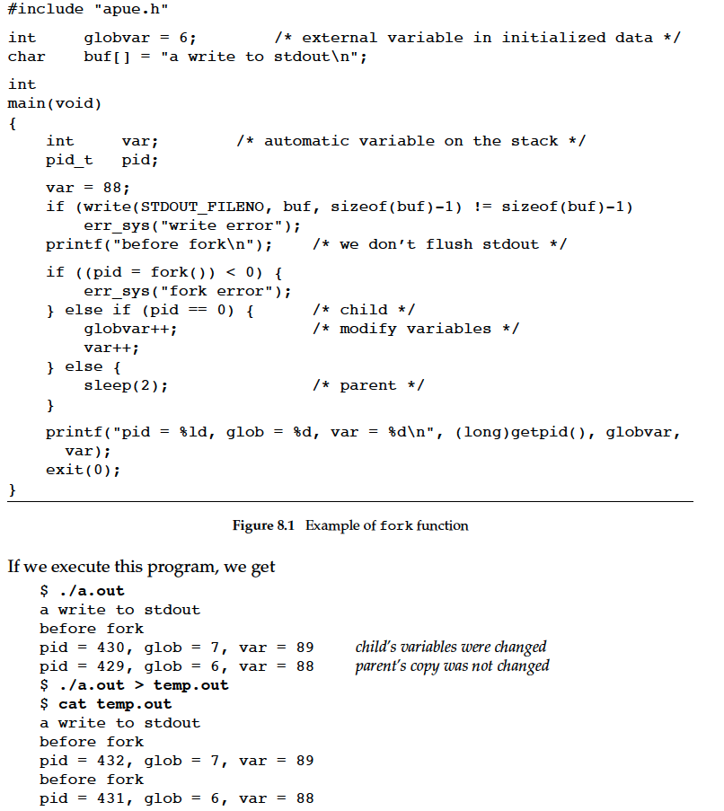

# OS

[toc]

## process and program/thread

process在APUE（P13）的定义:

A program is an executable file residing on disk in a directory. A program is read into memory and is executed by the kernel as a result of one of the seven exec functions.
An executing instance of a program is called a process, a term used on almost every page of this text. Some operating systems use the term task to refer to a program that is being executed

举个例子， 将下方代码加载进内存时候，就是一个instance of program/process

```c language
#include "apue.h"
#include <sys/wait.h>
int
main(void)
{
    char buf[MAXLINE]; /* from apue.h */
    pid_t pid;
    int status;
    printf("%% "); /* print prompt (printf requires %% to print %) */
    while (fgets(buf, MAXLINE, stdin) != NULL) {
        if (buf[strlen(buf) - 1] == ’\n’)
        buf[strlen(buf) - 1] = 0; /* replace newline with null */
        if ((pid = fork()) < 0) {
            err_sys("fork error");
        } else if (pid == 0) { /* child */
            execlp(buf, buf, (char *)0);
            err_ret("couldn’t execute: %s", buf);
            exit(127);
        }
    /* parent */
    if ((pid = waitpid(pid, &status, 0)) < 0)
        err_sys("waitpid error");
        printf("%% ");
    }
    exit(0);
}
```

<!-- 上述代码中，fork() 会复制一个线程thread，如果当前线程为parent，则fork后的为child。
因为在某一时刻，代码仅能由一个thread执行，所以可以理解为process只能有一个thread控制。 -->

note: All threads within a process share the same address space, file descriptors, stacks,and process-related attributes. Each thread executes on its own stack, although any thread can access the stacks of other threads in the same process. Because they can access the same memory, the threads need to synchronize access to shared data among themselves to avoid inconsistencies.(APUE P14)

the child process gets a copy of the parent’s data space, heap, and stack by `fork()`. Note that this is a copy for the child; the parent and the child do not share these portions of memory. The parent and the child do share the text segment, however(APUE P229)

### ID

Every process has a unique process ID, a non-negative integer. Although unique, process IDs are reused. As processes terminate, their IDs become candidates for reuse. The init process never dies. It is a normal user process, not a system process within the kernel, like the swapper, although it does run with superuser privileges.

### init

Process ID 1 is usually the init process and is invoked by the kernel at the end of the bootstrap procedure

### fork()



`fork`后的parent process 和 child process变量互不影响

我们控制不了parent和child哪一个限制性，他们是由kernel的scheduling algorithm决定的。
如果想让the child and parent synchronize their actions, some form of interprocess communication is required. 例如use signals to synchronize a parent and a child after a fork.

## I/O

### file descriptors（APUE）

To the kernel, all open files are referred to by file descriptors. A file descriptor is a non-negative integer. When we open an existing file or create a new file, the kernel returns a file descriptor to the process.

A file is opened or created by calling either the **open** function or the **openat** function.

The file descriptor returned by open and openat is guaranteed to be the lowestnumbered unused descriptor. For example, an application
might close standard output — normally, file descriptor 1—and then open another file, knowing that it will be opened on file descriptor 1.

### architecture (OSTEP)

system designers have adopted this hierarchical approach, where components that demand high performance (such as the graphics card) are nearer the CPU. Lower performance components are further away


Of course, modern systems increasingly use specialized chipsets and faster point-to-point interconnects to improve performance. Such as graphics.

The CPU connects to an I/O chip via Intel’s proprietary DMI (Direct Media Interface), and the rest of the devices connect to this chip via a number of different interconnects.


### A Canonical Device (OSTEP)

拿一个抽象的例子来理解I/O


设备通过interface和操作系统内部打交道。 设备需要需要三个registers组成： status, command, data. status是告诉操作系统该设备的状态，是忙还是闲等，command就是操作系统需要告诉设备进行哪些任务操作


### interrupt

操作系统为了能感知一个I/O设备的状态，首先考虑的是轮询polling。 但是轮询消耗大量cpu资源。 一些工程师想到了用the interrupt.

the OS can issue a request, put the calling process to sleep, and context switch to another task. When the device is finally finished with the operation, it will raise a hardware interrupt, causing the CPU to jump into the OS at a predetermined interrupt service routine (ISR) or more simply an interrupt handler. The handler is just a piece of operating system code that will finish the request (for example, by reading data and perhaps an error code from the device) and wake the process waiting for the I/O, which can then proceed as desired.


### Direct Memory Access (DMA)

当进行大量数据的IO时候，interrupt也不是一个好的方法。

DMA works as follows. To transfer data to the device, for example, the OS would program the DMA engine by telling it where the data lives in memory, how much data to copy, and which device to send it to. At that point, the OS is done with the transfer and can proceed with other work. When the DMA is complete, the DMA controller raises an interrupt, and
the OS thus knows the transfer is complete.