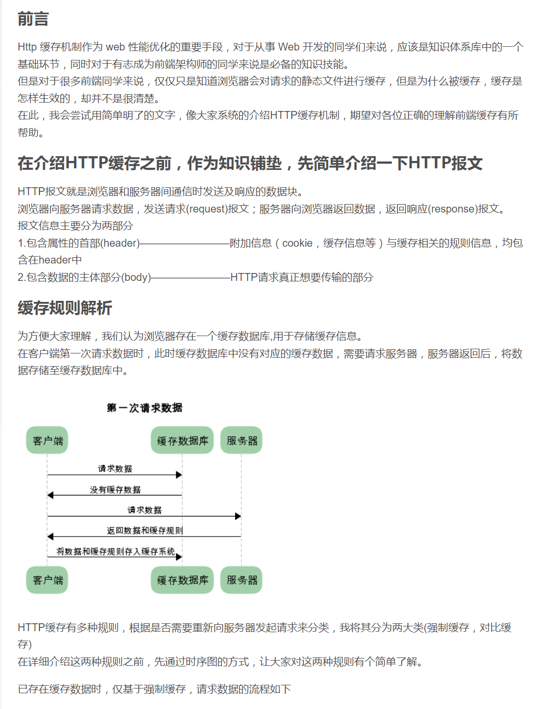
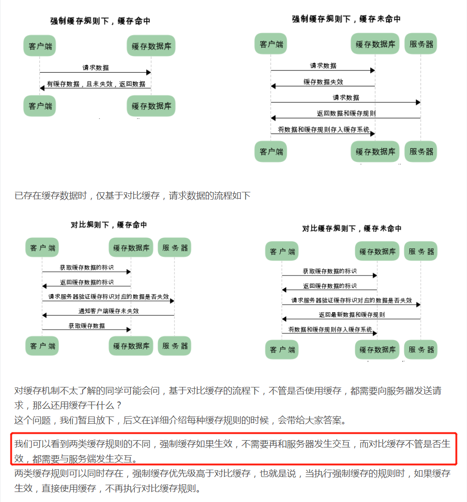
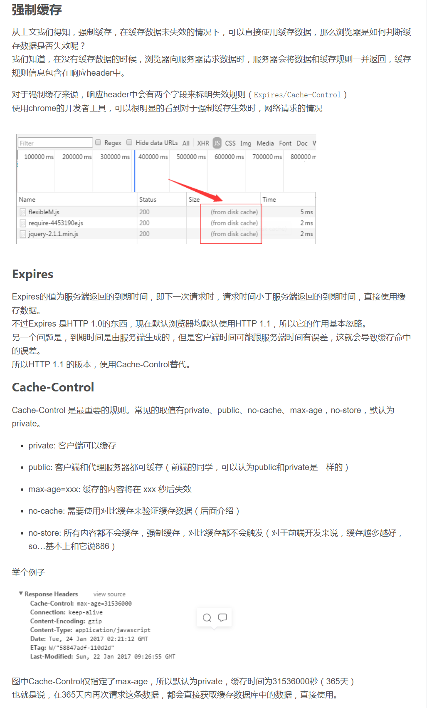
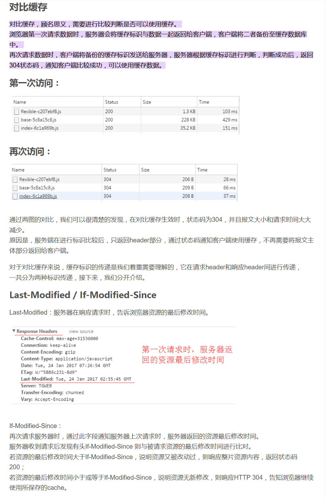
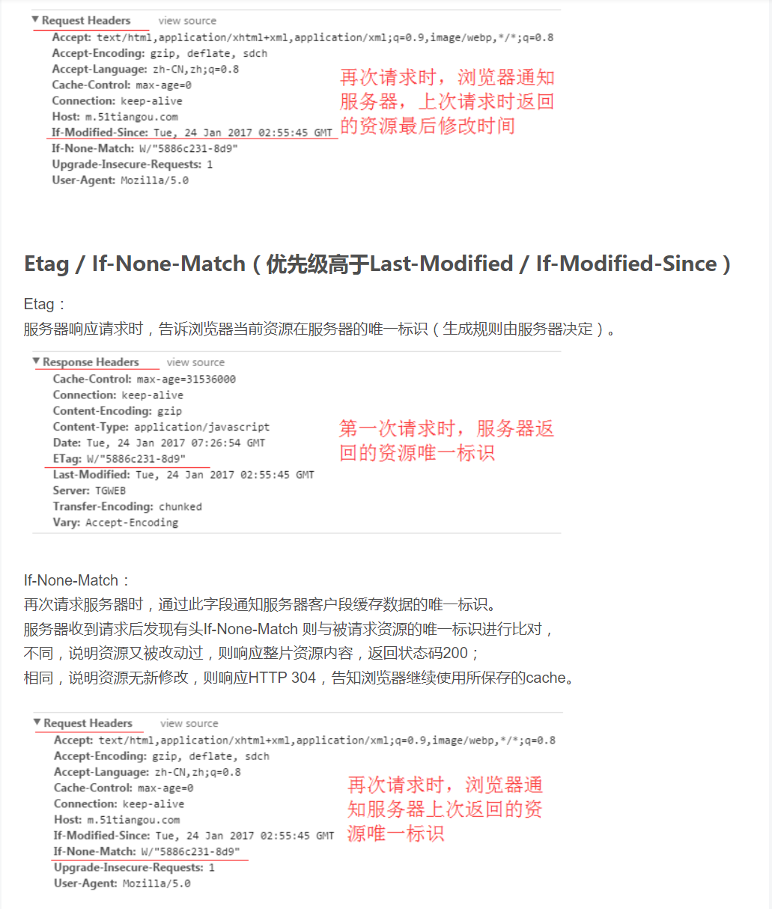
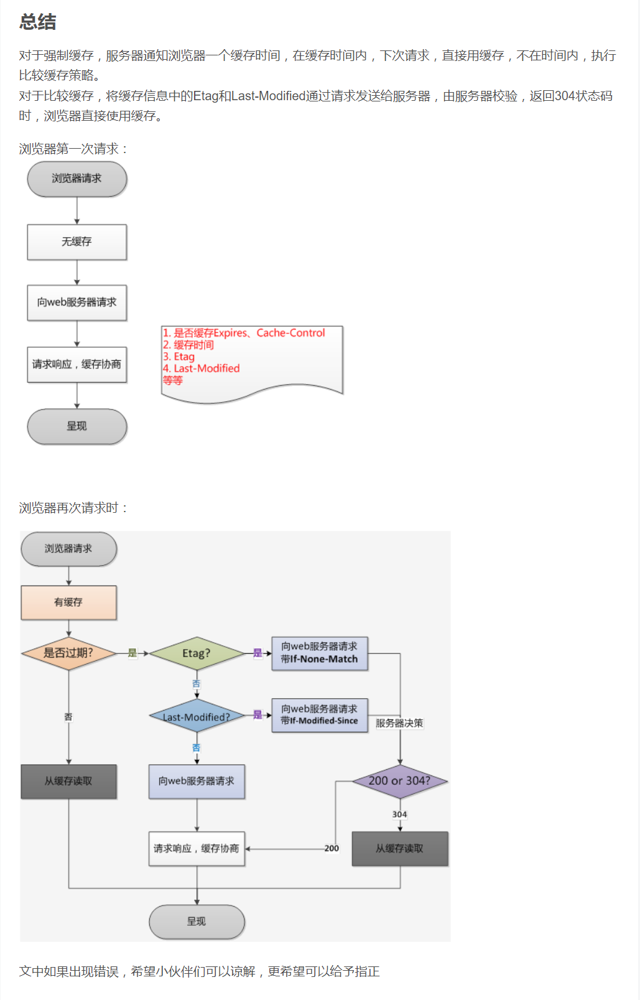

# HTTP 缓存机制

## reference

[csdn](https://blog.csdn.net/qianshangding0708/article/details/105911381#:~:text=%E5%AF%B9%E6%AF%94%E7%BC%93%E5%AD%98%EF%BC%8C%E9%A1%BE%E5%90%8D%E6%80%9D%E4%B9%89%EF%BC%8C%E9%9C%80%E8%A6%81%E8%BF%9B%E8%A1%8C,%E6%88%90%E5%8A%9F%EF%BC%8C%E5%8F%AF%E4%BB%A5%E4%BD%BF%E7%94%A8%E7%BC%93%E5%AD%98%E6%95%B0%E6%8D%AE%E3%80%82)