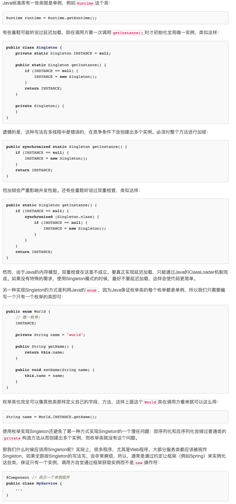
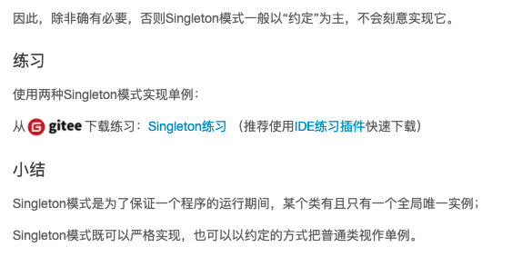

# 单例模式

## 定义

保证一个类仅有一个实例，并提供一个访问它的全局访问点

## why use it

有一些对象我们往往只需要一个，比如线程池、全局缓存、浏览器中的 window 对象等。

## js中的单例

### 直接实现一个单例类

```JavaScript
var CreateDiv = (function(){
    var instance;
    var CreateDiv = function( html ){
        if ( instance ){
            return instance;
        }
        this.html = html;
        this.init();

        return instance = this;
    };

    CreateDiv.prototype.init = function(){
        var div = document.createElement( 'div' );
        div.innerHTML = this.html;
        document.body.appendChild( div );
    };

    return CreateDiv;
})();

var a = new CreateDiv( 'sven1' );
var b = new CreateDiv( 'sven2' );
alert ( a === b ); // true
```

缺点:
为了把 instance 封装起来，我们使用了自执行的匿名函数和闭包，并且让这个匿名函数返回真正的 Singleton 构造方法，这增加了一些程序的复杂度，阅读起来也不是很舒服。

### 用代理实现单例模式

```JavaScript
var CreateDiv = function( html ){
    this.html = html;
    this.init();
};

CreateDiv.prototype.init = function(){
    var div = document.createElement( 'div' );
    div.innerHTML = this.html;
    document.body.appendChild( div );
};

// 接下来引入代理类 proxySingletonCreateDiv：
var ProxySingletonCreateDiv = (function(){
    var instance;
    return function( html ){
        if ( !instance ){
            instance = new CreateDiv( html );
        }
        return instance;
    }
})();

var a = new ProxySingletonCreateDiv( 'sven1' );
var b = new ProxySingletonCreateDiv( 'sven2' );
alert ( a === b );
```

通过引入代理类的方式，我们同样完成了一个单例模式的编写，跟之前不同的是，现在我们把负责管理单例的逻辑移到了代理类 proxySingletonCreateDiv 中。这样一来，CreateDiv 就变成了一个普通的类，它跟 proxySingletonCreateDiv 组合起来可以达到单例模式的效果。

### 惰性单例

惰性单例指的是在需要的时候才创建对象实例。 instance 实例对象总是在我们调用 Singleton.getInstance 的时候才被创建，而不是在页面加载好的时候就创建，代码如下：

```JavaScript
Singleton.getInstance = (function(){
    var instance = null;
    return function( name ){
        if ( !instance ){
            instance = new Singleton( name );
        }
    return instance;
 }
})();
```

## java 单例模式 [link1](https://www.runoob.com/design-pattern/singleton-pattern.html) [link2](https://www.liaoxuefeng.com/wiki/1252599548343744/1281319214514210) --详情见网页

为了避免他人用`new`的方式来生成类的实例, 需要将单例的构造方法constructor必须是private，这样就防止了调用方自己创建实例，但是在类的内部，是可以用一个静态字段来引用唯一创建的实例的：

```java
public class Singleton {
    // 静态字段引用唯一实例:
    private static final Singleton INSTANCE = new Singleton();

    // private构造方法保证外部无法实例化:
    private Singleton() {
    }
}
```

那么问题来了，外部调用方如何获得这个唯一实例？
答案是提供一个静态方法，直接返回实例：

```java
public class Singleton {
    // 静态字段引用唯一实例:
    public static final Singleton INSTANCE = new Singleton();

    // private构造方法保证外部无法实例化:
    private Singleton() {
    }
}
```

所以，单例模式的实现方式很简单：

* 只有private构造方法，确保外部无法实例化；
* 通过private static变量持有唯一实例，保证全局唯一性；
* 通过public static方法返回此唯一实例，使外部调用方能获取到实例。





## reference

<< JavaScript 设计模式和开发实践>>
[link1](https://www.runoob.com/design-pattern/singleton-pattern.html)
[link2](https://www.liaoxuefeng.com/wiki/1252599548343744/1281319214514210)