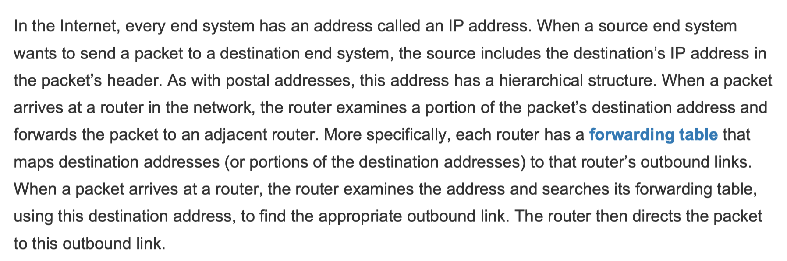

# computer networking

## network core

### Network Protocols

A protocol defines the format and the order of messages exchanged between two or more communicating entities, as well as the actions taken on the transmission and/or receipt of a message or other event.

a example:
First, your computer will send a connection request message to the Web server and wait for a reply. The Web server will eventually receive your connection request message and return a connection reply message. Knowing that it is now OK to request the Web document, your computer then sends the name of the Web page it wants to fetch from that Web server in a GET message. Finally, the Web server returns the Web page (file) to your computer.

### Packet Switching

To send a message from a source end system to a destination end system, the source breaks long messages into smaller chunks of data known as **packets**. Between source and destination, each packet travels through communication links and **packet switches** (for which there are two predominant types, **routers** and **link-layer switches**). Packets are transmitted over each communication link at a rate equal to the full transmission rate of the link. So, if a source end system or a packet switch is sending a packet of L bits over a link with transmission rate R bits/sec, then the time to transmit the packet is
L / R seconds.

Most packet switches use **store-and-forward transmission** at the inputs to the links. Store-and-forward transmission means that the packet switch must receive the entire packet before it can begin to transmit the first bit of the packet onto the outbound link.

### output queue

Each packet switch has multiple links attached to it.

For each attached link, the packet switch has an output buffer (also called an output queue), which stores packets that the router is about to send into that link. The output buffers play a key role in packet switching. If an arriving packet needs to be transmitted onto a link but finds the link busy with the transmission of another packet, the arriving packet must wait in the output buffer. Thus, in addition to **the store-and-forward delays, packets suffer output buffer queuing delays.

### Forwarding Tables

how does the router determine which link it should forward the packet onto?

Packet forwarding is actually done in different ways in different types of computer networks. In the internet:

## Delay, Loss, and Throughput in Packet-Switched Networks

### delay

Recall that a packet starts in a host (the source), passes through a series of routers, and ends its journey in another host (the destination). As a packet travels from one node (host or router) to the subsequent node (host or router) along this path, the packet suffers from several types of delays at each node along the path.

The most important of these delays are **the nodal processing delay**, **queuing delay**, **transmission delay**, and **propagation delay**; together, these delays accumulate to give a **total nodal delay**.

### Processing Delay

The time required to examine the packet’s header and determine where to direct the packet is part of the processing delay. After this nodal processing, the router directs the packet to the queue that precedes the link to router B.

### Queuing Delay

The length of the queuing delay of a specific packet will depend on the number of earlier-arriving packets that are queued and waiting for transmission onto the link. if the traffic is heavy and many other packets are also waiting to be transmitted, the queuing delay will be long.

### other delay

reading books page 23

