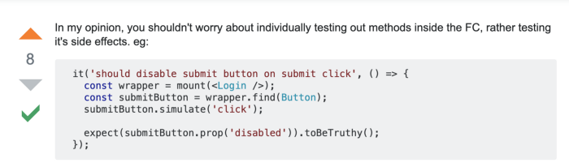
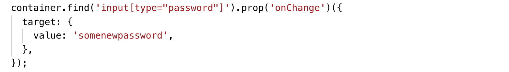

# Testing React Function Components with Hooks using Enzyme

Consider this simple React function component implementing hooks:

```javascript
import React from 'react';

export default function Login(props) {
  const { email: propsEmail, password: propsPassword, dispatch } = props;
  const [isLoginDisabled, setIsLoginDisabled] = React.useState(true);
  const [email, setEmail] = React.useState(propsEmail || '');
  const [password, setPassword] = React.useState(propsPassword || '');

  React.useEffect(() => {
    validateForm();
  }, [email, password]);

  const validateEmail = text => /@/.test(text);

  const validateForm = () => {
    setIsLoginDisabled(password.length < 8 || !validateEmail(email));
  };

  const handleEmailBlur = evt => {
    const emailValue = evt.target.value.trim();
    setEmail(emailValue);
  };

  const handlePasswordChange = evt => {
    const passwordValue = evt.target.value.trim();
    setPassword(passwordValue);
  };

  const handleSubmit = () => {
    dispatch('submit(email, password)');
    setIsLoginDisabled(true);
  };

  return (
    <form>
      <input
        type="email"
        placeholder="email"
        className="mx-auto my-2"
        onBlur={handleEmailBlur}
      />
      <input
        type="password"
        className="my-2"
        onChange={handlePasswordChange}
        value={password}
      />
      <input
        type="button"
        className="btn btn-primary"
        onClick={handleSubmit}
        disabled={isLoginDisabled}
        value="Submit"
      />
    </form>
  );
}
```

The above example consists of a simple form as a function component with an uncontrolled email input field and a controlled password input field with internal methods that update the state using the useState and useEffect hooks and a submit button that dispatches a submit action.
By writing test specs for this component I’ll be covering the various use cases that we have to deal with while writing tests for React Function Components.

## Enzyme and Jest

I wont go into depth about describing Jest and Enzyme and how to install them. I’ll just assume that you are a bit familiar with them to make this article brief. In short, Jest is the javascript testing framework I am using for writing tests and Enzyme is the testing utility that I am using along with jest to simplify writing tests. For setting up Jest and Enzyme use the following links:

[Setting up enzyme with adapter](https://enzymejs.github.io/enzyme/docs/installation/react-16.html)

[Jest setup](https://jestjs.io/docs/getting-started)

## Shallow vs Mount

In layman terms, mount renders a component to its extreme leaf nodes whereas shallow as the name suggests does a shallow render i.e. renders just the component and not its children.
I prefer shallow render over mounting the component as it helps testing a component as a unit rather than asserting the behavior of components inside a unit component. This is useful as we use an UI component library like Reactstrap in our source code. So we wouldn’t want to test the components from this library (as it’s already been done in the library itself). If we used mount then even the component library we used would render to its leaf node. Shallow rendering helps us use the components without rendering them to their smallest html unit nodes. Also shallow rendering has performance benefits when compared with mount.
I used to write class based components and test by shallow rendering them using enzyme and jest. Testing class based components are well documented in the Enzyme documentation. As for testing function components the documentation was scarce as it had just been released when I first started implementing it. React recommends using react-testing-library to test hooks which is based on mount.
I could figure out no proper way to access and test internal methods that would update the state of the component using Enzyme. So after googling for hours and not finding a proper solution on how to write test specs for function component using shallow and enzyme I did what every developer should do i.e. I posted a question on stackoverflow. Then Alex replied:



It seemed to be the correct approach for testing the function component as we couldn’t know if the hooks were being called by spying or stubbing them but we could determine the state updates that the hooks carried out by looking at the updated props.

## Testing component ui and props

use [snapshot](https://jestjs.io/docs/snapshot-testing) to test UI.

test rendered components, use [find](https://enzymejs.github.io/enzyme/docs/api/ReactWrapper/find.html) selector method to make sure that the elements are present and match the props

```javascript
import React from 'react';
import { shallow } from 'enzyme';
import Login from '../index';

describe('<Login /> with no props', () => {
  const container = shallow(<Login />);
  it('should match the snapshot', () => {
    expect(container.html()).toMatchSnapshot();
  });

  it('should have an email field', () => {
    expect(container.find('input[type="email"]').length).toEqual(1);
  });

  it('should have proper props for email field', () => {
    expect(container.find('input[type="email"]').props()).toEqual({
      className: 'mx-auto my-2',
      onBlur: expect.any(Function),
      placeholder: 'email',
      type: 'email',
    });
  });

  it('should have a password field', () => { /* Similar to above */ });
  it('should have proper props for password field', () => {
    expect(container.find('input[type="password"]').prop('value')).toEqual(
      'notpassword',
    );
  });
  it('should have a submit button', () => { /* */ });
  it('should have proper props for submit button', () => { /* */ });
});

```

Now to test the login components with props passed we copy the same method as above and update the necessary props that would change when the **initialProps** are passed.

```javascript

describe('<Login /> with other props', () => {
  const initialProps = {
    email: 'acesmndr@gmail.com',
    password: 'notapassword',
  };
  const container = shallow(<Login {...initialProps} />);

  it('should have proper props for email field', () => {
    expect(container.find('input[type="email"]').props()).toEqual({
      className: 'mx-auto my-2',
      onBlur: expect.any(Function),
      placeholder: 'email',
      type: 'email',
    });
  });

  it('should have proper props for password field', () => {
    expect(container.find('input[type="password"]').props()).toEqual({
      className: 'my-2',
      onChange: expect.any(Function),
      type: 'password',
      value: 'notapassword',
    });
  });

  it('should have proper props for submit button', () => { /* */ });
});

```

## Testing state updates

States are maintained in function components using useState hooks. As the state hooks are internal to the component they aren’t exposed thus they can’t be tested by calling them.

Thus to test if a state has updated we:

1. [simulate](https://airbnb.io/enzyme/docs/api/ShallowWrapper/simulate.html) events
2. call the method props of the component and check if the state has updated by determining the update to the props of the rendered components.

Support for useState has been added fairly recently from [React 16.8.5](https://github.com/facebook/react/pull/15120) thus requires the same or above version of React.

```javascript

it('should set the password value on change event with trim', () => {
    container.find('input[type="password"]').simulate('change', {
      target: {
        value: 'somenewpassword  ',
      },
    });
    expect(container.find('input[type="password"]').prop('value')).toEqual(
      'somenewpassword',
    );
  });

  it('should call the dispatch function and disable the submit button on button click', () => {
    container.find('input[type="button"]').simulate('click');
    expect(
      container.find('input[type="button"]').prop('disabled'),
    ).toBeTruthy();
    expect(initialProps.dispatch).toHaveBeenCalledTimes(1);
  });
```

An alternative to simulating events using simulate method is to execute the props by calling them as functions by passing in the necessary params.



It is useful when we have a custom component with custom methods as props.


Here to trigger **onDropdownClose** we do:


## Lifecycle hooks

Lifecycle hooks such as **useEffect** aren’t yet supported in shallow render (those hooks don’t get called).
so we need to use **mount** instead of **shallow** to test those components