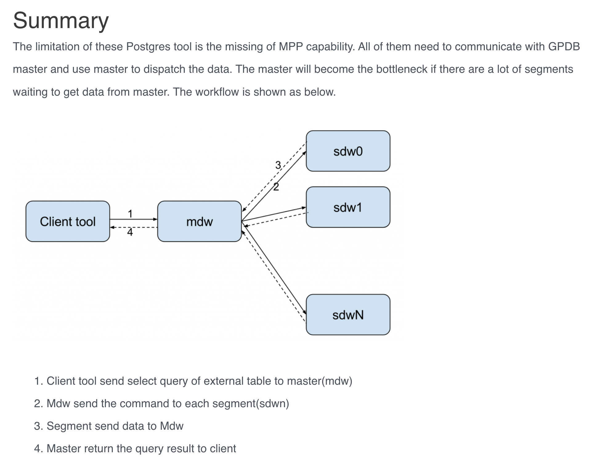
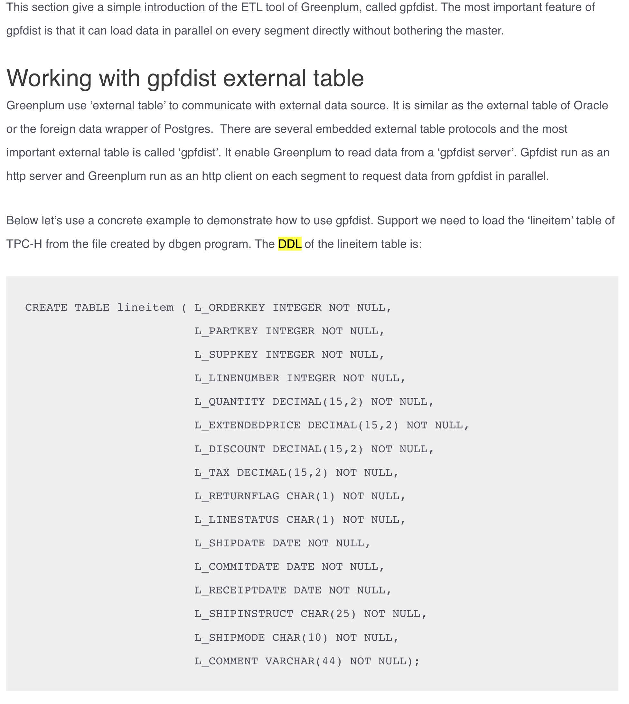
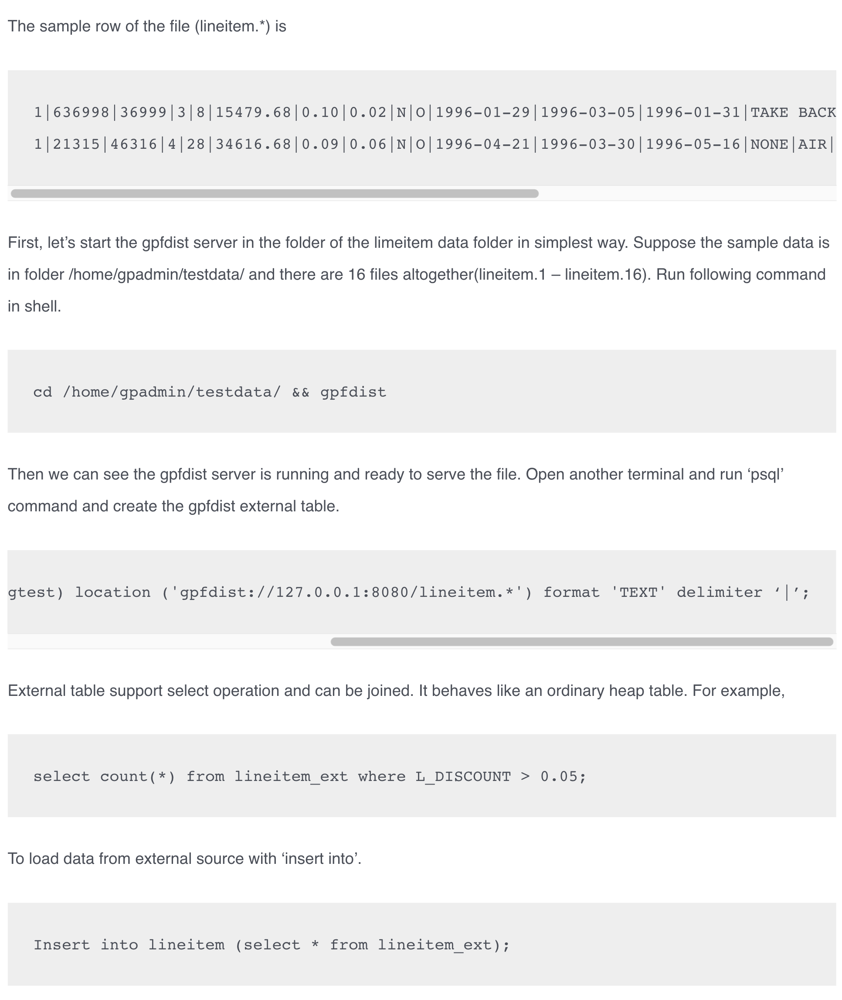
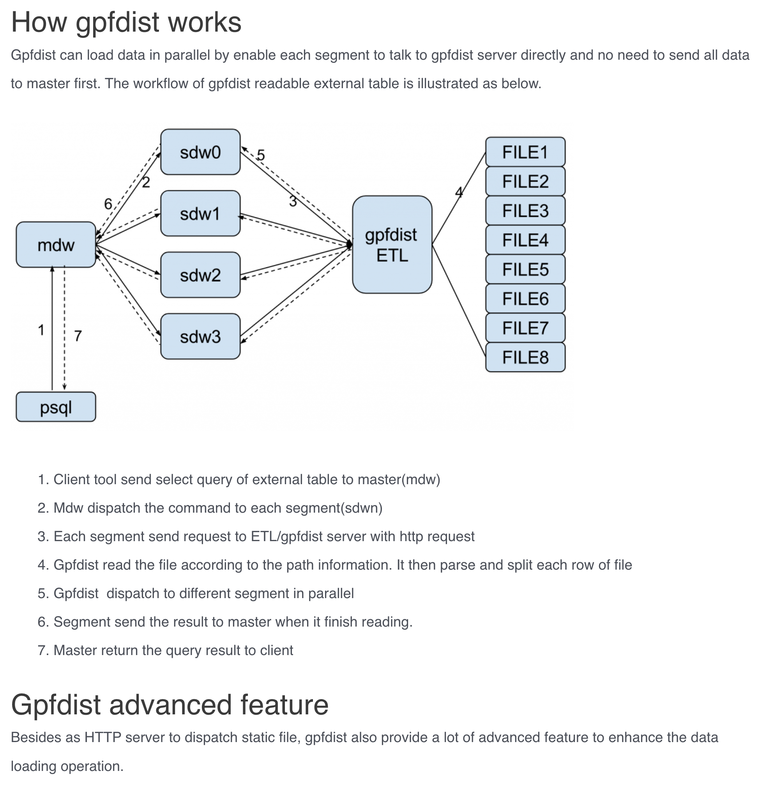

# Greenplum ETL Tool

ETL tools help Greenplum to load data from external source reliably and effectively.

## ETL in postgres

### pg_dump

Pg_dump is a command line tool that can extract data from a database table to a file. It is the official backup solution of Postgres.

```bash
pg_dump mydb > db.sql
```

And use psql to restore the dumped file:

```bash
psql -f db.sql mydb
```

### copy

copy can dump the content of a table with required delimiter, escape, header, etc to a file, and vice verse. More importantly, Copy can be executed at a client side, which means it can also use the file that locates on the host of psql against the table on remote server.

```bash
copy mytable to '/path/to/file.csv' format csv
```

If the file is on the client host, then run:

```bash
\copy mytable to '/path/to/file.csv' format csv
```

Latest Greenplum 5.0 enhance the copy feature to allow it to process the file on each segment host, instead of on the master host, if there is `on segment` keyword in copy command. This feature works better for some backup restore purpose than gpfdist.



## Gpfdist of Greenplum





## reference

[blog](https://greenplum.org/greenplum-etl/)