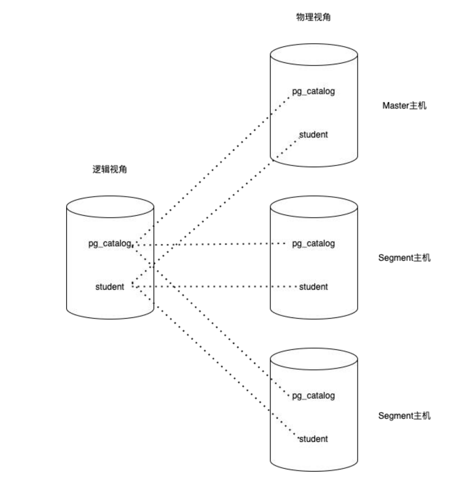

# partition in greenplum

## need to read [partition in postgreql](../postgreSQL/partition.md) at first.

## MMP structure

用户看到的是一个逻辑数据库，每个数据库都有系统表（例如 pg_catalog 下面的 pg_class, pg_proc 等）和数据表（下例中为 student 表）。在物理层面，它由很多个独立的数据库组成，每个数据库都有自己的一份系统表和用户数据表。master数据库仅仅包含元数据而不保存用户数据，但是 master 上仍然有用户数据表，这些用户数据表都是空表，没有数据。优化器需要使用这些空表进行查询优化和计划生成。segment数据库上绝大多数系统表（除了少数表，例 如统计信息相关表）和 master 上的系统表内容一样，每个 segment 都保存用户数据表的一部分。