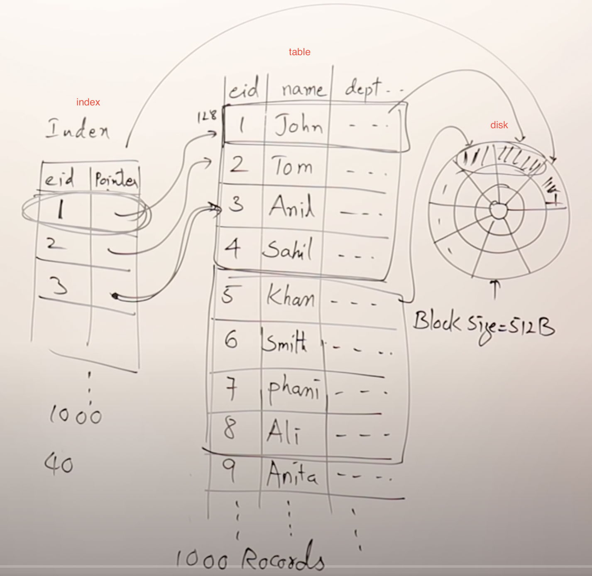
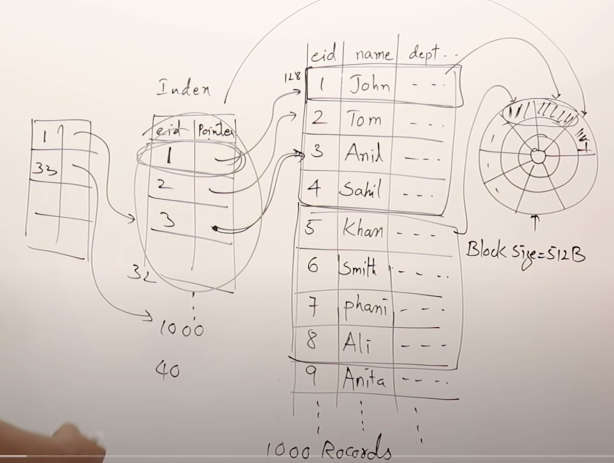
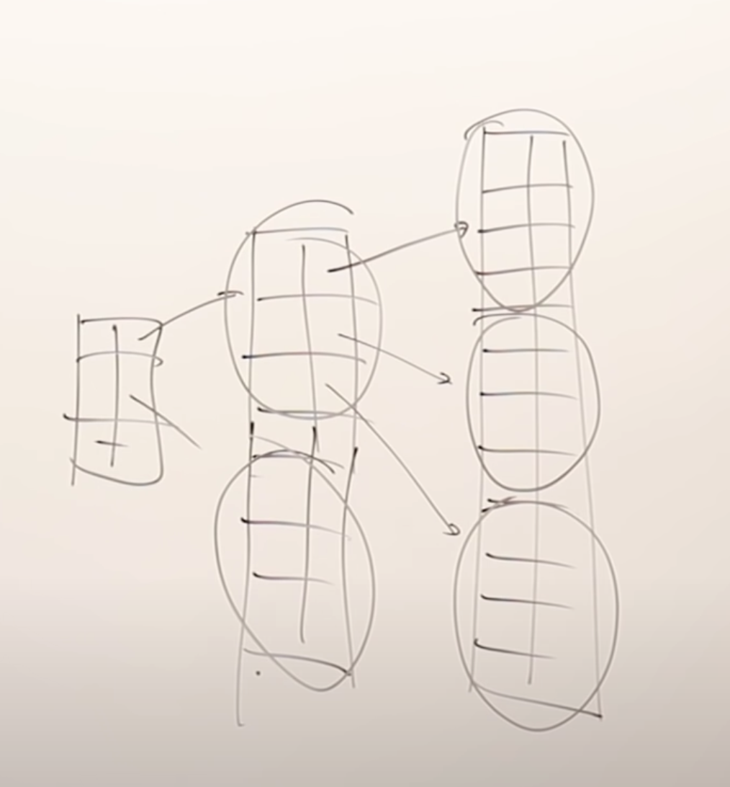
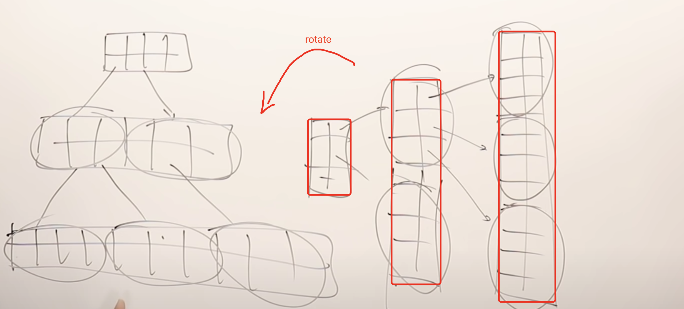
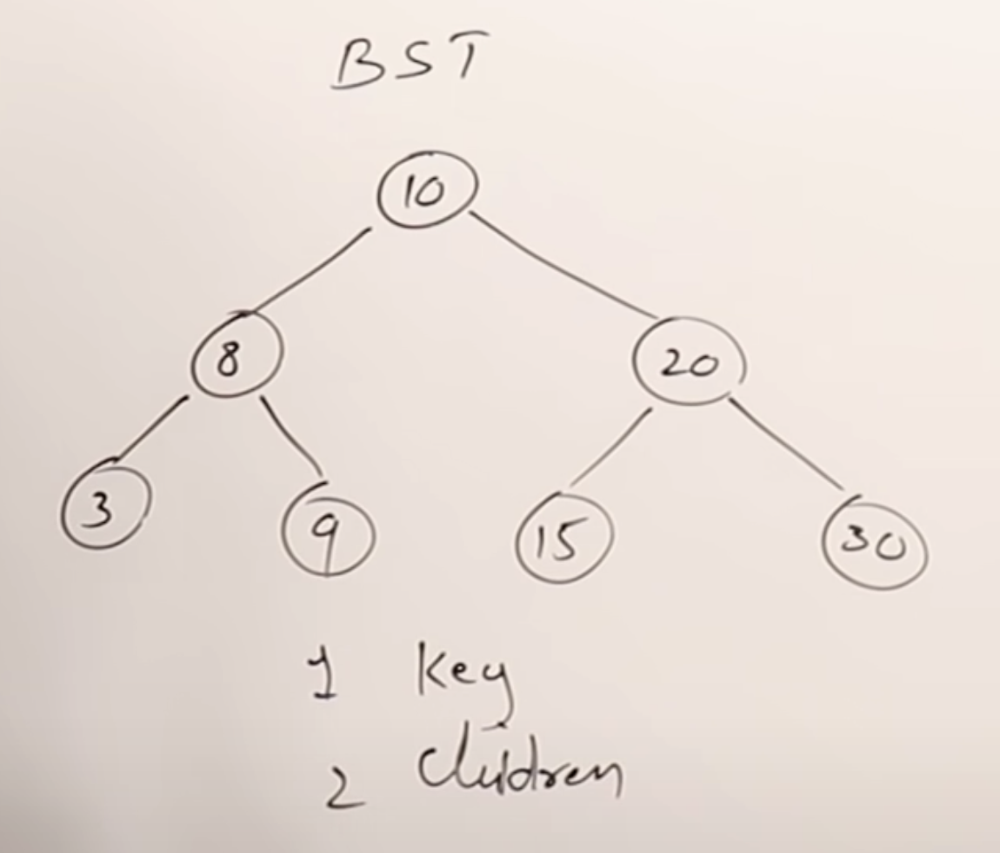
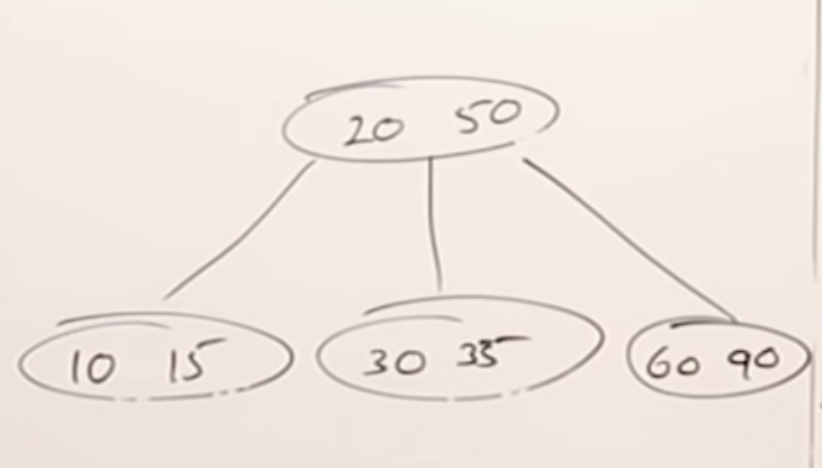
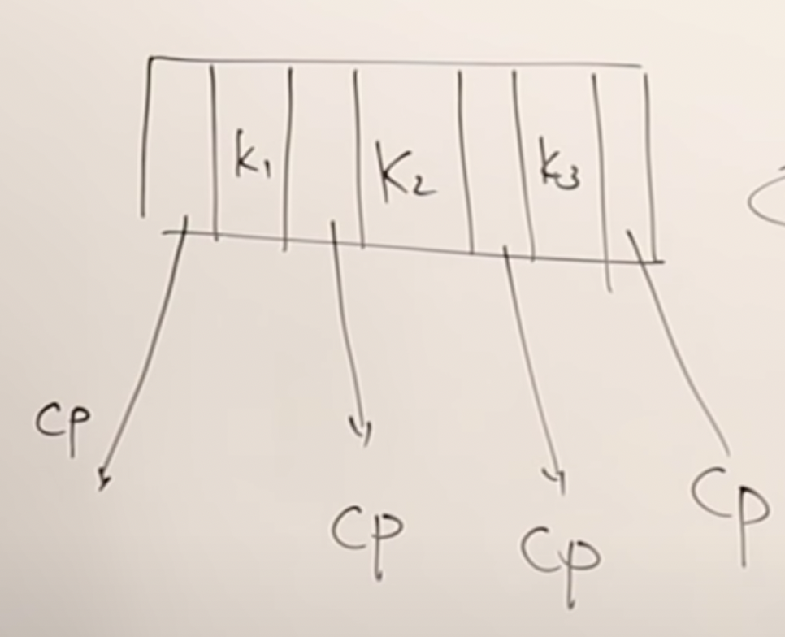
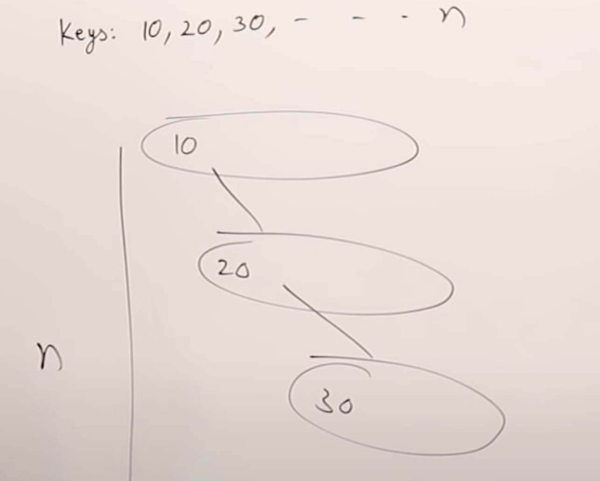
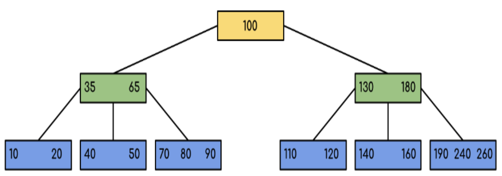

# B Tree

## table and index

suppose there are table, which take up `2 blocks`, but its index just take up `1 block`. we could iterate index instead of table to search data, it is more efficient.
But, as the data increases, the index will continue to increase.

we could add a new index for the index:

this is the basic idea for b tree and b+tree

## tree

if we have many index levels:

then, rotate it, we get a tree:

## M-way search tree(MWST)

then, we all know `BST`, which every node has two children, and the value of the left child is less than the parent, and the value of the right child is larger than the parent.

what if we add more value in every node?

just like the above picture, `20 < 50`, so the children `30` and `35` is at the middle. all values in left child is all less than `20` and all values in right child is all larger than `50`. It is called `3-ways search tree`. Every node at most have 3 children.

so, `m-way search tree` means a node could have `m-1` keys and at most `m` children

## use `m-way search tree` to build index

if we have many values: `10, 20, 30, ..., m`, we want to build m-way search tree one by one. The bigger problem is if we insert values from min to max, it will become as the following picture:

## B tree

so, we optimize `m way search tree`, and create the `b tree`. see video [29:48](https://www.youtube.com/watch?v=aZjYr87r1b8&t=1788s) to know how to build a `b tree`

## B tree rules

* B-Tree grows and shrinks from the bottom to top which is unlike Binary Search Tree. Binary Search Trees grow and shrink from top to bottom.
* All leaves are at the same level.
* A B-Tree is defined by the term minimum degree `t`. The value of `t` depends upon disk block size. `t` is just like `m` in `m-way search tree`.
* Every node except root must contain at least t-1 keys. The root may contain minimum 1 key.
* All nodes (including root) may contain at most `2*t - 1` keys.
* The number of children of a node is equal to the number of keys in it `plus 1`.
* All keys of a node are sorted in increasing order. The child between two keys k1 and k2 contains all keys in the range from k1 and k2.
* Like other balanced Binary Search Trees, time complexity to search, insert and delete is `O(log n)`.
* Insertion of a Node in B-Tree happens only at Leaf Node.

## reference

[youtube](https://www.youtube.com/watch?v=aZjYr87r1b8&t=1588s)