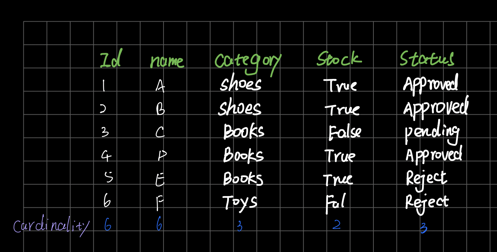
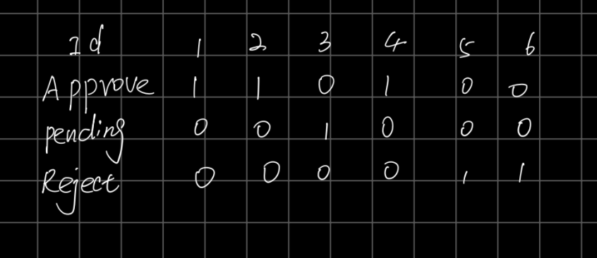

# bitmap scan

first, we need to know what is **cardinality**: the number of different content

for the following table, `ID`'s cardinality is 6, `name`'s cardinality is 6, `Category`'s cardinality is 3, `Stock`'s cardinality is 2, `Status`'s cardinality is 3

the less cardinality is, the more suitable for `bitmap scan`. The more cardinality is, the more suitable for `B+ tree scan`.

so, we could use `stock` or `status` as bitmap. why not use category? because it will increse along the data.

so, we could build bitmap for `status`:

if we want to find a data belonging to `Approved`, We just need to scan the corresponding bitmap

[video for more details](https://www.youtube.com/watch?v=5-JYVeM3IQg)下≈≈≈