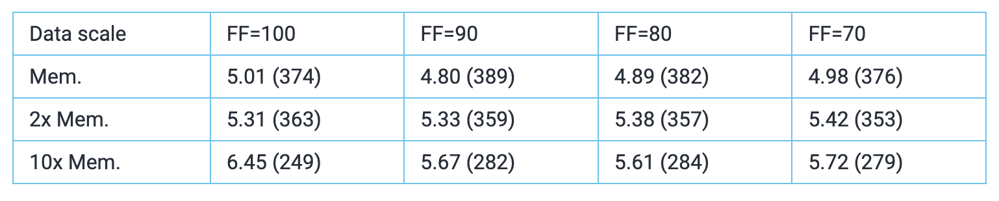

# WHAT IS FILLFACTOR AND HOW DOES IT AFFECT POSTGRESQL PERFORMANCE?

## what is fillfactor

[Simon](https://www.postgresql.org/docs/12/sql-createtable.html#id-1.9.3.85.6.3.2) says:

```test
The fillfactor for a table is a percentage between 10 and 100. 100 (complete packing) is the default. When a smaller fillfactor is specified, INSERT operations pack table pages only to the indicated percentage; the remaining space on each page is reserved for updating rows on that page. This gives UPDATE a chance to place the updated copy of a row on the same page as the original, which is more efficient than placing it on a different page. For a table, whose entries are never updated, complete packing is the best choice, but in heavily updated tables smaller fillfactors are appropriate. This parameter cannot be set for TOAST tables.
```

So in short it's a per table (or index!) parameter that directs Postgres to initially leave some extra disk space on data pages unused. Later UPDATE-s could use it, touching ultimately only one data block, thus speeding up such operations. And besides normal updates it also potentially (depending on if updated columns are indexed or not) enables another special, and even more beneficial, type of updates that are known as HOT updates - with the acronym meaning Heap Only Tuples, i.e. not indexes are touched.

So quite a simple base concept of how densely should we initially "pack" the rows (many other database systems offer something similar also), not much more to it - but how to set it? Sadly (or probably luckily) there's no global parameter for that and we need to change it "per table". Via some SQL like that:

```sql
-- leave 10% of block space unused when inserting data
ALTER TABLE pgbench_accounts SET (fillfactor = 90);
```

## Effects of fillfactor

As the [documentation](https://www.postgresql.org/docs/12/sql-createtable.html#id-1.9.3.85.6.3.2) mentions, for heavily updated tables we can gain on transaction performance by reducing the fillfactor (FF). But in what range should we adjust it and how much? Documentation doesn't risk with any numbers here - but based on my personal experience after slight FF reductions small transaction improvements can usually be observed not immediately, but over some longer period of time (days, weeks). And as I haven't also witnessed any cases where it severely harms performance such FF experiments can certainly be suggested and tried for busy tables. But to get some ballpark numbers I guess the only way is to set up some test…

## Test setup

As per usual, I modified some test scripts I had lying around, that use the default pgbench schema and transactions, which should embody a typical simple OLTP transaction with lots of UPDATE-s…so exactly what we want. The most important parameter (relative to hardware, especially memory) for pgbench transaction performance is the "scale factor", so here I chose different values covering 3 cases - initial active data set fits almost into RAM, half fits and only a fraction (ca 10%) fits. Tested fillfactor ranges were 70, 80, 90, 100.

Test host: 4 CPU i5-6600, 16GB RAM, SATA SSD

PostgreSQL: v12.2, all defaults except: shared_buffers set to 25% of RAM, i.e. 4GB, checkpoint_completion_target = 0.9, track_io_timing = on, wal_compression = on, shared_preload_libraries='pg_stat_statements'

Pgbench: scales 1000/2500/10000, 12h runtime for each scale / FF combination, 2 concurrent sessions.

Query latencies were measured directly in the database using the pg_stat_statement extension, so they should be accurate.

By the way, if you're wondering why I'm not using the latest Postgres version v12.3 for my testing (which is normally the way to go) - all these combinations took a week to run through and although a new release appeared during that time I thought it's not worth it as I didn't see anything relevant from the release notes.

## Test results

Performance has many aspects and even for a bit of a simplistic pgbench test we could measure many things - maybe most important for us in this fillfactor context are the frequent updates on our biggest table that we want to optimize. But let's not also forget about the effect of our fillfactor changes on the Postgres background processes, worse caching rates etc, so for completeness let's also look at the total Transactions per Seconds numbers. Remember - 1 pgbench default transaction includes 3 updates (2 mini-tables + 1 main), 1 insert into the write-only history table + 1 select from the main table by PK.

So here the effects on pgbench_accounts UPDATE mean time as measured via pg_stat_statements in milliseconds with global TPS in parentheses:



## Deriving a rule of thumb

So what can we learn from the test data…although it seems that there was some slight randomness in the tests (as 2x Mem test actually made things minimally slower) but as a whole it seems that indeed - decreasing FF a bit mostly improves performance also "a bit"! So my general hunch has something to it even 🙂 In average a 10% boost, when decreasing FF by 10 or 20% - not game changing of course but could be a visible difference.

And the second learning - don't overdo it! As we see that FF 70% clearly deteriorates the update performance instead of improving it, with all scaling factors.

So my try at a rule of thumb - when your active / hot data set is a lot bigger than the amount of RAM, going with fillfactor 90% seems to be a good idea. But don't forget - there are still no free lunches out there and optimizing for fast updates on table X, we pay some of the winnings back with global TPS numbers as our tables will be somewhat bigger, we somewhat lose on cache hit ratios and also background workers like the Autovacuum daemon have more scanning to do. So for smaller data vs RAM ratios the benefits are not particularly visible, and you might instead lose slightly in global TPS numbers.

Some more thoughts - I'm pretty sure that if I had tuned Autovacuum to be more aggressive we would have seen some more performance improvement, as in spite of decreasing the FF the pgbench_accounts table was still growing considerably during the testing (~35% at biggest scale) even at FF 70%. And the same for old spinning disks - the potential for additional winnings with fillfactor tuning is even bigger there compared to SSD-s as fillfactor helps to reduce exactly the Achilles heel of rotating disks - the costly random access.