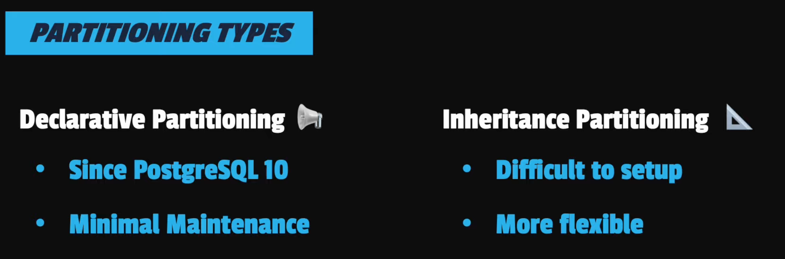
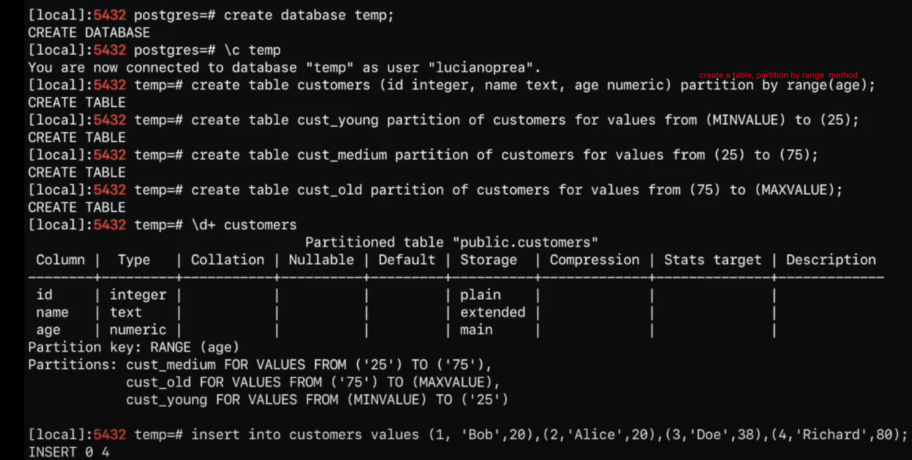
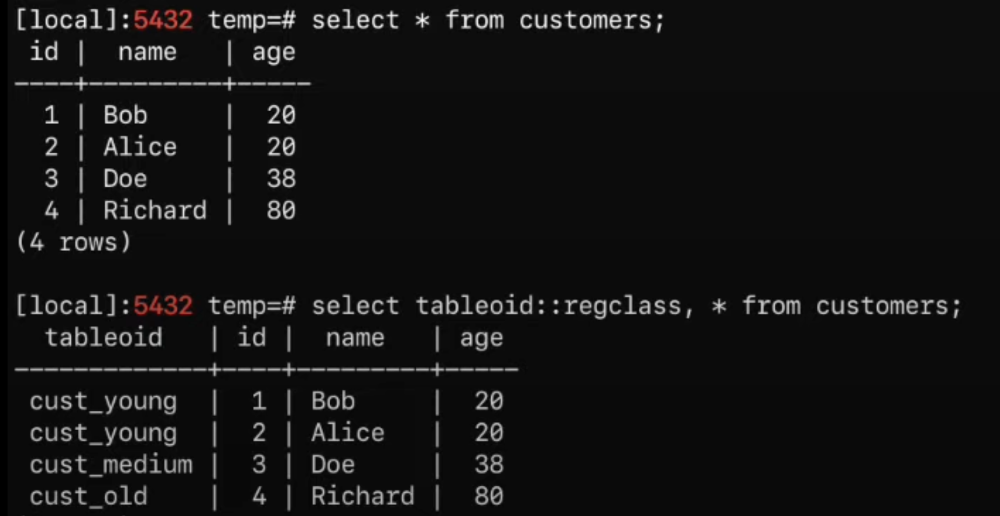

# partition

just watch the video for more details

## partition methods

Declarative Partition: List, Range, Hash

## an example

after we partition a table by range, we couldn't actually see which table the row is. we need to use `tableoid`

## reference

[video](https://www.youtube.com/watch?v=oJj-pltxBUM)

[blog](https://www.enterprisedb.com/postgres-tutorials/how-use-table-partitioning-scale-postgresql)

[document in postgreSQL](https://www.postgresql.org/docs/current/ddl-partitioning.html#DDL-PARTITIONING-DECLARATIVE)