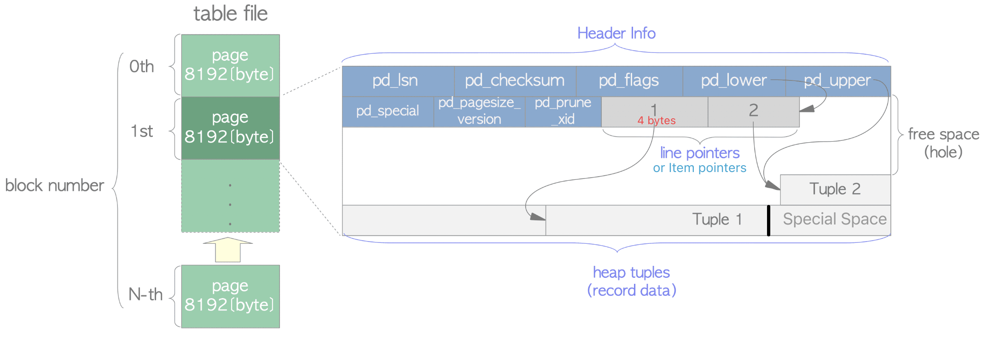
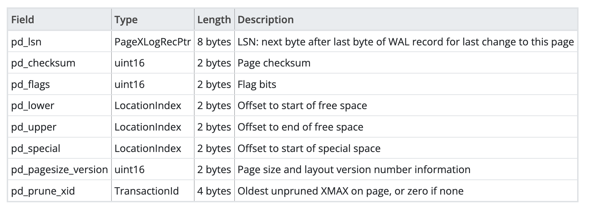

# table structure

[toc]

## Internal Layout of a Heap Table File

### page header

page header total is 24 bytes:

### item pointer/line pointer

every item pointer points to a tuple, every item pointer is 4 bytes. Line pointers form a simple array, which plays the role of index to the tuples. Each index is numbered sequentially from 1, and called offset number. When a new tuple is added to the page, a new line pointer is also pushed onto the array to point to the new one.

## Tuple Structure

Heap tuples in table pages are classified as a usual data tuple and a TOAST tuple. This section describes only the usual tuple.

A heap tuple comprises three parts: **the HeapTupleHeaderData structure**, **NULL bitmap**, and **user data**

* t_xmin holds the txid of the transaction that inserted this tuple.
* t_xmax holds the txid of the transaction that deleted or updated this tuple. If this tuple has not been deleted or updated, t_xmax is set to 0, which means INVALID.
* t_cid holds the command id (cid), which means how many SQL commands were executed before this command was executed within the current transaction beginning from 0. For example, assume that we execute three INSERT commands within a single transaction: 'BEGIN; INSERT; INSERT; INSERT; COMMIT;'. If the first command inserts this tuple, t_cid is set to 0. If the second command inserts this, t_cid is set to 1, and so on.
* t_ctid holds the tuple identifier (tid) that points to itself or a new tuple. tid, described in Section 1.3, is used to identify a tuple within a table. When this tuple is updated, the t_ctid of this tuple points to the new tuple; otherwise, the t_ctid points to itself.