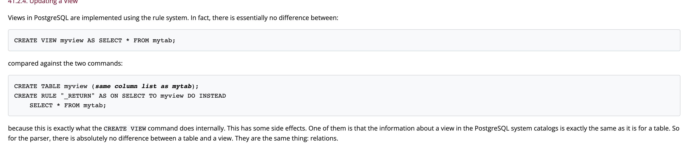

# PostgreSQL Views

A view is a named query that provides another way to present data in the database tables. A view is defined based on one or more tables which are known as base tables. When you create a view, you basically create a query and assign a name to the query. Therefore, a view is useful for wrapping a commonly used complex query.

Notice that a view does not store data physically except for a materialized view.

## how Views work

## referernce

[blog about PostgreSQL](https://www.postgresqltutorial.com/postgresql-views/)

[document](https://www.postgresql.org/docs/current/rules-views.html)
